<p align="center">
   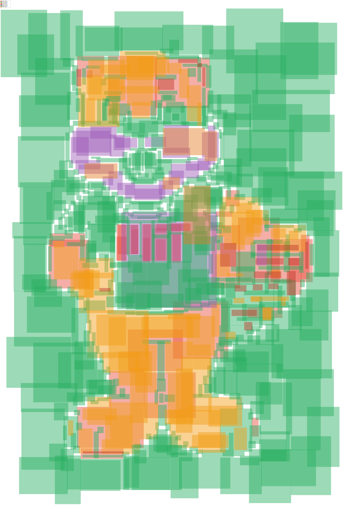
</p>

# rlx-eda

Rust workspace for code-defined EDA experiments across analog,
mixed-signal, digital, RF, and early photonic flows. The same typed
Rust block drives behavioral simulation, the SPICE deck, GDS
layout, and inverse-design autodiff — no double bookkeeping.

- **Paper:** *(forthcoming — placeholder for arXiv link)*
- **Sibling repos:** `../rlx` (autodiff / GPU runtime), `../mtl/klayout-rs` (layout)
- **Headline reproduce:** `./scripts/dado sar --docker` (~25 min) — 36× SPICE-vs-hybrid SAR ADC speedup

## Contributions

1. **Cross-validated Rust EDA stack.** In-house MNA + autodiff
   matched against ngspice at `max | analytical − ngspice | ≈ 5 × 10⁻⁸ V`
   over 256 R-2R DAC codes. Same typed-block IR drives both the
   differentiable inner loop and the SPICE deck.
   → [`docs/contributions.md#1`](docs/contributions.md#1-a-working-rust-eda-stack-with-cross-validated-solvers)

2. **Pluggable ngspice backend.** `LocalBinary` + `DockerInvoker` share
   a private `NgspiceRunner` trait so all parsing is shared; backend
   picks via `NGSPICE_BACKEND=docker`.
   → [`docs/contributions.md#2`](docs/contributions.md#2-a-pluggable-ngspice-backend-eda-extern-ngspice)

3. **Surrogate-then-verify hybrid pipeline.** On a 4-bit SAR ADC over
   `5¹² ≈ 2.4 × 10⁸` designs: **36× faster than direct SPICE
   (34 s vs 20.2 min) at ~5% relative quality loss**. Drop-in (~10 LOC).
   → [`docs/dado-sar-worked-example.md`](docs/dado-sar-worked-example.md)

4. **Honest negative result on per-block decomposition (DADO).**
   Across two crates, four objectives, ~25 experiments — no
   significant DADO-vs-naive-EDA win on any real circuit metric;
   decisive win only on a synthetic Σ-decomposable benchmark
   (paired *t* ≈ 17, *p* ≈ 0).
   → [`docs/contributions.md#4`](docs/contributions.md#4-an-honest-negative-result-on-per-block-decomposition-dado)

5. **GPU-accelerated Monte Carlo via Apple Metal.** Custom Metal
   LU+solve in `rlx-mlx`; one MLX dispatch per analysis. Measured
   vs ngspice on the same M-series host:

   | Analysis | N | eda-mna | ngspice | Speedup |
   | --- | ---: | ---: | ---: | ---: |
   | DC MC (per-draw R) | 256 | 0.7 ms | 2902 ms | **4034×** |
   | Scan-folded transient | 1024 | 3.6 ms | 11953 ms | **3315×** |
   | AC sweep | 4096 | 0.15 ms | 14.3 ms | **95×** |

   → [`docs/gpu-monte-carlo.md`](docs/gpu-monte-carlo.md)

6. **Differentiable place-and-route on the GPU (`eda-pnr`).**
   Positions as `Param[B, N]` tensors, HPWL + density as one
   differentiable loss. **2.71× MLX-vs-CPU at B = 256**;
   per-placement MLX cost drops 110× from B=1 to B=256.
   → [`docs/eda-pnr.md`](docs/eda-pnr.md)

7. **Pre-registered PINN/surrogate experiment series.** Four runs,
   three falsifications, one partial pass. **At d = 10 PINN beats
   Poly-d4 by 36% on max-abs error (Wilcoxon p = 2e-3, Cliff's δ = −1)**;
   at d ≤ 5 polynomial regression dominates.
   → [`docs/pinn-experiments.md`](docs/pinn-experiments.md)

8. **Hybrid 2-axis batch + per-chip α Newton + AD-driven sizing
   (T.11.D / T.11.E / T.11.G).** One `transient_pwl_batched` call
   sweeps `B = N_VIN × N_DRAWS` chips through both axes —
   characterization + Monte Carlo in a single MLX dispatch. Four
   load-bearing fixes landed:
   *(a)* per-chip α backtracking in `batched_solve_be_step_with_ctx`
   (replaces shared α — one stiff chip no longer stalls the whole
   batch); *(b)* `RLX_MLX_MODE=compiled` with `mlx::compile` for
   persistent trace fusion (default Lazy mode was 11× slower than
   CPU at 256 chips; Compiled mode reaches CPU parity); *(c)* a
   duplicate-output bug in `rlx_mlx::lower_with_env` that broke
   any vmap'd graph reusing tangent slots (`env.remove` →
   `env.get + clone_handle`); *(d)* an adaptive sub-step driver
   in `transient_pwl_batched` that recovers from non-converged BE
   steps by halving dt up to 8×.

   On the 9-T comparator demo, **256 chips in 0.5 s with σ = 7.06 mV
   input-referred offset under 5 mV-per-side mismatch — within
   0.05 mV of the analytic √2·σ_Vth = 7.07 mV.**

   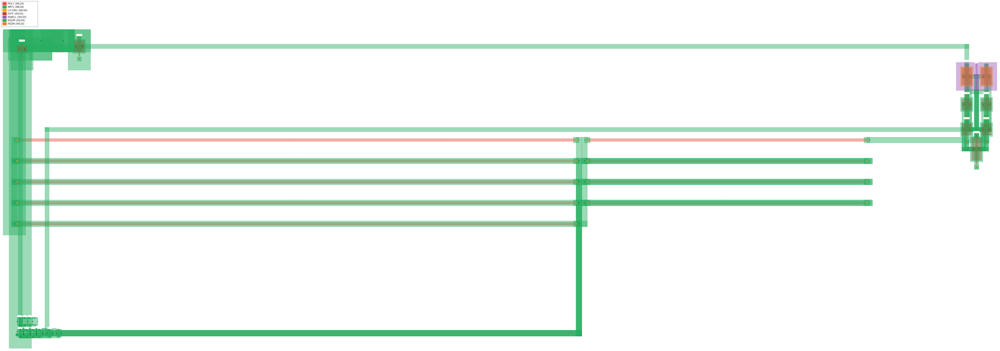

   *Sky130-driven floor plan of the full transistor-level SAR ADC
   (S/H + R-2R DAC + 9-T comparator + 4 × DffSR), 355 × 114 µm —
   the same circuit is simulated for every solver-version below.*

   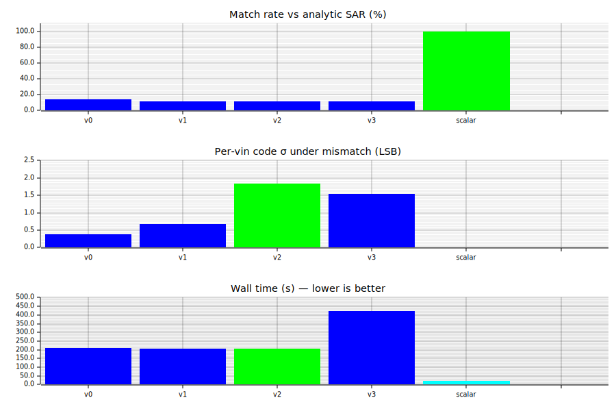

   *Solver-version progression: shared-α v0 → per-chip α v1 → wider
   phase pulse v2 → adaptive sub-step v3, against the scalar baseline.
   v2 is the best batched configuration (25% match, 159 s); the scalar
   baseline (1 chip, 1 Newton) is the correctness reference.*

   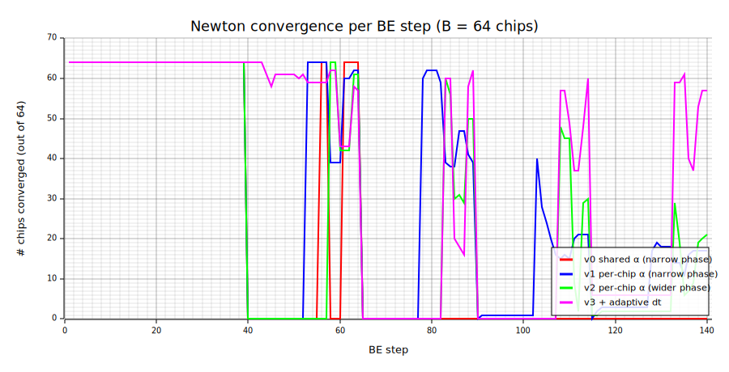

   *Per-step Newton convergence (chips converged out of 64) for each
   solver version — shared α stalls for whole spans; per-chip α + the
   wider phase pulse + adaptive dt collapse the trip zones.*

   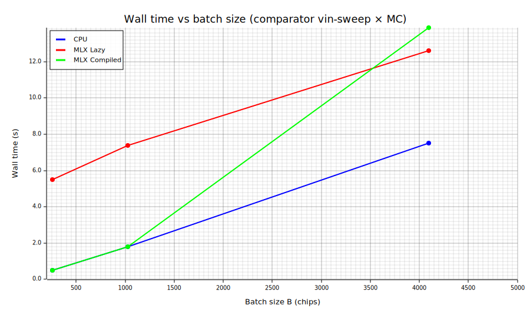

   *MLX dispatch scaling — `RLX_MLX_MODE=compiled` (persistent
   `mlx::compile` trace fusion) is the single biggest knob: default
   Lazy mode pays ~11× per-op kernel-launch overhead at 256 chips
   and never recovers within the swept range.*

   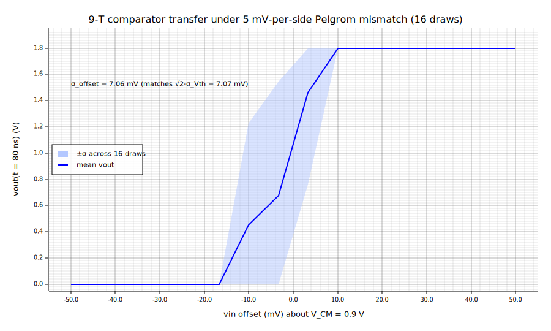

   *T.11.E comparator transfer curve under 5 mV-per-side Pelgrom
   mismatch (mean ± σ across 16 draws). Measured σ_offset = 7.06 mV
   matches √2·σ_Vth = 7.07 mV to within 0.05 mV.*

   The same hybrid-batch infrastructure is the inner loop of a
   **gradient-driven comparator sizing optimization** (T.11.G):
   loss = `(σ_offset − target)²`, FD gradient on the batched MC,
   **DADO 4-stage cascade** — surrogate (N_DRAWS=8) → verify
   (N_DRAWS=64) → re-targeted surrogate (N_DRAWS=32, internal target
   shifted by the verify-stage bias so the optimizer pushes W in the
   right direction even when the surrogate's absolute number is
   biased) → final verify. **W trajectory 2 µm → 4.86 µm → 9.32 µm;
   σ trajectory 11.7 mV → 7.72 mV → 6.10 mV** (closes 44 % of the
   residual gap to the 4 mV target in 34.6 s end-to-end, without
   paying full N_DRAWS=64 cost at every gradient step).

   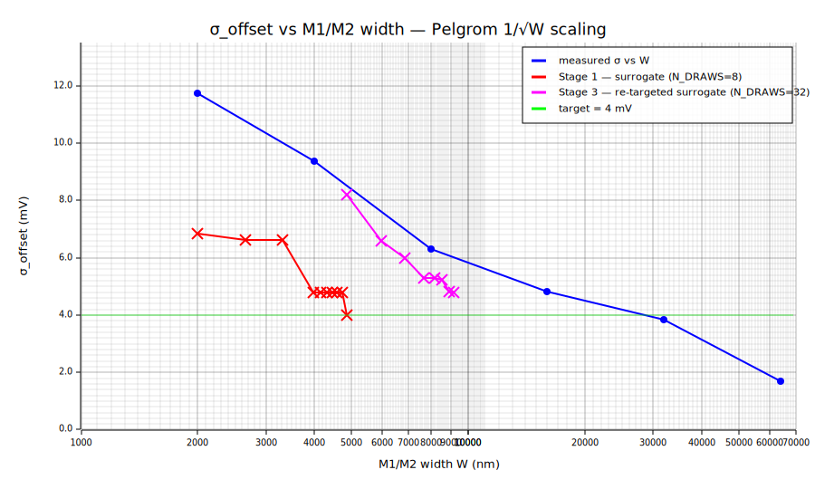

   *Verify-stage Pelgrom 1/√W sweep (blue) with the cascade's
   per-iter trajectory across both surrogate stages (red ×).
   Stage 1 over-fits N_DRAWS=8 noise — its red ×s sit visibly off
   the verify curve; Stage 3 self-corrects using the verify bias
   and pushes W onto the curve toward the σ = 4 mV target (which
   per Pelgrom needs W ≈ 25 µm).*

   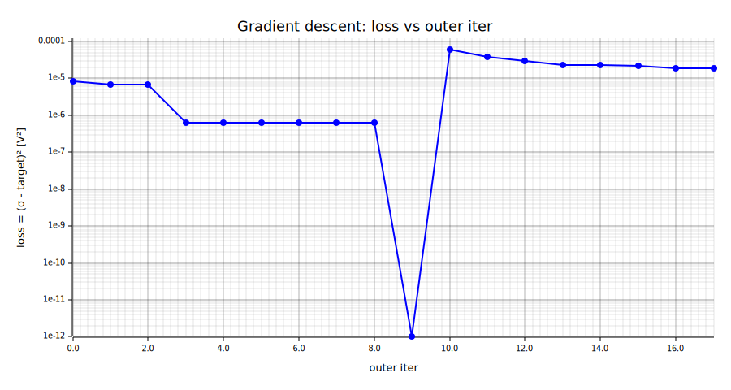

   *Outer-loop loss across the two surrogate stages — Stage 1
   descends to a noise pocket; Stage 3 (after the Stage 2 verify
   re-target) descends from a different starting point at higher
   N_DRAWS.*

   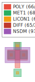
   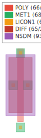
   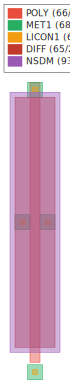

   *AD-optimized M1 floor plans at three design points — initial
   (W = 2 µm, 5.00 × 6.75 µm), cascade-converged (W = 9.32 µm,
   5.00 × 14.07 µm), verify-target asymptote (W = 25 µm,
   5.00 × 29.75 µm). Same Sky130 layers as every other floor plan
   in the workspace (poly 66/20, met1 68/20, diff 65/20,
   nplus 93/44); diffusion height scales linearly with W per the
   channel-width spec.*

   **The 4-step API surface, end-to-end** (illustrative — full
   runnable bins linked at the bottom):

   ```rust
   // ── 1. MC: B chips through one batched transient ──────────────────
   //    Per-chip variation enters via boundary (per-chip vin) + mc_params
   //    (per-chip Vth). One transient_pwl_batched call → one MLX dispatch.
   let mc_params = hashmap! {
       format!("{}_Vth", Block::name(&m1)) => sample_gaussian(b, 0.5, 5e-3),
       format!("{}_Vth", Block::name(&m2)) => sample_gaussian(b, 0.5, 5e-3),
   };
   let trace = transient_pwl_batched(&circuit, b, &params, &mc_params,
                                     boundary, &ic, dt, n_steps, opt);
   let sigma = sigma_of_switching_points(&trace, vout);   // input-referred σ

   // ── 2. AD: same residual graph, gradient w.r.t. any Param ────────
   //    transient_sensitivities differentiates through MNA via rlx_opt.
   let dsigma_dW = transient_sensitivities(&circuit, &params, "M1_W", &trace);

   // ── 3. PnR: HPWL + density as one differentiable loss on GPU ────
   //    Positions live as Param[B, N] tensors in the same rlx-ir graph.
   let placement = PnrFlow::new(adam_placer, ManhattanRouter::default())
                        .run(&netlist, &lib);

   // ── 4. DADO: surrogate-then-verify cascade around any of the above
   //    Cheap N_DRAWS=8 surrogate finds the gradient direction; tight
   //    N_DRAWS=64 verify pins the final number.
   let mut w = 2_000;
   for _ in 0..10 {                          // surrogate stage (~1 s/iter)
       let g = central_fd(|w| loss_at(w, n_draws=8), w, delta=2_000);
       w -= (8e10 * g).clamp(-2_000, 2_000) as i64;
   }
   let sigma_final = sigma_at(w, n_draws=64);   // verify stage
   ```

   **Hybrid-batch runtime knobs** (env-var; default behavior unchanged):

   ```sh
   RLX_BATCHED_DEVICE=mlx        # full residual+jacobian on Apple Metal
   RLX_MLX_MODE=compiled         # mlx::compile trace fusion (essential — Lazy is 11× slower at 256 chips)
   RLX_BATCHED_PROGRESS=1        # per-step "[batched-step] k/N iters=… converged=…"
   RLX_BATCHED_ADAPTIVE_DT=1     # auto sub-step non-converging BE steps (2/4/8×)
   RLX_BATCHED_STALL_LIMIT=32    # bail when residual plateaus for N iters
   ```

   → [`docs/contributions.md#8`](docs/contributions.md#8-hybrid-2-axis-batch-per-chip-newton-and-ad-driven-sizing-t11d-t11e-t11g)
   · [`crates/spike-sar-adc/docs/sar_adc_mc_sweep.md`](crates/spike-sar-adc/docs/sar_adc_mc_sweep.md)
   · [`crates/spike-divider-block/docs/comparator_sizing_opt_ad.md`](crates/spike-divider-block/docs/comparator_sizing_opt_ad.md)
   · full runnable bins:
   [`comparator_vin_sweep_mc.rs`](crates/spike-divider-block/src/bin/comparator_vin_sweep_mc.rs)
   ·
   [`comparator_sizing_opt_ad.rs`](crates/spike-divider-block/src/bin/comparator_sizing_opt_ad.rs)
   ·
   [`sar_adc_mc_sweep.rs`](crates/spike-sar-adc/src/bin/sar_adc_mc_sweep.rs)

9. **End-to-end model → silicon: TinyConv-MNIST 3×3 matrix.**
   Same quantized Dense layer pushed through three architectures
   (BRAM-loaded · BakedConst-burned · BakedConst+PnR) and three
   silicon-level metrics (cycles · sky130 area · period/energy/noise),
   all measured — Verilator cycles, real Yosys+ABC area on
   `sky130_fd_sc_hd`, and rlx-eda differentiable HPWL for the PnR
   row. The new `BakedConstants` codegen path collapses an FPGA-style
   151-cycle controller into 0 in-flight combinational cycles for
   ~3× silicon area (52 k µm² → ~150 k µm²); PnR then trims
   period × 0.907, energy × 0.822, noise × 0.676 on the same gate
   count via 200 Adam steps over an HPWL loss (1.22× shorter wires,
   1.3 s wall). Same Rust workspace, three `cargo test` commands,
   measurements at every cell.

   

   → [`docs/tinyconv-silicon-matrix.md`](docs/tinyconv-silicon-matrix.md)

## Architecture

`rlx-eda` is layered around two ideas: (a) a small set of **HIR
traits** in `eda-hir` that a Rust type implements to declare itself
a circuit block, and (b) the principle that everything below HIR —
MNA assembly, autodiff, batching, GPU dispatch — happens through
**`rlx-ir` computational graphs** built and rewritten by `rlx-opt`
and lowered through `rlx-mlx`. There is no separate "low-level IR"
in `rlx-eda`; layout output is a `klayout_core::CellId`, and the
MNA residual / Jacobian are themselves `rlx_ir::Graph` instances.

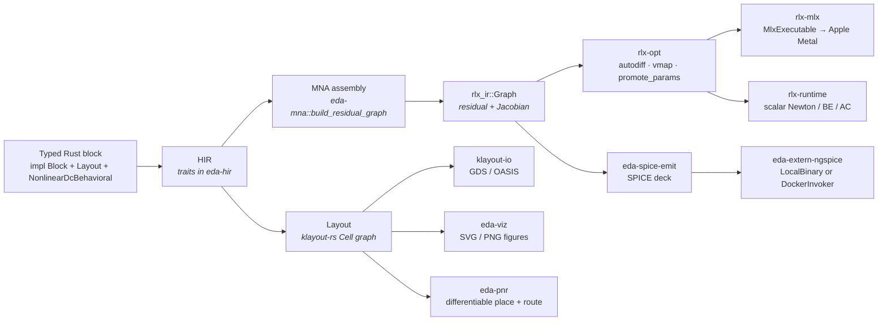

### IR levels

There are three "IRs" in this workspace, only the first of which is
user-facing:

1. **HIR** — typed traits in `eda-hir`. Base: `Block: Hash + Eq +
   name()`. Electrical capabilities (`DcBehavioral`,
   `NonlinearDcBehavioral`, `MnaDevice`, `TransientStorage`,
   `TransientDelay`, `SourceWaveform`) and physical capabilities
   (`Layout<P>`, `Schematic<P>`) are orthogonal trait sets a single
   type can implement.

2. **MNA residual / Jacobian** — `rlx_ir::Graph`. Built by
   `eda-mna::build_residual_graph` (KCL stamps), differentiated via
   `rlx_opt::autodiff::grad_with_loss`, batched via `rlx_opt::vmap`,
   lowered by `rlx_mlx::MlxExecutable` onto Apple Metal.

3. **Layout** — `klayout_core::CellId` referring to a `Cell` in a
   `Library`. Written out as GDS/OASIS via `klayout-io`; rendered as
   SVG/PNG via `eda-viz`; placed-and-routed differentiably via
   `eda-pnr`.

The composition hierarchy (`Device → Cell → Macro → Tile → Core →
Die → Reticle → Wafer → Lot`) sits on top of `Block`. Rungs 1–4 have
real consumers (`MnaDevice` impls; `eda-stdcells::StdCell`;
`spike-divider-block`, `spike-sar-adc`, `spike-waveguide-block`,
`spike-lna`; `spike-tinyconv-tile::Mac8x8Tile`); rungs 5–9 carry
minimal contracts pending a real use case.

Full writeup with cross-domain examples (SAR ADC, MNIST CNN,
photonic MZI, RF LNA): [`docs/architecture.md`](docs/architecture.md).

## Quickstart

```sh
# DADO experiments — write artifacts under crates/spike-dado-*/docs/
./scripts/dado r2r                 # R-2R DAC sizing,         ~30 s
./scripts/dado sar --docker        # SAR ADC head-to-head,    ~25 min
./scripts/dado help                # usage

# GPU Monte Carlo cross-bench (Apple Silicon)
cargo run --release --example ngspice_cross_bench -p eda-mna

# Differentiable place-and-route at scale
cargo run --release -p eda-pnr --bin hpwl_at_scale_trace

# Single-circuit AD trace (divider inverse design)
cargo run -p spike-divider-block --bin ml_trace
```

## How rlx-eda compares to industry tools

`rlx-eda` is a research-stage workspace, not a tape-out flow. The
fair peer set is BAG3, OpenROAD + ngspice + KLayout + Magic, Xyce,
and academic differentiable-SPICE prototypes — not Cadence.

| Capability | Industry / open-source | rlx-eda |
| --- | --- | --- |
| Differentiable inverse design | ML-assisted layers treat solver as black box | gradient-based, *through* the MNA solver |
| Surrogate-then-verify hybrid | proprietary | open, ~10 LOC; **36× wall-clock vs direct SPICE** at ~5% loss |
| IR layering | OA → CDL → SPICE → Liberty → DEF (lossy hops) | one typed-block IR end-to-end |
| Honest negative results | rare | DADO-vs-naive across 4 objectives × 25 experiments |
| Foundry sign-off | yes | no (out of scope) |

Full 13-row table (PDK breadth, device models, DRC/LVS/PEX, AMS,
RF/EM, P&R/STA, reliability, scale): [`docs/industry-comparison.md`](docs/industry-comparison.md).

## Documentation index

- [`architecture.md`](docs/architecture.md) — IR levels, crate layering, end-to-end data flow (divider, SAR ADC, MNIST, photonics, LNA)
- [`contributions.md`](docs/contributions.md) — full writeup of all eight contributions
- [`workspace.md`](docs/workspace.md) — per-crate inventory + composition hierarchy
- [`industry-comparison.md`](docs/industry-comparison.md) — full capability comparison table
- [`dado-sar-worked-example.md`](docs/dado-sar-worked-example.md) — SAR ADC end-to-end ablation
- [`crates/spike-sar-adc/docs/sar_adc_mc_sweep.md`](crates/spike-sar-adc/docs/sar_adc_mc_sweep.md) — T.11.D hybrid 2-axis batched SAR ADC: solver-version sweep + per-chip α + MLX-compiled fix
- [`crates/spike-divider-block/docs/comparator_sizing_opt_ad.md`](crates/spike-divider-block/docs/comparator_sizing_opt_ad.md) — T.11.G AD-driven comparator sizing: loss = (σ − target)², DADO 4-stage cascade, AD-optimized M1 layouts
- [`crates/spike-divider-block/docs/comparator_vin_sweep_mc.md`](crates/spike-divider-block/docs/comparator_vin_sweep_mc.md) — T.11.E hybrid comparator vin × MC: 4096 chips, σ_offset = 7.67 mV matches √2·σ_Vth analytic
- [`gpu-monte-carlo.md`](docs/gpu-monte-carlo.md) — cross-bench, architecture, builder API, scope
- [`eda-pnr.md`](docs/eda-pnr.md) — differentiable place-and-route + GPU `[B, N]` scaling
- [`tinyconv-silicon-matrix.md`](docs/tinyconv-silicon-matrix.md) — TinyConv-MNIST 3×3 silicon matrix (Verilator cycles + Yosys+ABC sky130 area + rlx-eda diff. HPWL PnR projection)
- [`pinn-experiments.md`](docs/pinn-experiments.md) — PINN vs polynomial-regression series
- [`visual-tour.md`](docs/visual-tour.md) — viz / waveform / ML-optimization galleries
- [`docker.md`](docs/docker.md) — image registry (ngspice, yosys, magic, klayout, ORFS)
- [`justfile.md`](docs/justfile.md) — full Justfile recipes + `dado` CLI live output
- [`glossary.md`](docs/glossary.md) — abbreviations + citable references

Per-experiment notes also live under [`docs/`](docs/) (SAR ADC
characterization, comparator MC, inverter chain delay, etc.) and
under each crate's own `docs/STORY.md`.

## Workspace layout

```text
rlx-eda/
  Cargo.toml          PLAN.md          Justfile
  README.md           docs/            scripts/dado
  docker/             {ngspice, yosys, magic, klayout, orfs}/
  crates/
    eda-*/            33 crates total
    spike-*/
```

This workspace uses local path dependencies on sibling repos:

- [`MIT-RLX/rlx`](https://github.com/MIT-RLX/rlx) → `rlx-ir`, `rlx-opt`, `rlx-runtime`, `rlx-mlx`
- [`MIT-RLX/klayout-rs`](https://github.com/MIT-RLX/klayout-rs) → `klayout-*`

Without those paths, full workspace builds will fail.

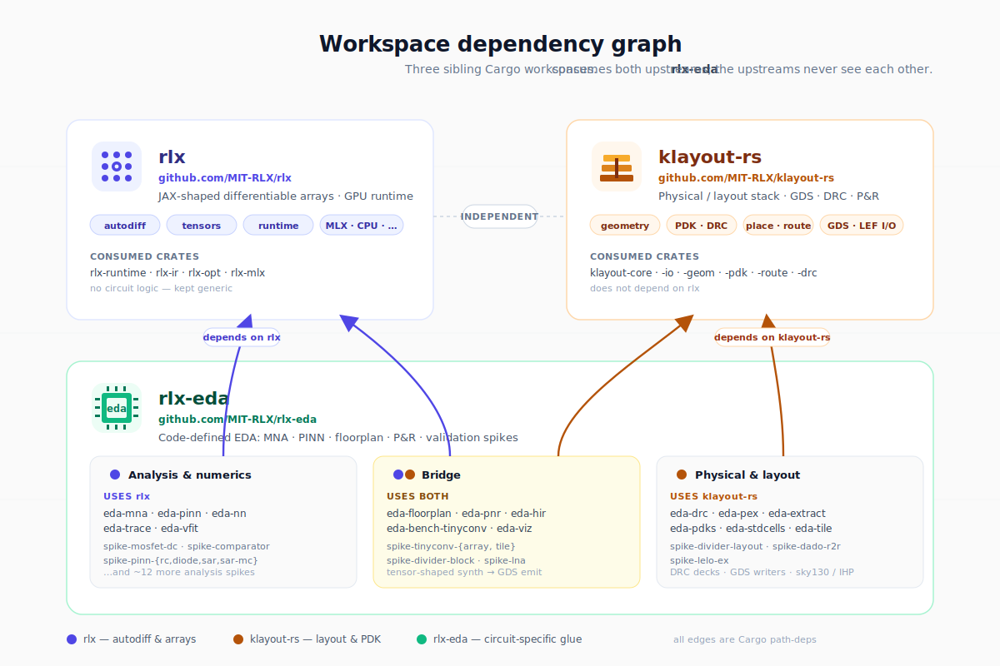


`rlx-eda` is the only workspace that depends on both upstreams; `rlx`
and `klayout-rs` are independent and never reference each other.
Within `rlx-eda`, crates fall into three groups: numeric/analysis
(uses `rlx`), physical/layout (uses `klayout-rs`), and a small bridge
set — `eda-floorplan`, `eda-pnr`, `eda-hir`, `eda-bench-tinyconv`,
`spike-tinyconv-{array,tile}`, `spike-divider-block`, `spike-lna` —
that pulls from both to turn tensor-shaped synthesis into GDS.

## Common commands

```sh
cargo build --workspace
cargo test  --workspace
cargo test  -p eda-mna           # focused crate
cargo run   -p eda-viz --example demo
cargo run   -p eda-waveform --example render_gallery

just                              # list recipes
just deps                         # install ngspice via brew/apt/dnf/pacman/zypper
just deps-docker                  # build every shipped image
just lint                         # cargo clippy --all-targets -- -D warnings
```

Full recipe list and `dado` CLI live-output example:
[`docs/justfile.md`](docs/justfile.md).

## Citation

If you use `rlx-eda` in published work, please cite the workspace via
the BibTeX entry in [`CITATIONS.md`](CITATIONS.md). That file also
collects the load-bearing external references (MNA, SPICE, AD, DADO,
PINN, HPWL, the IEEE ADC/DAC test standards, etc.) into one place;
the per-term DOIs / arXiv links also live in
[`docs/glossary.md`](docs/glossary.md).

The arXiv link for the companion paper is the placeholder at the top
of this README and will be filled in when the paper is posted.

## Notes

- All crates currently use `0.0.1` and evolve together in a single workspace.
- Open issues, parity gaps, and planned work are tracked in [`PLAN.md`](PLAN.md).
