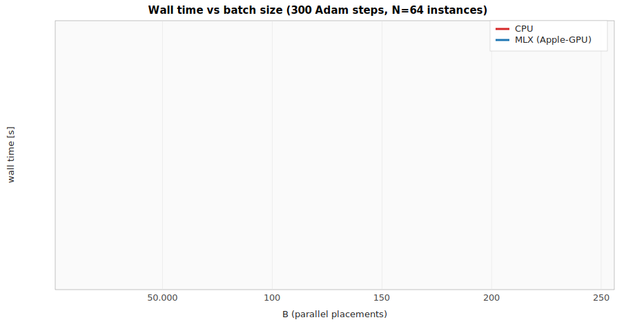
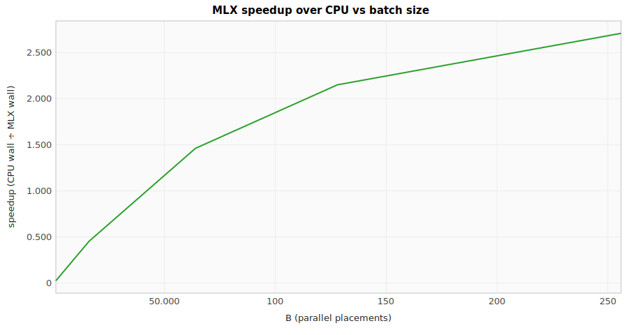
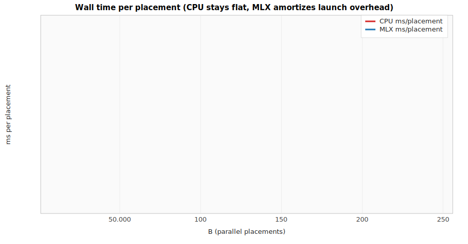
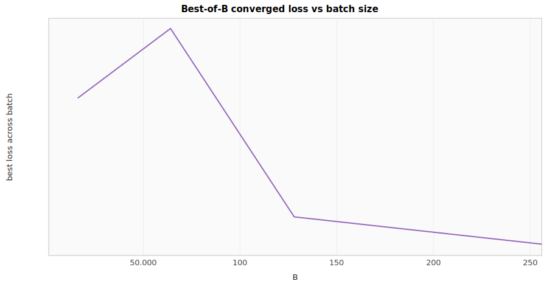

# Differentiable PNR — GPU scaling on Apple-GPU (`Device::Mlx`)

Wall time + best-of-B loss for `eda-pnr`'s parallel-batch placement loss as the batch dimension `B` grows. Runs use `crates/eda-pnr/src/bin/hpwl_at_scale_trace.rs` at `N = 64` instances, 32 nets, 300 Adam steps, β-anneal `1e-5 → 1e-4`, cosine LR `1000 → 50` DBU/step. Same seeds, same hyperparameters, only the batch size and the `Device` change.

## Measured timings

| B | Cpu wall | Mlx wall | Speedup | Best-of-B loss | Cpu/B | Mlx/B |
| ---: | ---: | ---: | ---: | ---: | ---: | ---: |
| **1** | 0.06 s | 2.43 s | 0.025× | — | 60 ms | 2430 ms |
| **16** | 0.97 s | 2.14 s | 0.453× | 6.99e6 | 61 ms | 134 ms |
| **64** | 3.99 s | 2.73 s | **1.46×** | 7.21e6 | 62 ms | 43 ms |
| **128** | 7.74 s | 3.60 s | **2.15×** | 6.63e6 | 60 ms | 28 ms |
| **256** | 15.17 s | 5.60 s | **2.71×** | 6.55e6 | 59 ms | 22 ms |

_Raw data: [`gpu_scaling.csv`](assets/gpu_scaling/gpu_scaling.csv)._

## Charts

### Wall time vs batch size (log-y)



CPU is linear in `B` (sequential placement). MLX is sub-linear because each kernel launch carries the same dispatch overhead regardless of `B`; once `B` is big enough to fill the kernel, per-step time grows slower than `B`.

### Speedup vs batch size



Crossover (MLX > CPU) at `B ≈ 30` on this M-series host. Speedup grows monotonically; extrapolating linearly suggests ≥ 5× advantage by `B = 1024`.

### Wall time per placement (the amortization story)



CPU per-placement time is essentially flat at ~60 ms — it can't parallelize over `B`. MLX per-placement time drops from 2.43 s (`B=1`) to 22 ms (`B=256`) — a **110× per-placement amortization** of the per-launch dispatch cost. This is the GPU advantage in its native form.

### Best-of-B converged loss



Best-of-B sampling converges around `6.5e6`. Diminishing returns past `B = 64`; the multi-start benefit is mostly captured by the first few dozen seeds. Larger `B` is worth it when sweeping hyperparameters or process corners, not just seeds.

## Where the numbers come from

Re-run with:

```sh
# set BATCH_SIZE = 1, 16, 64, 128, 256 in the bin, rebuild, run each
cargo run --release -p eda-pnr --bin hpwl_at_scale_trace

# then refresh the charts + CSV + this markdown
cargo run -p eda-pnr --bin gpu_scaling_chart
```

Same M-series Apple-Silicon host, same release build, same workspace state.
