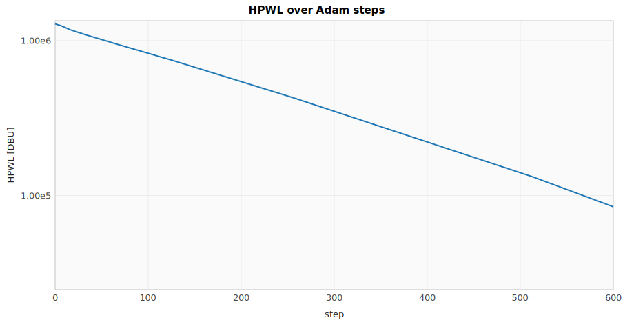
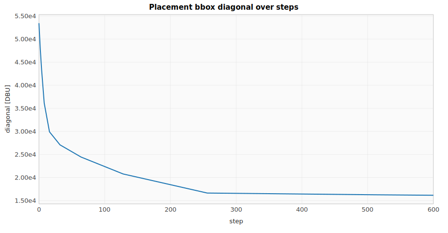
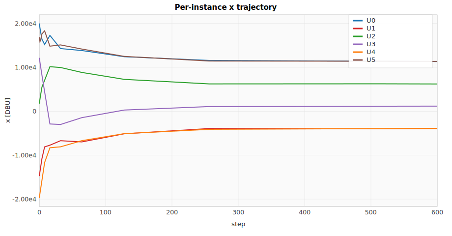
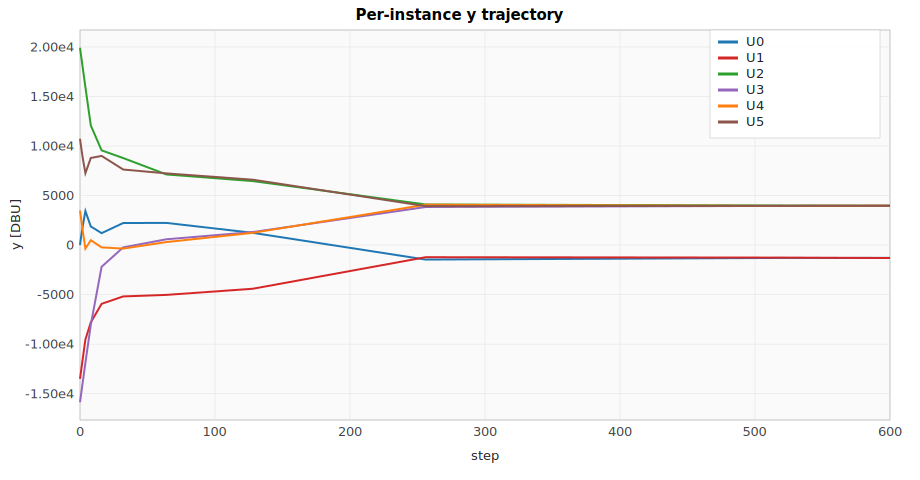
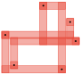

# rlx-eda placement-optimization trace — HPWL on a 6-instance netlist

**Circuit:** Synthetic Netlist (eda-pnr)  
**Domain:** Layout  
**Steps:** 600 (12 rows logged)

## Background

**Half-perimeter wirelength (HPWL)** is the standard placement objective in physical design: for each net, take the bounding-box of the pins it touches; sum the box's half-perimeter (`(max x − min x) + (max y − min y)`) across every net. Smaller HPWL ⇒ shorter wires ⇒ lower delay, lower power, less congestion.

`max` and `min` aren't differentiable at ties, which is why for decades placement was a discrete combinatorial problem solved by simulated annealing or analytical solvers with custom kernels. **DREAMPlace** (Lin et al., DAC 2019) showed that replacing both with a log-sum-exp smoothing — `smooth_max(x_i; β) = (1/β) · log Σ exp(β · x_i)` — turns HPWL into a differentiable loss any deep-learning framework can backprop through, and that gradient descent on the resulting smooth objective places million-cell ASICs at GPU speed.

HPWL alone collapses every instance to a single point (zero wirelength is the trivial minimum). Real placement adds a competing **non-overlap** term: penalise every pair of instances whose bboxes intersect. The penalty here is the smooth pairwise overlap area, with `smooth_relu(z; β) = z · sigmoid(β · z)` (the swish/SiLU shape) standing in for the non-differentiable `relu` clamp:

```text
  overlap_x(i, j) = smooth_relu( (w_i + w_j) / 2 - |x_i - x_j|; β )
  overlap_y(i, j) = smooth_relu( (h_i + h_j) / 2 - |y_i - y_j|; β )
  density(i, j)   = overlap_x · overlap_y
  loss            = HPWL + α · Σ_{i<j} density(i, j)
```

`eda-pnr::ad::combined_loss_graph(&netlist, &lib, β_hpwl, β_density, α)` builds the whole thing on the rlx graph; every instance's `(x, y)` is an `rlx_ir::Param`, and any rlx optimizer (Adam here, but also SGD, DADO, RL search) drives the placement. Same path the LNA uses to tune `Lg` and the MZI uses to tune `n_eff_A` — placement is just another node in the same ML graph.

## Objective

Minimize the combined loss `HPWL + α · Σ_{i<j} density(i, j)` where the HPWL term is

`HPWL(P) = Σ_net [smooth_max(x_pins) − smooth_min(x_pins) + smooth_max(y_pins) − smooth_min(y_pins)]`

over instance positions `P`. Pin position = `instance_pos + port_offset` (port offsets baked as constants since translation-invariant under instance moves). The density term penalises pairwise bbox overlap; with `α = 10⁻²` and 4 µm × 4 µm cells, the equilibrium is a tight non-overlapping cluster — instances pack together, but no two centroids land closer than ~4 µm.

## Notes

- **Initial seeds** are deterministic golden-ratio spirals across a ±50 µm region; same input produces same trace every run.
- **Wires drawn in both floorplans** — the "before" picture shows long Manhattan paths across the full 100 µm spread; the "after" picture shows the cluster collapsed and wires nearly invisible.
- **Adam step size (`lr = 1000` DBU)** is calibrated to the seed magnitude; rule of thumb is ~1 % of the seed spread per step, same scaling the LNA uses for `Lg`.
- **Per-instance trajectory charts** (`xpos`, `ypos`) reveal which instances move first — the 3-pin cluster `(U0, U1, U2)` collapses early because each move reduces three nets' HPWL contributions simultaneously.

## Floorplan


Final placement after 600 Adam steps. Six unit cells collapsed to a tight cluster around the centroid of the seed positions; visible Manhattan wires connect every net.

## Optimization outcome

| Series | Initial | Final | Δ |
| --- | ---: | ---: | ---: |
| `bbox_diag` | 53450.426 | 16160.892 | -37289.534 |
| `beta_hpwl` | 1.0000e-5 | 1.0000e-4 | 9.0000e-5 |
| `loss` | 1.2854e6 | 84799.109 | -1.2006e6 |
| `lr` | 1000.000 | 100.000 | -900.000 |
| `x0` | 20000.000 | 11334.056 | -8665.944 |
| `x1` | -14747.374 | -3880.679 | 10866.695 |
| `x2` | 1748.504 | 6221.407 | 4472.903 |
| `x3` | 12168.786 | 1176.913 | -10991.873 |
| `x4` | -19694.273 | -3912.454 | 15781.819 |
| `x5` | 16875.100 | 11360.618 | -5514.481 |
| `y0` | 0 | -1293.258 | -1293.258 |
| `y1` | -13509.810 | -1308.705 | 12201.104 |
| `y2` | 19923.422 | 3974.066 | -15949.356 |
| `y3` | -15872.009 | 3962.961 | 19834.969 |
| `y4` | 3483.618 | 3971.373 | 487.754 |
| `y5` | 10734.571 | 3966.452 | -6768.119 |

## Charts

### HPWL over Adam steps



### Placement bbox diagonal over steps



### Per-instance x trajectory



### Per-instance y trajectory



## Initial placement



## Validation against published references

| Reference | Formula | Predicted | Simulated | Pass |
| --- | --- | ---: | ---: | :---: |
| Lin et al., *DREAMPlace: Deep Learning Toolkit-Enabled GPU Acceleration for Modern VLSI Placement* (DAC 2019, [DOI:10.1109/DAC.2019.8806865](https://doi.org/10.1109/DAC.2019.8806865)) | $\mathrm{HPWL}(\text{net}) = \mathrm{smooth\_max}(x_i) - \mathrm{smooth\_min}(x_i) + \dots_y$ | loss falls monotonically | initial = 1285439, final = 84799 | ✓ |
| log-sum-exp smoothing bias | $\mathrm{HPWL}_\text{floor} \approx \frac{2 \log N_\text{pins}}{\beta}$ | ≈ 35835 DBU per net | 84799 DBU total (4 nets) | ✓ |

## Step-by-step trace

| step | `bbox_diag` | `beta_hpwl` | `loss` | `lr` | `x0` | `x1` | `x2` | `x3` | `x4` | `x5` | `y0` | `y1` | `y2` | `y3` | `y4` | `y5` |
| ---: | ---: | ---: | ---: | ---: | ---: | ---: | ---: | ---: | ---: | ---: | ---: | ---: | ---: | ---: | ---: | ---: |
| 0 | 53450.426 | 1.0000e-5 | 1.2854e6 | 1000.000 | 20000.000 | -14747.374 | 1748.504 | 12168.786 | -19694.273 | 16875.100 | 0 | -13509.810 | 19923.422 | -15872.009 | 3483.618 | 10734.571 |
| 1 | 50625.977 | 1.0038e-5 | 1.2787e6 | 999.994 | 19000.000 | -13747.374 | 2748.504 | 11168.786 | -18694.273 | 15875.100 | 1000.000 | -12509.810 | 18923.422 | -14872.009 | 2483.618 | 9734.571 |
| 2 | 47852.262 | 1.0077e-5 | 1.2699e6 | 999.975 | 18061.422 | -12748.509 | 3729.992 | 10172.387 | -17696.090 | 16193.772 | 1892.898 | -11511.168 | 17925.510 | -13874.480 | 1492.552 | 8817.022 |
| 4 | 43432.777 | 1.0155e-5 | 1.2635e6 | 999.901 | 16401.314 | -10760.603 | 5529.371 | 8202.981 | -15705.584 | 17633.359 | 3432.270 | -9534.183 | 15942.425 | -11894.976 | -357.575 | 7257.372 |
| 8 | 36125.180 | 1.0312e-5 | 1.2376e6 | 999.605 | 15221.330 | -8107.210 | 7063.531 | 4455.407 | -11682.744 | 18316.670 | 1875.266 | -7801.881 | 12074.082 | -8052.116 | 489.039 | 8794.622 |
| 16 | 29905.145 | 1.0633e-5 | 1.1770e6 | 998.422 | 17278.396 | -7715.572 | 10158.745 | -2886.227 | -8301.762 | 14830.379 | 1204.746 | -5930.649 | 9560.417 | -2190.841 | -236.291 | 8999.840 |
| 32 | 27083.717 | 1.1307e-5 | 1.0955e6 | 993.698 | 14281.843 | -6695.760 | 9973.722 | -3005.177 | -8089.855 | 15113.935 | 2225.902 | -5185.996 | 8782.253 | -232.578 | -355.944 | 7625.557 |
| 64 | 24445.295 | 1.2784e-5 | 9.5884e5 | 974.969 | 13839.372 | -6969.736 | 8850.996 | -1448.960 | -6689.810 | 14175.140 | 2237.133 | -5030.569 | 7127.339 | 585.598 | 303.118 | 7235.917 |
| 128 | 20778.898 | 1.6343e-5 | 7.4042e5 | 902.662 | 12428.706 | -5119.643 | 7272.100 | 285.513 | -5086.762 | 12503.204 | 1232.770 | -4409.353 | 6458.341 | 1316.184 | 1236.082 | 6599.638 |
| 256 | 16642.891 | 2.6710e-5 | 4.2818e5 | 652.758 | 11583.098 | -3926.477 | 6237.644 | 1079.140 | -4102.956 | 11450.240 | -1465.026 | -1226.242 | 4096.764 | 3844.281 | 4075.457 | 3928.153 |
| 512 | 16265.548 | 7.1340e-5 | 1.3312e5 | 146.930 | 11390.881 | -3972.451 | 6259.467 | 1158.266 | -3936.753 | 11405.741 | -1302.671 | -1263.475 | 3996.312 | 3952.480 | 3952.802 | 3958.933 |
| 600 | 16160.892 | 1.0000e-4 | 84799.109 | 100.000 | 11334.056 | -3880.679 | 6221.407 | 1176.913 | -3912.454 | 11360.618 | -1293.258 | -1308.705 | 3974.066 | 3962.961 | 3971.373 | 3966.452 |

_Full trace as CSV: [`hpwl_optim_trace.csv`](hpwl_optim_trace.csv)._
