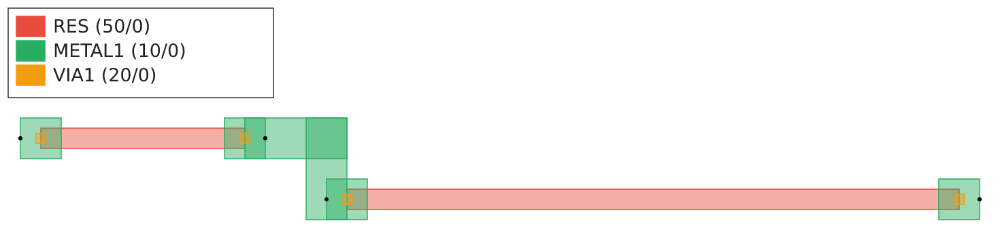
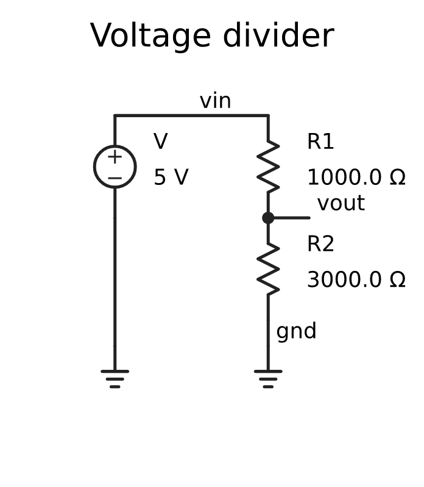

# eda-viz

SVG (and optional PNG) rendering for circuits in the rlx-eda framework.

Two complementary renderers in one crate:

- **`layout`** — flattens a klayout `(Library, CellId)` and draws every
  `Shape` on a per-layer color, with port markers and a layer legend.
  Visualizes whatever a `Layout<P>::layout(...)` impl produced.
- **`schematic`** — symbolic glyphs (resistor zigzag, capacitor plates,
  diode triangle, V-source circle, ground), placed on a coarse grid,
  connected by polylines. Driven by `eda_hir::SchematicIr`, which any
  block produces from its `Schematic<P>::schematic(pdk)` impl. The
  same Rust value that produced the layout produces the schematic, so
  they cannot drift.

PNG output is gated behind the `png` cargo feature (pulls
`resvg` + `usvg` + `tiny-skia`). Default builds keep the dep tree to
just `klayout-core` + `eda-hir`.

## Example output

The `cargo run -p eda-viz --example demo --features png` example
constructs **one** `RcDivider` value and asks it for both views:

```rust
let divider = RcDivider::new(
    Resistor { length: 10_000, id: "R1".into() },
    Resistor { length: 30_000, id: "R2".into() },
);
let top = divider.layout(&lib, &pdk);                  // Layout<P>
let ir  = divider.schematic(&pdk);                     // Schematic<P>
let svg = render_to_svg(&from_ir(&ir), &Default::default());
```

### Layout



Two RES bodies (resistors), METAL1 contact pads, VIA1 squares, and an
L-shaped METAL1 routing wire from R1's right pad to R2's left pad
(routed by `klayout-route::ManhattanPlanner` inside
`RcDivider::layout`). Black dots are top-level ports (`vin`, `vout`,
`gnd`).

`spike-divider-block/tests/lvs.rs` asserts this layout has exactly
three METAL1 nets. eda-viz's `tests/smoke.rs` re-runs that LVS check
*in the same test* that drives the renderer, so the demo binary
cannot ship a connectivity-broken layout.

### Symbolic schematic



Derived from `RcDivider::schematic(&pdk)`. `R1 = 1000.0 Ω` and
`R2 = 3000.0 Ω` come from the *same* `length` fields that drove the
layout, via `length_to_resistance(...)`. Change `length` once and both
views update together.

## Reproducing

```sh
cargo run -p eda-viz --example demo --features png
```

emits SVGs and PNGs into `target/eda-viz-demo/`.

## Bundled font

PNG rasterization uses **DejaVu Sans** (`assets/DejaVuSans.ttf`,
public-domain DejaVu changes over Bitstream Vera —
`assets/DejaVuSans-LICENSE.txt`) so output is deterministic across
machines. usvg is built with `default-features = false, features =
["text"]` — no system-font scanning at build or runtime.
