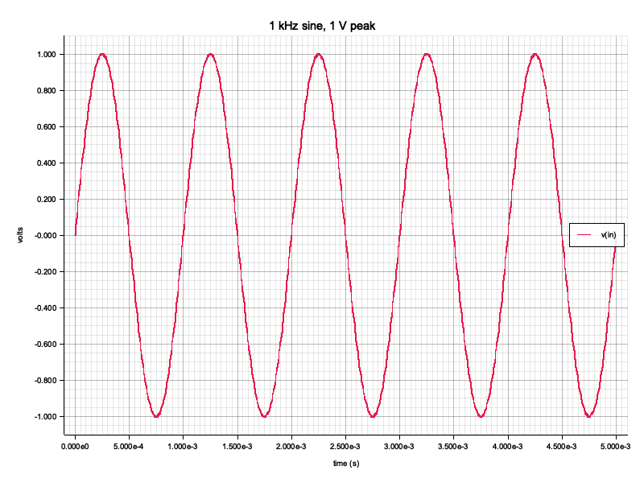
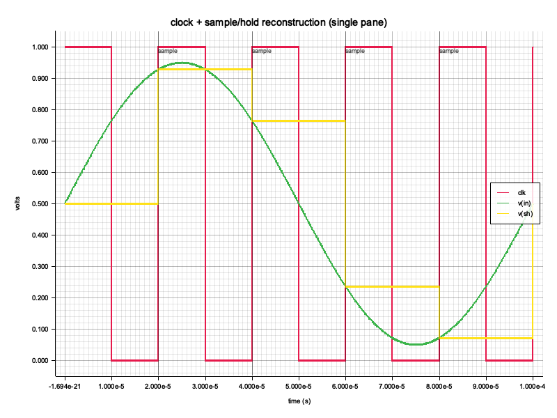
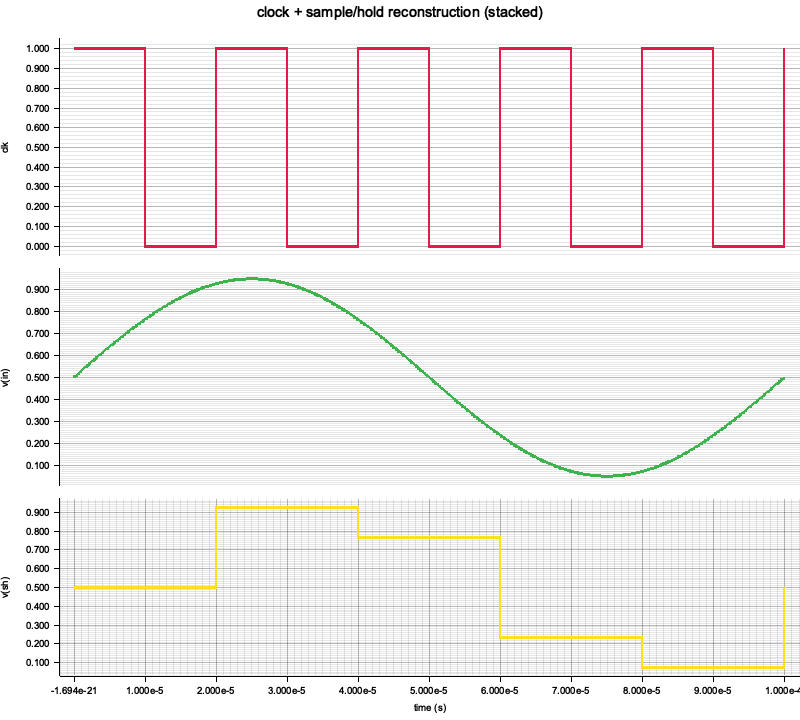
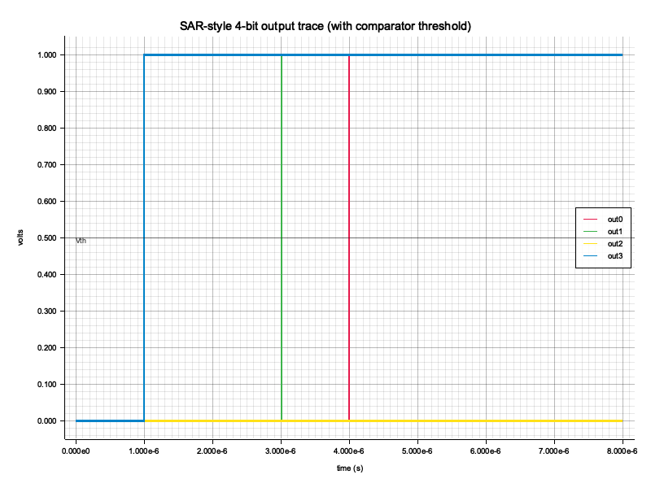
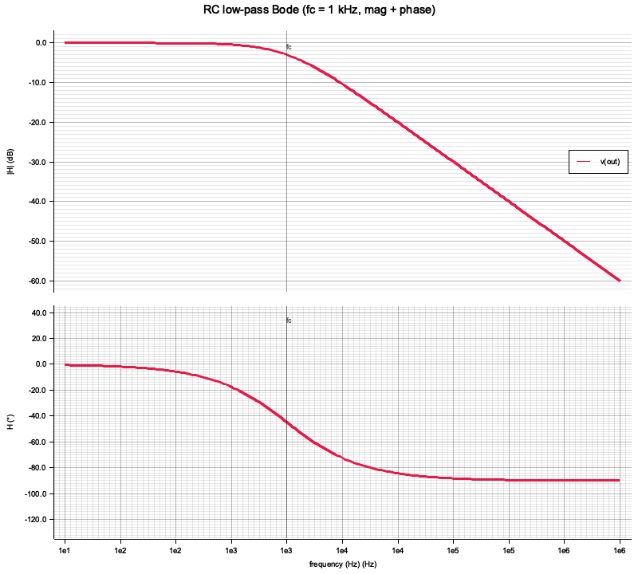

# eda-waveform

Common waveform IR + parsers + writers + plotters for the rlx-eda stack.

Phase-1's "validation pipe" hinges on every external simulator (ngspice,
LTspice, Xyce, …) and every rlx-eda native solver speaking the same
in-memory waveform shape. This crate owns that shape and the parsers /
writers that bridge it to the outside world.

## Modules

| Module   | Purpose                                                                          |
| -------- | -------------------------------------------------------------------------------- |
| `nutmeg` | ngspice + LTspice "raw" parser (ASCII + binary) **and** ASCII writer.            |
| `csv`    | One-column-per-signal CSV writer / reader. Pandas / cicwave-friendly.            |
| `vcd`    | Value Change Dump writer for digital traces (analog → bit via thresholding).     |
| `plot`   | PNG and SVG line plots via `plotters`. Single / stacked / Bode layouts, markers. |

## The `Waveform` type

```rust
pub enum Waveform {
    Real    { axis_name: String, axis: Vec<f64>, signals: BTreeMap<String, Vec<f64>> },
    Complex { axis_name: String, axis: Vec<f64>, signals: BTreeMap<String, Vec<(f64, f64)>> },
}
```

`BTreeMap` keeps deterministic iteration for snapshot tests and CSV
column ordering. The independent axis (`time`, `frequency`, …) is
stored separately from the signals map.

## Round-trip with simulators

```rust
use eda_waveform::{from_nutmeg_real, nutmeg};

// Read:  ngspice / LTspice → Waveform
let plot = nutmeg::parse_bytes(&raw_bytes)?;
let wave = from_nutmeg_real(&plot).unwrap();

// Write: rlx-eda → .raw that LTspice / ngspice / cicwave can ingest
let mut buf = Vec::new();
nutmeg::write_ascii(&plot, &mut buf)?;
```

The `nutmeg` parser is shared between `eda-extern-ngspice` and
`eda-extern-ltspice`; the writer closes the loop so rlx-eda's own
solver can dump traces in the same format.

## Plotting

```rust
use eda_waveform::plot::{
    png_to_path, svg_to_path, svg_to_string,
    PlotConfig, Layout, Marker,
};

// Defaults: 800×600, single pane, no markers.
png_to_path(&wave, "out.png", &PlotConfig::default())?;

// Builder for richer configs.
let cfg = PlotConfig::new()
    .with_title("SAR conversion cycle")
    .with_layout(Layout::Stacked)
    .add_marker(Marker::Vertical { x: 1e-6, label: Some("clk".into()) })
    .add_marker(Marker::Horizontal { y: 0.5, label: Some("Vth".into()) });
svg_to_path(&wave, "out.svg", &cfg)?;

// Inline SVG for HTML reports — no filesystem.
let svg: String = svg_to_string(&wave, &cfg)?;
```

### Layout modes

| Mode               | Use when                                                          |
| ------------------ | ----------------------------------------------------------------- |
| `Layout::Single`   | All signals share a y-scale (same units, similar magnitudes).     |
| `Layout::Stacked`  | Mixed digital + analog, or any time signals have very different   |
|                    | scales (e.g. SAR ADC: 8 bits + clock + analog input on one plot). |

Complex waveforms always render as a Bode pair (magnitude on top, phase
on bottom, shared log-frequency x-axis). The `Layout` setting is
ignored for complex.

### Markers

`Marker::Vertical { x, label }` — drawn on every pane. Useful for
sampling instants, clock edges, settling-time references.

`Marker::Horizontal { y, label }` — drawn on every pane at the given
y. Useful for comparator thresholds and full-scale references.

## Gallery

Generated by [`examples/render_gallery.rs`](examples/render_gallery.rs).
Re-run with:

```sh
cargo run -p eda-waveform --example render_gallery
```

### 1. Single sine — simplest real waveform



Smoke-test for the line-plot path: one signal, linear axes, auto-scaled
y range, axis ticks formatted in plain decimal.

### 2. Clock + sample/hold (single pane, with sample markers)



Three signals on one axis: digital clock (red square wave), analog input
(grey sine), and the sample-and-hold reconstruction (yellow staircase).
Vertical markers annotate the sampling instants. Readable but cluttered
— signals with mixed scales call for stacked panes.

### 3. Same waveform, stacked layout



`Layout::Stacked` gives each signal its own y-scaled pane sharing one
x-axis. The digital clock no longer crowds the analog signals. This is
the right default for any SAR ADC plot (clock + 8 bits + analog input).

### 4. SAR-style bit lines with threshold



Four bit lines settling at successive 1 µs ticks (binary-search pattern
of a 4-bit SAR). A horizontal `Marker::Horizontal { y: 0.5, … }`
annotates the comparator decision threshold. Demonstrates the
auto-scaling x-axis formatter — under 10 ms the axis switches to
scientific notation (`1.000e-6`, `2.000e-6`, …) so the µs-scale labels
stay readable.

### 5. RC low-pass Bode (magnitude + phase + cutoff marker)



Complex `Waveform`s always render as Bode pairs. Magnitude on top
(0 dB passband, –3 dB at the 1 kHz cutoff, asymptotic –20 dB/decade
slope above), phase on bottom (the textbook 0° → –90° transition
through the cutoff). A vertical marker at `f = 1 kHz` (mapped to
`log₁₀(f) = 3` automatically) highlights the cutoff frequency.

## SVG vs PNG

Both formats render through the same `render<DB: DrawingBackend>`
helper, so adding a new format (Cairo PDF, etc.) is one wrapper.

| Use case                                     | Pick                              |
| -------------------------------------------- | --------------------------------- |
| GitHub README / issue / PR comment           | PNG (no client-side rendering)    |
| Documentation, technical reports, slides     | SVG (vector zoom, smaller)        |
| HTML dashboards, embedded waveform viewers   | `svg_to_string` (no filesystem)   |
| CI artifacts                                 | PNG (uniform display in browsers) |

## Cross-simulator usage

`nutmeg` is shared between `eda-extern-ngspice` and
`eda-extern-ltspice` — both depend on this crate's parser. Adding a
third SPICE driver (Xyce, Spectre via intermediate, …) means writing a
thin runner crate and reusing this parser. The writer side closes the
loop in the other direction: any rlx-eda native transient engine can
dump a `.raw` that the same external tools (and cicwave) ingest.
