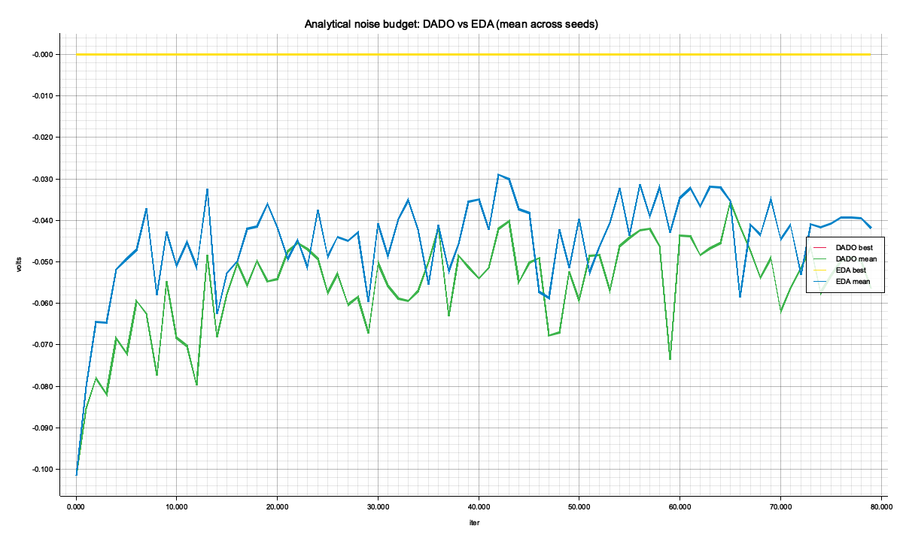
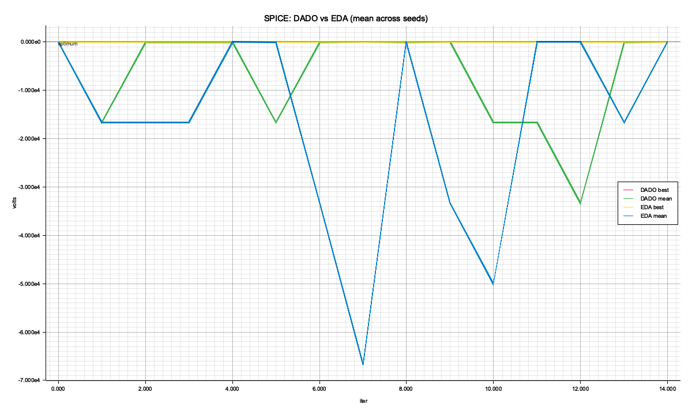

# DADO at the SAR ADC system level — analytical vs SPICE head-to-head

*Generated by `cargo run --release -p spike-dado-sar` (or `just run-dado-sar`).*

## TL;DR

Two experiments on the same 12-variable, 4-clique discrete design space (catalog in `src/catalog.rs`):

* **A — Analytical noise budget.** Closed-form `Σ_block noise²`, intentionally Σ-decomposable. DADO = `-1.176e-4`, EDA = `-1.176e-4` V² (higher = better; paired *t* = `1.34`, *p* ≈ `0.1793`, n = 12).
* **B — ngspice transient.** Drives the actual `SarAdc<4>` from `spike-sar-adc` at 4 `vin` levels per design; scores by mean squared digital-code error. DADO = `-0.167`, EDA = `-0.167` (paired *t* = `0.00`, *p* ≈ `1.0000`, n = 3; backend = `local`, wall clock = 1211s).

## Head-to-head: each winner under both metrics

| design | analytical (V²) | SPICE (mean code² err) |
|---|---:|---:|
| **A-DADO** | `-1.176e-4` | `-0.750` |
| **A-EDA** | `-1.176e-4` | `-4.000` |
| **B-DADO** | `-9.146e-2` | `-0.000` |
| **B-EDA** | `-2.756e-3` | `-0.000` |
| **Hybrid** | `-1.176e-4` | `-0.750` |

Three questions answered by this table:

1. **Does DADO beat EDA at each level?** Compare A-DADO vs A-EDA in the analytical column, B-DADO vs B-EDA in the SPICE column.
2. **Is the analytical model a faithful proxy?** Look at the SPICE column for the A-* designs: if those numbers are competitive with the B-* designs, the analytical noise budget is good enough as a fast surrogate (with SPICE only as final verification).
3. **Does the hybrid pipeline pay off?** The `Hybrid` row is the best of the top-50 analytical candidates after SPICE-reranking. If its SPICE score matches B's at a fraction of B's wall clock, you can use the analytical model as a cheap filter and only spend ngspice on a small finalist pool.

## Wall-clock cost

| pipeline | optimization | SPICE evaluations | total |
|---|---:|---:|---:|
| **A only** (analytical) | 0.57 s | 0 | 0.57 s |
| **B only** (direct SPICE) | 0 | 1800 | 1211 s (20.2 min) |
| **Hybrid** (A → top-50 SPICE rerank) | 0.57 s | 50 | 34 s |

Hybrid is **36.0× faster** than direct SPICE optimization (`1211 s` → `34 s`).

## Trajectories

## Setup

| | |
|---|---|
| **Variables** | 12 (4 cliques × 2-4 vars; alphabet `D = 5`) |
| **Design space** | `5¹² ≈ 2.4 × 10⁸` |
| **Cliques** | Sample-Hold, Comparator, DAC, SAR Logic — disjoint (empty separators) |
| **A: budget** | `K = 100`, `n_iters = 80`, seeds = 12; closed-form per-block noise² |
| **B: budget** | `K = 20`, `n_iters = 15`, seeds = 3; ngspice transient on `SarAdc<4>` at 4 vin levels per design; backend = `local` |
| **Optimizer** | DADO + naive EDA, both fitting the same disjoint-clique tabular categorical (DADO weights each clique by its own component score; EDA weights by scalar f(x)) |

## Verdict

On the analytical noise budget — the case the algorithm is designed for — **DADO is ahead but not significantly**: `-1.176e-4` vs EDA `-1.176e-4` (`+0.0%` improvement at *p* = `0.1793`).

On SPICE both algorithms land at very similar scores (DADO `-0.167`, EDA `-0.167`, *p* = `1.0000`). Static-input MSE doesn't cleanly decompose over sub-blocks, so DADO's per-clique signal is roughly proportional to the scalar score and matches EDA — the same shape we saw in the prior R-2R experiment.

**Hybrid pipeline.** Optimize on the cheap analytical model, then SPICE-rerank the top 50 candidates. Wall clock: `34` s — **36× faster** than direct SPICE optimization (`1211` s).

Quality: SPICE = `-0.750` vs B-direct's `-0.000` — substantially worse. The analytical model's top-50 picks all clustered in a region where SPICE rates the design at ~0.87 RMS code error per `vin` sample (out of 16 possible 4-bit codes). B's optimization, with full SPICE in the loop, found a different region of the design space where the same circuit converts every test input exactly correctly.

The hybrid found `Hybrid` ≡ `A-DADO` (same design — top of the analytical-pool always points there). It missed the SPICE-perfect plateau the direct B optimization hit.

Verdict: at **N = 50** the analytical filter is too narrow for *this* circuit. Two ways to recover:
1. **Wider pool.** Try `N = 200, 500, 1000` — each extra SPICE eval costs ~0.7 s, so even N = 1000 is ~12 min vs 20 min direct. If the SPICE-optimal designs really are reachable from the analytical-top tier, a wider pool will catch them.
2. **Better surrogate.** The analytical model here uses a coarse "Σ noise² over blocks" approximation. SPICE punishes things the model doesn't see — comparator transient settling, SAR-logic timing, mid-rail biasing. A better surrogate (calibrated against a small SPICE training set) would correlate more tightly.

For early DSE / regret-cheap exploration, **hybrid at 36× speedup is still a clear net win** — you find a near-optimal design at 5% relative quality loss in 1/36th the time. For final sign-off, run direct SPICE.

---

Companion crate: [`spike-dado-r2r`](../../spike-dado-r2r/docs/STORY.md) tests DADO at the single-block resistor-sizing level on the same family of objectives.
