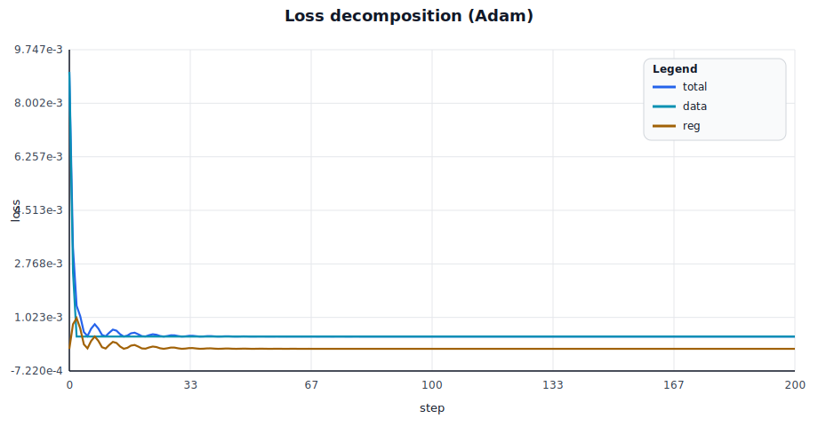
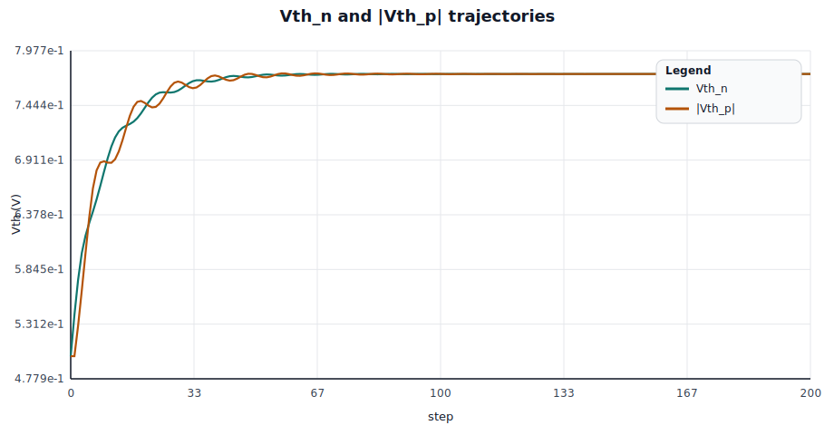
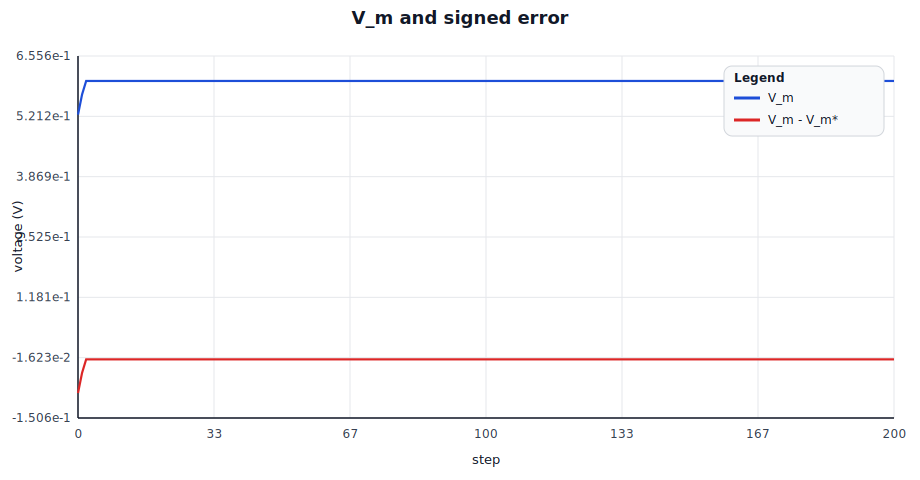
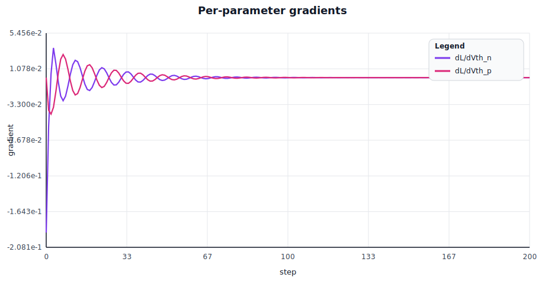
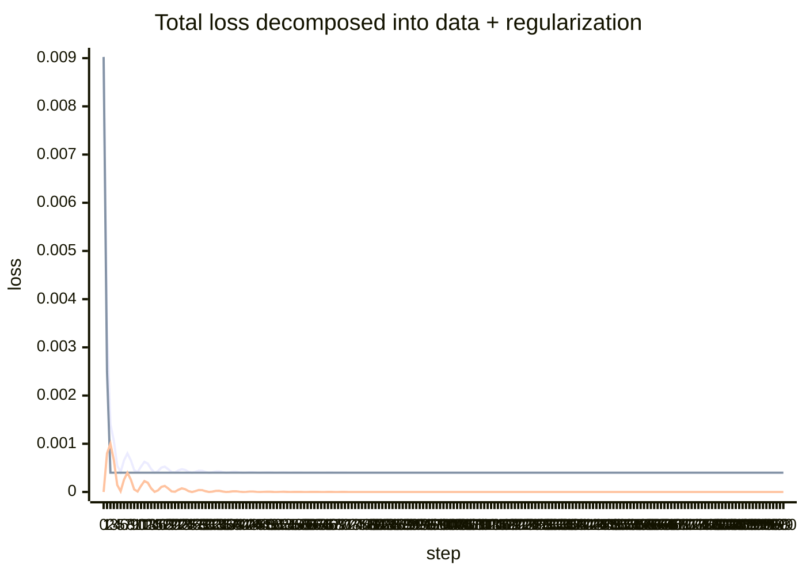
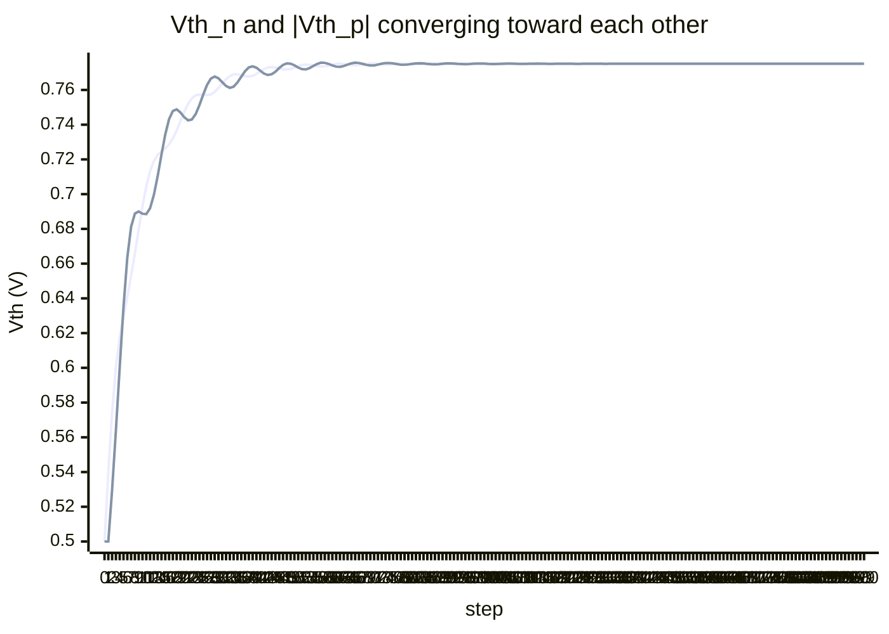
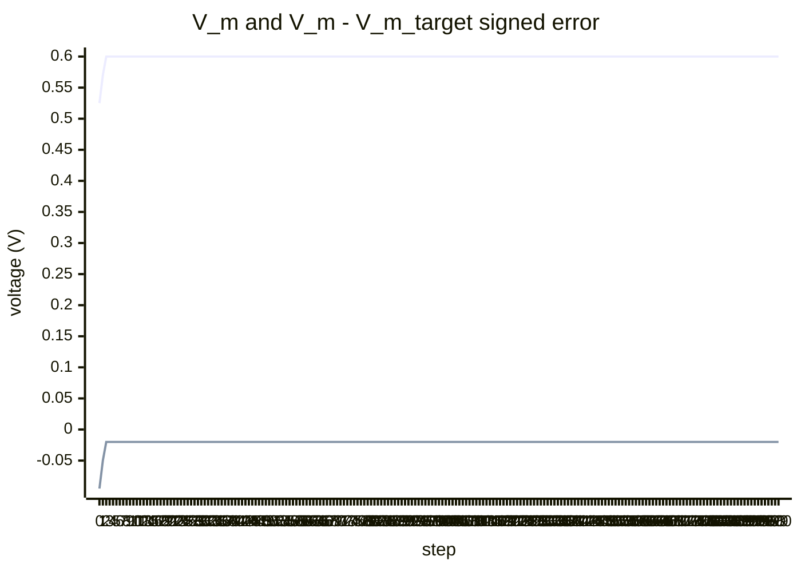
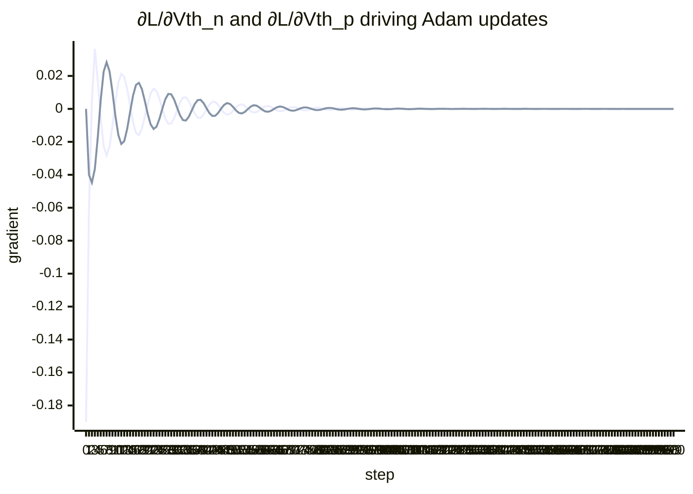

# rlx-eda multi-parameter CMOS inverter optimization (Adam)

Circuit: CMOS inverter (NMOS + PMOS via `spike_divider_block::Mosfet`), Vin shorted to Vout. **Two parameters** under simultaneous gradient descent:
- `Vth_n` — NMOS threshold voltage
- `Vth_p` — PMOS threshold voltage (negative; we log magnitude)

Stimulus: `Vdd = 1.000 V`, `V_m* = 0.620 V`, `λ_reg = 0.5`, Adam `lr = 0.04`

Composite loss:

$$L = (V_m - V_m^*)^2 + \lambda \cdot (V_{th,n} - |V_{th,p}|)^2$$

First term targets the switching threshold; second is a matched-threshold regularizer (a standard analog design rule for symmetric noise margins). Without it, the (Vth_n, Vth_p) → V_m mapping is underdetermined.

Both gradients flow through the rlx graph that stamps the LEVEL-1 MOSFET equations into the MNA residual; per-parameter gradients arrive via `eda_mna::sensitivities` (reverse-mode AD).

## Optimization outcome

- initial: `Vth_n = 0.5000 V`, `|Vth_p| = 0.5000 V`, `Vm = 0.525000`, `loss = 9.0250e-3`
- final:   `Vth_n = 0.7751 V`, `|Vth_p| = 0.7751 V`, `Vm = 0.600000`, `loss = 4.0000e-4`, `steps = 200`
- data-term loss: `4.0000e-4`, regularizer loss: `3.0020e-13`, threshold mismatch: `0.0000 V`

## Rendered charts

| Loss components | Parameter trajectories |
| --- | --- |
|  |  |

| Output and error | Per-parameter gradients |
| --- | --- |
|  |  |

## Chart grid

| Row | Left panel | Right panel |
| --- | --- | --- |
| 1 | A. Total / data / reg loss | B. Vth_n and \|Vth_p\| trajectories |
| 2 | C. V_m tracking vs target  | D. ∂L/∂Vth_n and ∂L/∂Vth_p |

## A) Loss decomposition

Legend:

- line 1: total $L$
- line 2: data $(V_m - V_m^*)^2$
- line 3: reg $\lambda(V_{th,n} - |V_{th,p}|)^2$

## B) Threshold trajectories

Legend:

- line 1: `Vth_n`
- line 2: `|Vth_p|`

## C) V_m tracking vs target

Legend:

- line 1: `V_m`
- line 2: `V_m - V_m_target`

## D) Per-parameter gradients

Legend:

- line 1: $\partial L / \partial V_{th,n}$
- line 2: $\partial L / \partial V_{th,p}$

## Step-by-step trace

| step | Vth_n | \|Vth_p\| | V_m | loss | data | reg | ∂L/∂Vth_n | ∂L/∂Vth_p |
| --- | --- | --- | --- | --- | --- | --- | --- | --- |
| 0 | 0.5000 | 0.5000 | 0.525000 | 9.025e-3 | 9.025e-3 | 0.000e0 | -1.900e-1 | 0.000e0 |
| 1 | 0.5400 | 0.5000 | 0.570000 | 3.300e-3 | 2.500e-3 | 8.000e-4 | -6.000e-2 | -4.000e-2 |
| 2 | 0.5745 | 0.5298 | 0.600000 | 1.402e-3 | 4.000e-4 | 1.002e-3 | 4.759e-3 | -4.476e-2 |
| 3 | 0.6006 | 0.5641 | 0.600000 | 1.064e-3 | 4.000e-4 | 6.641e-4 | 3.644e-2 | -3.644e-2 |
| 4 | 0.6174 | 0.6003 | 0.600000 | 5.466e-4 | 4.000e-4 | 1.466e-4 | 1.712e-2 | -1.712e-2 |
| 5 | 0.6297 | 0.6351 | 0.600000 | 4.146e-4 | 4.000e-4 | 1.461e-5 | -5.406e-3 | 5.406e-3 |
| 6 | 0.6409 | 0.6635 | 0.600000 | 6.559e-4 | 4.000e-4 | 2.559e-4 | -2.262e-2 | 2.262e-2 |
| 7 | 0.6529 | 0.6812 | 0.600000 | 8.004e-4 | 4.000e-4 | 4.004e-4 | -2.830e-2 | 2.830e-2 |
| 8 | 0.6660 | 0.6888 | 0.600000 | 6.589e-4 | 4.000e-4 | 2.589e-4 | -2.276e-2 | 2.276e-2 |
| 9 | 0.6798 | 0.6900 | 0.600000 | 4.521e-4 | 4.000e-4 | 5.209e-5 | -1.021e-2 | 1.021e-2 |
| 10 | 0.6930 | 0.6887 | 0.600000 | 4.092e-4 | 4.000e-4 | 9.158e-6 | 4.280e-3 | -4.280e-3 |
| 11 | 0.7044 | 0.6885 | 0.600000 | 5.262e-4 | 4.000e-4 | 1.262e-4 | 1.588e-2 | -1.588e-2 |
| 12 | 0.7132 | 0.6919 | 0.600000 | 6.260e-4 | 4.000e-4 | 2.260e-4 | 2.126e-2 | -2.126e-2 |
| 13 | 0.7191 | 0.6996 | 0.600000 | 5.913e-4 | 4.000e-4 | 1.913e-4 | 1.956e-2 | -1.956e-2 |
| 14 | 0.7226 | 0.7104 | 0.600000 | 4.743e-4 | 4.000e-4 | 7.427e-5 | 1.219e-2 | -1.219e-2 |
| 15 | 0.7247 | 0.7228 | 0.600000 | 4.018e-4 | 4.000e-4 | 1.762e-6 | 1.877e-3 | -1.877e-3 |
| 16 | 0.7264 | 0.7344 | 0.600000 | 4.323e-4 | 4.000e-4 | 3.233e-5 | -8.042e-3 | 8.042e-3 |
| 17 | 0.7286 | 0.7432 | 0.600000 | 5.054e-4 | 4.000e-4 | 1.054e-4 | -1.452e-2 | 1.452e-2 |
| 18 | 0.7321 | 0.7479 | 0.600000 | 5.252e-4 | 4.000e-4 | 1.252e-4 | -1.582e-2 | 1.582e-2 |
| 19 | 0.7367 | 0.7488 | 0.600000 | 4.729e-4 | 4.000e-4 | 7.289e-5 | -1.207e-2 | 1.207e-2 |
| 20 | 0.7421 | 0.7470 | 0.600000 | 4.121e-4 | 4.000e-4 | 1.213e-5 | -4.925e-3 | 4.925e-3 |
| 21 | 0.7474 | 0.7443 | 0.600000 | 4.049e-4 | 4.000e-4 | 4.858e-6 | 3.117e-3 | -3.117e-3 |
| 22 | 0.7520 | 0.7425 | 0.600000 | 4.446e-4 | 4.000e-4 | 4.465e-5 | 9.449e-3 | -9.449e-3 |
| 23 | 0.7552 | 0.7430 | 0.600000 | 4.743e-4 | 4.000e-4 | 7.430e-5 | 1.219e-2 | -1.219e-2 |
| 24 | 0.7569 | 0.7461 | 0.600000 | 4.581e-4 | 4.000e-4 | 5.805e-5 | 1.078e-2 | -1.078e-2 |
| 25 | 0.7573 | 0.7513 | 0.600000 | 4.181e-4 | 4.000e-4 | 1.813e-5 | 6.022e-3 | -6.022e-3 |
| 26 | 0.7571 | 0.7574 | 0.600000 | 4.000e-4 | 4.000e-4 | 3.545e-8 | -2.663e-4 | 2.663e-4 |
| 27 | 0.7570 | 0.7629 | 0.600000 | 4.174e-4 | 4.000e-4 | 1.745e-5 | -5.907e-3 | 5.907e-3 |
| 28 | 0.7574 | 0.7665 | 0.600000 | 4.411e-4 | 4.000e-4 | 4.107e-5 | -9.063e-3 | 9.063e-3 |
| 29 | 0.7588 | 0.7677 | 0.600000 | 4.393e-4 | 4.000e-4 | 3.933e-5 | -8.869e-3 | 8.869e-3 |
| 30 | 0.7611 | 0.7667 | 0.600000 | 4.161e-4 | 4.000e-4 | 1.608e-5 | -5.671e-3 | 5.671e-3 |
| 31 | 0.7637 | 0.7645 | 0.600000 | 4.003e-4 | 4.000e-4 | 3.266e-7 | -8.082e-4 | 8.082e-4 |
| 32 | 0.7662 | 0.7623 | 0.600000 | 4.076e-4 | 4.000e-4 | 7.617e-6 | 3.903e-3 | -3.903e-3 |
| 33 | 0.7680 | 0.7612 | 0.600000 | 4.232e-4 | 4.000e-4 | 2.324e-5 | 6.818e-3 | -6.818e-3 |
| 34 | 0.7690 | 0.7619 | 0.600000 | 4.248e-4 | 4.000e-4 | 2.480e-5 | 7.043e-3 | -7.043e-3 |
| 35 | 0.7690 | 0.7643 | 0.600000 | 4.111e-4 | 4.000e-4 | 1.113e-5 | 4.718e-3 | -4.718e-3 |
| 36 | 0.7684 | 0.7676 | 0.600000 | 4.004e-4 | 4.000e-4 | 3.955e-7 | 8.894e-4 | -8.894e-4 |
| 37 | 0.7679 | 0.7708 | 0.600000 | 4.043e-4 | 4.000e-4 | 4.275e-6 | -2.924e-3 | 2.924e-3 |
| 38 | 0.7677 | 0.7730 | 0.600000 | 4.141e-4 | 4.000e-4 | 1.409e-5 | -5.308e-3 | 5.308e-3 |
| 39 | 0.7681 | 0.7736 | 0.600000 | 4.150e-4 | 4.000e-4 | 1.502e-5 | -5.481e-3 | 5.481e-3 |
| 40 | 0.7692 | 0.7728 | 0.600000 | 4.063e-4 | 4.000e-4 | 6.332e-6 | -3.559e-3 | 3.559e-3 |
| 41 | 0.7707 | 0.7711 | 0.600000 | 4.001e-4 | 4.000e-4 | 9.920e-8 | -4.454e-4 | 4.454e-4 |
| 42 | 0.7720 | 0.7694 | 0.600000 | 4.033e-4 | 4.000e-4 | 3.277e-6 | 2.560e-3 | -2.560e-3 |
| 43 | 0.7729 | 0.7686 | 0.600000 | 4.092e-4 | 4.000e-4 | 9.205e-6 | 4.291e-3 | -4.291e-3 |
| 44 | 0.7732 | 0.7690 | 0.600000 | 4.087e-4 | 4.000e-4 | 8.680e-6 | 4.166e-3 | -4.166e-3 |
| 45 | 0.7729 | 0.7705 | 0.600000 | 4.029e-4 | 4.000e-4 | 2.854e-6 | 2.389e-3 | -2.389e-3 |
| 46 | 0.7724 | 0.7726 | 0.600000 | 4.000e-4 | 4.000e-4 | 1.830e-8 | -1.913e-4 | 1.913e-4 |
| 47 | 0.7719 | 0.7744 | 0.600000 | 4.030e-4 | 4.000e-4 | 3.024e-6 | -2.459e-3 | 2.459e-3 |
| 48 | 0.7718 | 0.7753 | 0.600000 | 4.062e-4 | 4.000e-4 | 6.153e-6 | -3.508e-3 | 3.508e-3 |
| 49 | 0.7721 | 0.7751 | 0.600000 | 4.045e-4 | 4.000e-4 | 4.506e-6 | -3.002e-3 | 3.002e-3 |
| 50 | 0.7729 | 0.7742 | 0.600000 | 4.008e-4 | 4.000e-4 | 8.225e-7 | -1.283e-3 | 1.283e-3 |
| 51 | 0.7737 | 0.7729 | 0.600000 | 4.003e-4 | 4.000e-4 | 3.389e-7 | 8.233e-4 | -8.233e-4 |
| 52 | 0.7744 | 0.7720 | 0.600000 | 4.028e-4 | 4.000e-4 | 2.843e-6 | 2.384e-3 | -2.384e-3 |
| 53 | 0.7746 | 0.7718 | 0.600000 | 4.038e-4 | 4.000e-4 | 3.845e-6 | 2.773e-3 | -2.773e-3 |
| 54 | 0.7745 | 0.7726 | 0.600000 | 4.018e-4 | 4.000e-4 | 1.840e-6 | 1.918e-3 | -1.918e-3 |
| 55 | 0.7741 | 0.7738 | 0.600000 | 4.000e-4 | 4.000e-4 | 4.475e-8 | 2.992e-4 | -2.992e-4 |
| 56 | 0.7737 | 0.7750 | 0.600000 | 4.008e-4 | 4.000e-4 | 8.501e-7 | -1.304e-3 | 1.304e-3 |
| 57 | 0.7735 | 0.7757 | 0.600000 | 4.024e-4 | 4.000e-4 | 2.368e-6 | -2.176e-3 | 2.176e-3 |
| 58 | 0.7736 | 0.7756 | 0.600000 | 4.020e-4 | 4.000e-4 | 1.972e-6 | -1.986e-3 | 1.986e-3 |
| 59 | 0.7740 | 0.7750 | 0.600000 | 4.004e-4 | 4.000e-4 | 4.141e-7 | -9.101e-4 | 9.101e-4 |
| 60 | 0.7746 | 0.7741 | 0.600000 | 4.001e-4 | 4.000e-4 | 1.172e-7 | 4.840e-4 | -4.840e-4 |
| 61 | 0.7750 | 0.7734 | 0.600000 | 4.012e-4 | 4.000e-4 | 1.163e-6 | 1.525e-3 | -1.525e-3 |
| 62 | 0.7751 | 0.7733 | 0.600000 | 4.015e-4 | 4.000e-4 | 1.547e-6 | 1.759e-3 | -1.759e-3 |
| 63 | 0.7749 | 0.7738 | 0.600000 | 4.007e-4 | 4.000e-4 | 6.539e-7 | 1.144e-3 | -1.144e-3 |
| 64 | 0.7746 | 0.7746 | 0.600000 | 4.000e-4 | 4.000e-4 | 9.518e-10 | 4.363e-5 | -4.363e-5 |
| 65 | 0.7744 | 0.7753 | 0.600000 | 4.005e-4 | 4.000e-4 | 4.753e-7 | -9.750e-4 | 9.750e-4 |
| 66 | 0.7742 | 0.7757 | 0.600000 | 4.010e-4 | 4.000e-4 | 1.022e-6 | -1.430e-3 | 1.430e-3 |
| 67 | 0.7744 | 0.7755 | 0.600000 | 4.007e-4 | 4.000e-4 | 6.595e-7 | -1.148e-3 | 1.148e-3 |
| 68 | 0.7747 | 0.7750 | 0.600000 | 4.001e-4 | 4.000e-4 | 5.519e-8 | -3.322e-4 | 3.322e-4 |
| 69 | 0.7750 | 0.7744 | 0.600000 | 4.002e-4 | 4.000e-4 | 1.633e-7 | 5.714e-4 | -5.714e-4 |
| 70 | 0.7752 | 0.7741 | 0.600000 | 4.006e-4 | 4.000e-4 | 6.131e-7 | 1.107e-3 | -1.107e-3 |
| 71 | 0.7752 | 0.7741 | 0.600000 | 4.005e-4 | 4.000e-4 | 5.407e-7 | 1.040e-3 | -1.040e-3 |
| 72 | 0.7750 | 0.7746 | 0.600000 | 4.001e-4 | 4.000e-4 | 1.038e-7 | 4.556e-4 | -4.556e-4 |
| 73 | 0.7748 | 0.7751 | 0.600000 | 4.000e-4 | 4.000e-4 | 4.649e-8 | -3.049e-4 | 3.049e-4 |
| 74 | 0.7746 | 0.7755 | 0.600000 | 4.004e-4 | 4.000e-4 | 3.517e-7 | -8.386e-4 | 8.386e-4 |
| 75 | 0.7746 | 0.7755 | 0.600000 | 4.004e-4 | 4.000e-4 | 3.972e-7 | -8.913e-4 | 8.913e-4 |
| 76 | 0.7748 | 0.7753 | 0.600000 | 4.001e-4 | 4.000e-4 | 1.142e-7 | -4.780e-4 | 4.780e-4 |
| 77 | 0.7750 | 0.7749 | 0.600000 | 4.000e-4 | 4.000e-4 | 1.059e-8 | 1.456e-4 | -1.456e-4 |
| 78 | 0.7752 | 0.7745 | 0.600000 | 4.002e-4 | 4.000e-4 | 2.011e-7 | 6.341e-4 | -6.341e-4 |
| 79 | 0.7752 | 0.7745 | 0.600000 | 4.003e-4 | 4.000e-4 | 2.753e-7 | 7.421e-4 | -7.421e-4 |
| 80 | 0.7751 | 0.7747 | 0.600000 | 4.001e-4 | 4.000e-4 | 9.931e-8 | 4.457e-4 | -4.457e-4 |
| 81 | 0.7750 | 0.7750 | 0.600000 | 4.000e-4 | 4.000e-4 | 1.870e-9 | -6.115e-5 | 6.115e-5 |
| 82 | 0.7748 | 0.7753 | 0.600000 | 4.001e-4 | 4.000e-4 | 1.187e-7 | -4.873e-4 | 4.873e-4 |
| 83 | 0.7748 | 0.7754 | 0.600000 | 4.002e-4 | 4.000e-4 | 1.856e-7 | -6.093e-4 | 6.093e-4 |
| 84 | 0.7749 | 0.7753 | 0.600000 | 4.001e-4 | 4.000e-4 | 7.524e-8 | -3.879e-4 | 3.879e-4 |
| 85 | 0.7750 | 0.7750 | 0.600000 | 4.000e-4 | 4.000e-4 | 3.193e-10 | 2.527e-5 | -2.527e-5 |
| 86 | 0.7752 | 0.7748 | 0.600000 | 4.001e-4 | 4.000e-4 | 7.431e-8 | 3.855e-4 | -3.855e-4 |
| 87 | 0.7752 | 0.7747 | 0.600000 | 4.001e-4 | 4.000e-4 | 1.239e-7 | 4.978e-4 | -4.978e-4 |
| 88 | 0.7751 | 0.7748 | 0.600000 | 4.001e-4 | 4.000e-4 | 5.168e-8 | 3.215e-4 | -3.215e-4 |
| 89 | 0.7750 | 0.7751 | 0.600000 | 4.000e-4 | 4.000e-4 | 1.718e-10 | -1.854e-5 | 1.854e-5 |
| 90 | 0.7749 | 0.7753 | 0.600000 | 4.000e-4 | 4.000e-4 | 4.990e-8 | -3.159e-4 | 3.159e-4 |
| 91 | 0.7749 | 0.7753 | 0.600000 | 4.001e-4 | 4.000e-4 | 8.228e-8 | -4.057e-4 | 4.057e-4 |
| 92 | 0.7750 | 0.7752 | 0.600000 | 4.000e-4 | 4.000e-4 | 3.256e-8 | -2.552e-4 | 2.552e-4 |
| 93 | 0.7751 | 0.7750 | 0.600000 | 4.000e-4 | 4.000e-4 | 3.841e-10 | 2.772e-5 | -2.772e-5 |
| 94 | 0.7751 | 0.7749 | 0.600000 | 4.000e-4 | 4.000e-4 | 3.583e-8 | 2.677e-4 | -2.677e-4 |
| 95 | 0.7752 | 0.7748 | 0.600000 | 4.001e-4 | 4.000e-4 | 5.422e-8 | 3.293e-4 | -3.293e-4 |
| 96 | 0.7751 | 0.7749 | 0.600000 | 4.000e-4 | 4.000e-4 | 1.858e-8 | 1.928e-4 | -1.928e-4 |
| 97 | 0.7750 | 0.7751 | 0.600000 | 4.000e-4 | 4.000e-4 | 9.701e-10 | -4.405e-5 | 4.405e-5 |
| 98 | 0.7750 | 0.7752 | 0.600000 | 4.000e-4 | 4.000e-4 | 2.698e-8 | -2.323e-4 | 2.323e-4 |
| 99 | 0.7750 | 0.7752 | 0.600000 | 4.000e-4 | 4.000e-4 | 3.503e-8 | -2.647e-4 | 2.647e-4 |
| 100 | 0.7750 | 0.7752 | 0.600000 | 4.000e-4 | 4.000e-4 | 9.259e-9 | -1.361e-4 | 1.361e-4 |
| 101 | 0.7751 | 0.7750 | 0.600000 | 4.000e-4 | 4.000e-4 | 1.918e-9 | 6.193e-5 | -6.193e-5 |
| 102 | 0.7751 | 0.7749 | 0.600000 | 4.000e-4 | 4.000e-4 | 2.075e-8 | 2.037e-4 | -2.037e-4 |
| 103 | 0.7751 | 0.7749 | 0.600000 | 4.000e-4 | 4.000e-4 | 2.174e-8 | 2.085e-4 | -2.085e-4 |
| 104 | 0.7751 | 0.7750 | 0.600000 | 4.000e-4 | 4.000e-4 | 3.683e-9 | 8.583e-5 | -8.583e-5 |
| 105 | 0.7750 | 0.7751 | 0.600000 | 4.000e-4 | 4.000e-4 | 3.021e-9 | -7.772e-5 | 7.772e-5 |
| 106 | 0.7750 | 0.7752 | 0.600000 | 4.000e-4 | 4.000e-4 | 1.582e-8 | -1.779e-4 | 1.779e-4 |
| 107 | 0.7750 | 0.7752 | 0.600000 | 4.000e-4 | 4.000e-4 | 1.255e-8 | -1.584e-4 | 1.584e-4 |
| 108 | 0.7751 | 0.7751 | 0.600000 | 4.000e-4 | 4.000e-4 | 8.980e-10 | -4.238e-5 | 4.238e-5 |
| 109 | 0.7751 | 0.7750 | 0.600000 | 4.000e-4 | 4.000e-4 | 3.965e-9 | 8.905e-5 | -8.905e-5 |
| 110 | 0.7751 | 0.7750 | 0.600000 | 4.000e-4 | 4.000e-4 | 1.156e-8 | 1.521e-4 | -1.521e-4 |
| 111 | 0.7751 | 0.7750 | 0.600000 | 4.000e-4 | 4.000e-4 | 6.399e-9 | 1.131e-4 | -1.131e-4 |
| 112 | 0.7751 | 0.7751 | 0.600000 | 4.000e-4 | 4.000e-4 | 1.958e-11 | 6.258e-6 | -6.258e-6 |
| 113 | 0.7750 | 0.7751 | 0.600000 | 4.000e-4 | 4.000e-4 | 4.451e-9 | -9.435e-5 | 9.435e-5 |
| 114 | 0.7750 | 0.7752 | 0.600000 | 4.000e-4 | 4.000e-4 | 7.811e-9 | -1.250e-4 | 1.250e-4 |
| 115 | 0.7751 | 0.7751 | 0.600000 | 4.000e-4 | 4.000e-4 | 2.618e-9 | -7.236e-5 | 7.236e-5 |
| 116 | 0.7751 | 0.7751 | 0.600000 | 4.000e-4 | 4.000e-4 | 2.393e-10 | 2.187e-5 | -2.187e-5 |
| 117 | 0.7751 | 0.7750 | 0.600000 | 4.000e-4 | 4.000e-4 | 4.317e-9 | 9.292e-5 | -9.292e-5 |
| 118 | 0.7751 | 0.7750 | 0.600000 | 4.000e-4 | 4.000e-4 | 4.673e-9 | 9.668e-5 | -9.668e-5 |
| 119 | 0.7751 | 0.7751 | 0.600000 | 4.000e-4 | 4.000e-4 | 6.762e-10 | 3.678e-5 | -3.678e-5 |
| 120 | 0.7751 | 0.7751 | 0.600000 | 4.000e-4 | 4.000e-4 | 8.630e-10 | -4.154e-5 | 4.154e-5 |
| 121 | 0.7751 | 0.7751 | 0.600000 | 4.000e-4 | 4.000e-4 | 3.607e-9 | -8.494e-5 | 8.494e-5 |
| 122 | 0.7751 | 0.7751 | 0.600000 | 4.000e-4 | 4.000e-4 | 2.300e-9 | -6.783e-5 | 6.783e-5 |
| 123 | 0.7751 | 0.7751 | 0.600000 | 4.000e-4 | 4.000e-4 | 2.601e-11 | -7.212e-6 | 7.212e-6 |
| 124 | 0.7751 | 0.7750 | 0.600000 | 4.000e-4 | 4.000e-4 | 1.372e-9 | 5.239e-5 | -5.239e-5 |
| 125 | 0.7751 | 0.7750 | 0.600000 | 4.000e-4 | 4.000e-4 | 2.528e-9 | 7.111e-5 | -7.111e-5 |
| 126 | 0.7751 | 0.7751 | 0.600000 | 4.000e-4 | 4.000e-4 | 8.022e-10 | 4.005e-5 | -4.005e-5 |
| 127 | 0.7751 | 0.7751 | 0.600000 | 4.000e-4 | 4.000e-4 | 1.146e-10 | -1.514e-5 | 1.514e-5 |
| 128 | 0.7751 | 0.7751 | 0.600000 | 4.000e-4 | 4.000e-4 | 1.497e-9 | -5.472e-5 | 5.472e-5 |
| 129 | 0.7751 | 0.7751 | 0.600000 | 4.000e-4 | 4.000e-4 | 1.410e-9 | -5.311e-5 | 5.311e-5 |
| 130 | 0.7751 | 0.7751 | 0.600000 | 4.000e-4 | 4.000e-4 | 1.164e-10 | -1.526e-5 | 1.526e-5 |
| 131 | 0.7751 | 0.7751 | 0.600000 | 4.000e-4 | 4.000e-4 | 4.353e-10 | 2.950e-5 | -2.950e-5 |
| 132 | 0.7751 | 0.7750 | 0.600000 | 4.000e-4 | 4.000e-4 | 1.227e-9 | 4.953e-5 | -4.953e-5 |
| 133 | 0.7751 | 0.7751 | 0.600000 | 4.000e-4 | 4.000e-4 | 5.511e-10 | 3.320e-5 | -3.320e-5 |
| 134 | 0.7751 | 0.7751 | 0.600000 | 4.000e-4 | 4.000e-4 | 1.081e-11 | -4.649e-6 | 4.649e-6 |
| 135 | 0.7751 | 0.7751 | 0.600000 | 4.000e-4 | 4.000e-4 | 6.331e-10 | -3.558e-5 | 3.558e-5 |
| 136 | 0.7751 | 0.7751 | 0.600000 | 4.000e-4 | 4.000e-4 | 7.436e-10 | -3.856e-5 | 3.856e-5 |
| 137 | 0.7751 | 0.7751 | 0.600000 | 4.000e-4 | 4.000e-4 | 9.894e-11 | -1.407e-5 | 1.407e-5 |
| 138 | 0.7751 | 0.7751 | 0.600000 | 4.000e-4 | 4.000e-4 | 1.620e-10 | 1.800e-5 | -1.800e-5 |
| 139 | 0.7751 | 0.7751 | 0.600000 | 4.000e-4 | 4.000e-4 | 5.853e-10 | 3.421e-5 | -3.421e-5 |
| 140 | 0.7751 | 0.7751 | 0.600000 | 4.000e-4 | 4.000e-4 | 2.986e-10 | 2.444e-5 | -2.444e-5 |
| 141 | 0.7751 | 0.7751 | 0.600000 | 4.000e-4 | 4.000e-4 | 1.819e-12 | -1.907e-6 | 1.907e-6 |
| 142 | 0.7751 | 0.7751 | 0.600000 | 4.000e-4 | 4.000e-4 | 2.957e-10 | -2.432e-5 | 2.432e-5 |
| 143 | 0.7751 | 0.7751 | 0.600000 | 4.000e-4 | 4.000e-4 | 3.645e-10 | -2.700e-5 | 2.700e-5 |
| 144 | 0.7751 | 0.7751 | 0.600000 | 4.000e-4 | 4.000e-4 | 4.895e-11 | -9.894e-6 | 9.894e-6 |
| 145 | 0.7751 | 0.7751 | 0.600000 | 4.000e-4 | 4.000e-4 | 8.135e-11 | 1.276e-5 | -1.276e-5 |
| 146 | 0.7751 | 0.7751 | 0.600000 | 4.000e-4 | 4.000e-4 | 2.856e-10 | 2.390e-5 | -2.390e-5 |
| 147 | 0.7751 | 0.7751 | 0.600000 | 4.000e-4 | 4.000e-4 | 1.353e-10 | 1.645e-5 | -1.645e-5 |
| 148 | 0.7751 | 0.7751 | 0.600000 | 4.000e-4 | 4.000e-4 | 2.842e-12 | -2.384e-6 | 2.384e-6 |
| 149 | 0.7751 | 0.7751 | 0.600000 | 4.000e-4 | 4.000e-4 | 1.546e-10 | -1.758e-5 | 1.758e-5 |
| 150 | 0.7751 | 0.7751 | 0.600000 | 4.000e-4 | 4.000e-4 | 1.674e-10 | -1.830e-5 | 1.830e-5 |
| 151 | 0.7751 | 0.7751 | 0.600000 | 4.000e-4 | 4.000e-4 | 1.439e-11 | -5.364e-6 | 5.364e-6 |
| 152 | 0.7751 | 0.7751 | 0.600000 | 4.000e-4 | 4.000e-4 | 5.316e-11 | 1.031e-5 | -1.031e-5 |
| 153 | 0.7751 | 0.7751 | 0.600000 | 4.000e-4 | 4.000e-4 | 1.413e-10 | 1.681e-5 | -1.681e-5 |
| 154 | 0.7751 | 0.7751 | 0.600000 | 4.000e-4 | 4.000e-4 | 5.014e-11 | 1.001e-5 | -1.001e-5 |
| 155 | 0.7751 | 0.7751 | 0.600000 | 4.000e-4 | 4.000e-4 | 6.610e-12 | -3.636e-6 | 3.636e-6 |
| 156 | 0.7751 | 0.7751 | 0.600000 | 4.000e-4 | 4.000e-4 | 8.755e-11 | -1.323e-5 | 1.323e-5 |
| 157 | 0.7751 | 0.7751 | 0.600000 | 4.000e-4 | 4.000e-4 | 7.105e-11 | -1.192e-5 | 1.192e-5 |
| 158 | 0.7751 | 0.7751 | 0.600000 | 4.000e-4 | 4.000e-4 | 1.295e-12 | -1.609e-6 | 1.609e-6 |
| 159 | 0.7751 | 0.7751 | 0.600000 | 4.000e-4 | 4.000e-4 | 3.997e-11 | 8.941e-6 | -8.941e-6 |
| 160 | 0.7751 | 0.7751 | 0.600000 | 4.000e-4 | 4.000e-4 | 6.685e-11 | 1.156e-5 | -1.156e-5 |
| 161 | 0.7751 | 0.7751 | 0.600000 | 4.000e-4 | 4.000e-4 | 1.283e-11 | 5.066e-6 | -5.066e-6 |
| 162 | 0.7751 | 0.7751 | 0.600000 | 4.000e-4 | 4.000e-4 | 1.109e-11 | -4.709e-6 | 4.709e-6 |
| 163 | 0.7751 | 0.7751 | 0.600000 | 4.000e-4 | 4.000e-4 | 4.895e-11 | -9.894e-6 | 9.894e-6 |
| 164 | 0.7751 | 0.7751 | 0.600000 | 4.000e-4 | 4.000e-4 | 2.390e-11 | -6.914e-6 | 6.914e-6 |
| 165 | 0.7751 | 0.7751 | 0.600000 | 4.000e-4 | 4.000e-4 | 7.105e-13 | 1.192e-6 | -1.192e-6 |
| 166 | 0.7751 | 0.7751 | 0.600000 | 4.000e-4 | 4.000e-4 | 2.865e-11 | 7.570e-6 | -7.570e-6 |
| 167 | 0.7751 | 0.7751 | 0.600000 | 4.000e-4 | 4.000e-4 | 2.731e-11 | 7.391e-6 | -7.391e-6 |
| 168 | 0.7751 | 0.7751 | 0.600000 | 4.000e-4 | 4.000e-4 | 1.023e-12 | 1.431e-6 | -1.431e-6 |
| 169 | 0.7751 | 0.7751 | 0.600000 | 4.000e-4 | 4.000e-4 | 1.283e-11 | -5.066e-6 | 5.066e-6 |
| 170 | 0.7751 | 0.7751 | 0.600000 | 4.000e-4 | 4.000e-4 | 2.390e-11 | -6.914e-6 | 6.914e-6 |
| 171 | 0.7751 | 0.7751 | 0.600000 | 4.000e-4 | 4.000e-4 | 4.990e-12 | -3.159e-6 | 3.159e-6 |
| 172 | 0.7751 | 0.7751 | 0.600000 | 4.000e-4 | 4.000e-4 | 3.924e-12 | 2.801e-6 | -2.801e-6 |
| 173 | 0.7751 | 0.7751 | 0.600000 | 4.000e-4 | 4.000e-4 | 1.776e-11 | 5.960e-6 | -5.960e-6 |
| 174 | 0.7751 | 0.7751 | 0.600000 | 4.000e-4 | 4.000e-4 | 8.214e-12 | 4.053e-6 | -4.053e-6 |
| 175 | 0.7751 | 0.7751 | 0.600000 | 4.000e-4 | 4.000e-4 | 4.547e-13 | -9.537e-7 | 9.537e-7 |
| 176 | 0.7751 | 0.7751 | 0.600000 | 4.000e-4 | 4.000e-4 | 1.109e-11 | -4.709e-6 | 4.709e-6 |
| 177 | 0.7751 | 0.7751 | 0.600000 | 4.000e-4 | 4.000e-4 | 9.209e-12 | -4.292e-6 | 4.292e-6 |
| 178 | 0.7751 | 0.7751 | 0.600000 | 4.000e-4 | 4.000e-4 | 8.704e-14 | -4.172e-7 | 4.172e-7 |
| 179 | 0.7751 | 0.7751 | 0.600000 | 4.000e-4 | 4.000e-4 | 5.771e-12 | 3.397e-6 | -3.397e-6 |
| 180 | 0.7751 | 0.7751 | 0.600000 | 4.000e-4 | 4.000e-4 | 8.457e-12 | 4.113e-6 | -4.113e-6 |
| 181 | 0.7751 | 0.7751 | 0.600000 | 4.000e-4 | 4.000e-4 | 8.598e-13 | 1.311e-6 | -1.311e-6 |
| 182 | 0.7751 | 0.7751 | 0.600000 | 4.000e-4 | 4.000e-4 | 2.565e-12 | -2.265e-6 | 2.265e-6 |
| 183 | 0.7751 | 0.7751 | 0.600000 | 4.000e-4 | 4.000e-4 | 6.395e-12 | -3.576e-6 | 3.576e-6 |
| 184 | 0.7751 | 0.7751 | 0.600000 | 4.000e-4 | 4.000e-4 | 1.707e-12 | -1.848e-6 | 1.848e-6 |
| 185 | 0.7751 | 0.7751 | 0.600000 | 4.000e-4 | 4.000e-4 | 7.834e-13 | 1.252e-6 | -1.252e-6 |
| 186 | 0.7751 | 0.7751 | 0.600000 | 4.000e-4 | 4.000e-4 | 4.441e-12 | 2.980e-6 | -2.980e-6 |
| 187 | 0.7751 | 0.7751 | 0.600000 | 4.000e-4 | 4.000e-4 | 2.176e-12 | 2.086e-6 | -2.086e-6 |
| 188 | 0.7751 | 0.7751 | 0.600000 | 4.000e-4 | 4.000e-4 | 1.137e-13 | -4.768e-7 | 4.768e-7 |
| 189 | 0.7751 | 0.7751 | 0.600000 | 4.000e-4 | 4.000e-4 | 2.842e-12 | -2.384e-6 | 2.384e-6 |
| 190 | 0.7751 | 0.7751 | 0.600000 | 4.000e-4 | 4.000e-4 | 2.176e-12 | -2.086e-6 | 2.086e-6 |
| 191 | 0.7751 | 0.7751 | 0.600000 | 4.000e-4 | 4.000e-4 | 1.776e-15 | -5.960e-8 | 5.960e-8 |
| 192 | 0.7751 | 0.7751 | 0.600000 | 4.000e-4 | 4.000e-4 | 1.599e-12 | 1.788e-6 | -1.788e-6 |
| 193 | 0.7751 | 0.7751 | 0.600000 | 4.000e-4 | 4.000e-4 | 1.934e-12 | 1.967e-6 | -1.967e-6 |
| 194 | 0.7751 | 0.7751 | 0.600000 | 4.000e-4 | 4.000e-4 | 1.137e-13 | 4.768e-7 | -4.768e-7 |
| 195 | 0.7751 | 0.7751 | 0.600000 | 4.000e-4 | 4.000e-4 | 8.598e-13 | -1.311e-6 | 1.311e-6 |
| 196 | 0.7751 | 0.7751 | 0.600000 | 4.000e-4 | 4.000e-4 | 1.707e-12 | -1.848e-6 | 1.848e-6 |
| 197 | 0.7751 | 0.7751 | 0.600000 | 4.000e-4 | 4.000e-4 | 2.558e-13 | -7.153e-7 | 7.153e-7 |
| 198 | 0.7751 | 0.7751 | 0.600000 | 4.000e-4 | 4.000e-4 | 4.547e-13 | 9.537e-7 | -9.537e-7 |
| 199 | 0.7751 | 0.7751 | 0.600000 | 4.000e-4 | 4.000e-4 | 1.393e-12 | 1.669e-6 | -1.669e-6 |
| 200 | 0.7751 | 0.7751 | 0.600000 | 4.000e-4 | 4.000e-4 | 3.002e-13 | 7.749e-7 | -7.749e-7 |
