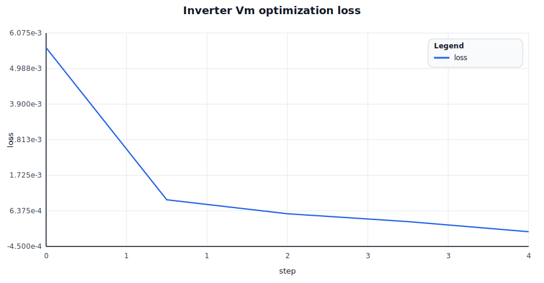
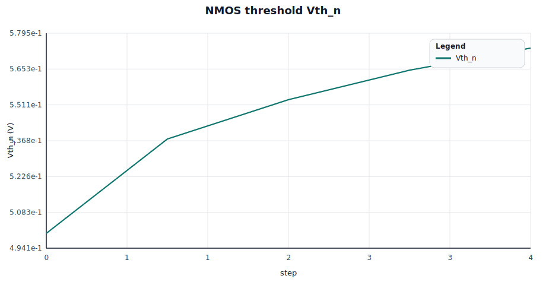
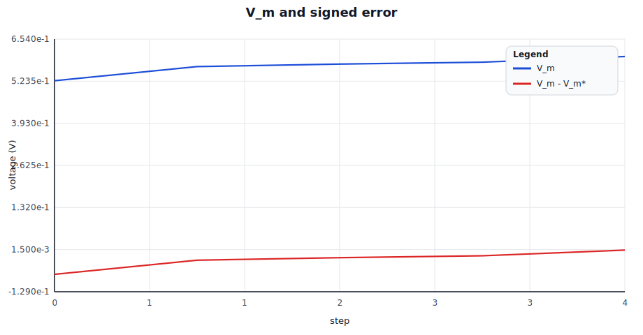
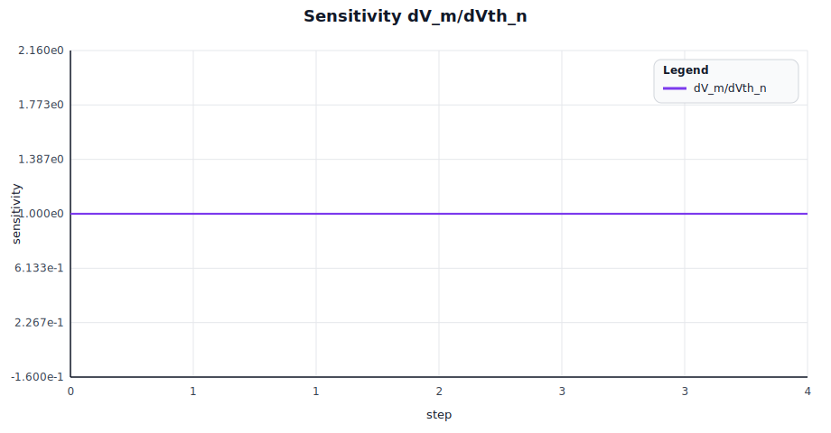
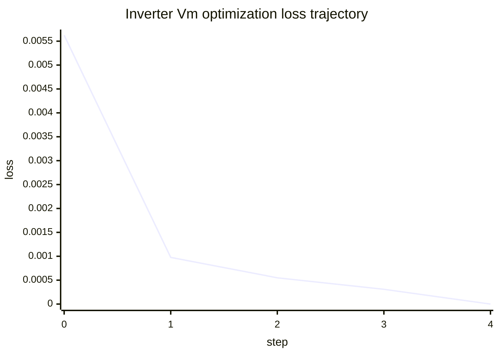
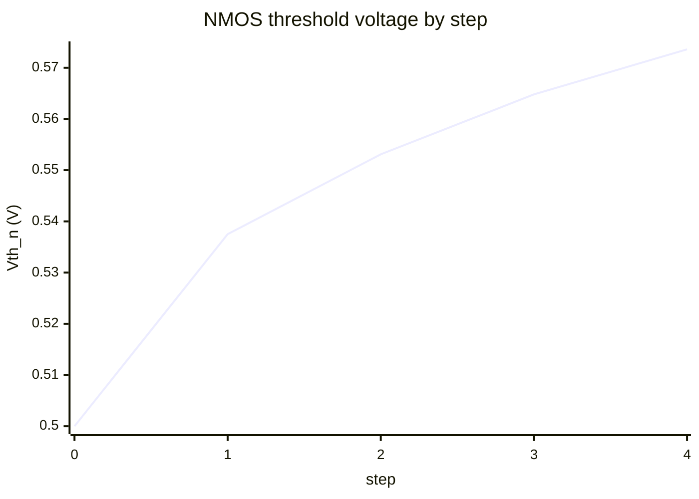
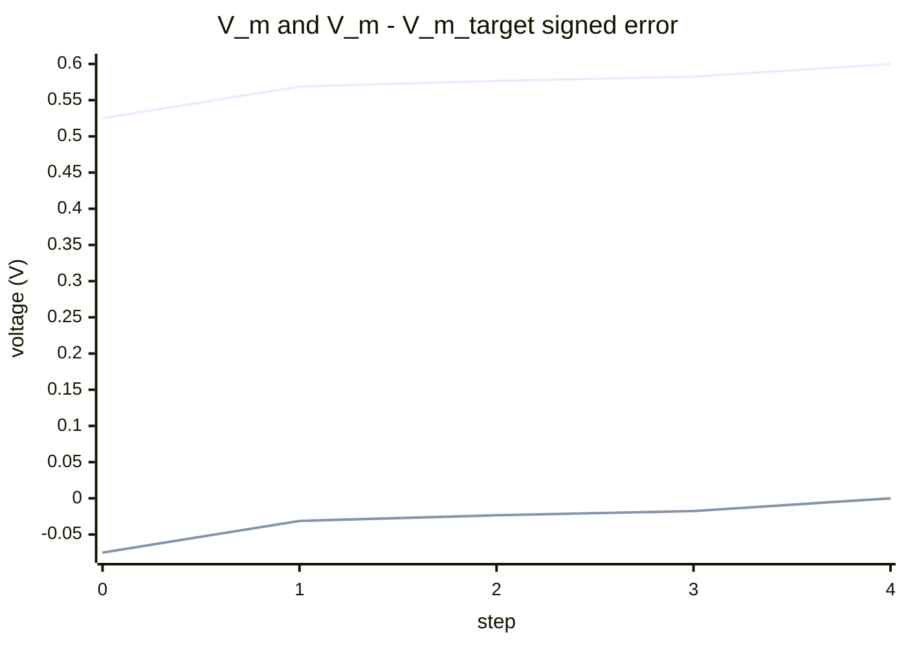

# rlx-eda differentiable CMOS inverter Vm optimization

Circuit: CMOS inverter (NMOS + PMOS via `spike_divider_block::Mosfet`), with input shorted to output so the solved DC operating point IS the switching threshold V_m.

Stimulus: `Vdd = 1.000 V`, `V_m* = 0.600 V`

Loss definition:

$$L = (V_m - V_{m,\text{target}})^2$$

Gradient-driven parameter update (outer Newton on $V_m(Vth_n) - V_m^* = 0$):

$$Vth_n \leftarrow Vth_n - \eta \cdot \frac{V_m - V_m^*}{\partial V_m / \partial Vth_n}$$

## Optimization outcome

- initial: `Vth_n (V) = 0.500`, `V_m = 0.525000`, `loss = 5.625e-3`
- final:   `Vth_n (V) = 0.574`, `V_m = 0.600000`, `loss = 0.000e0`, `steps = 4`

All gradients computed via reverse-mode AD on the rlx graph that stamps the MOSFET LEVEL-1 equations into the MNA residual. No SPICE oracle.

## Rendered charts

| Loss and objective | Parameter evolution |
| --- | --- |
|  |  |

| Output and error | Gradient signals |
| --- | --- |
|  |  |

## Chart grid

| Row | Left panel | Right panel |
| --- | --- | --- |
| 1 | A. Loss over steps | B. NMOS Vth trajectory |
| 2 | C. V_m tracking vs target | D. ∂V_m / ∂Vth_n evolution |

## A) Loss over steps



Legend:

- line 1: optimization loss $L = (V_m - V_m^*)^2$

## B) NMOS Vth trajectory



Legend:

- line 1: `Vth_n` (NMOS threshold voltage in V)

## C) V_m tracking vs target



Legend:

- line 1: `V_m`
- line 2: `V_m - V_m_target` (signed error)

## D) Gradient evolution

```mermaid
xychart-beta
  title "∂V_m / ∂Vth_n driving the parameter updates"
  x-axis "step" [0, 1, 2, 3, 4]
  y-axis "sensitivity"
  line [1.000000, 1.000000, 1.000000, 1.000000, 1.000000]
```

Legend:

- line 1: $\partial V_m / \partial Vth_n$ (V per unit width-multiplier)

## Step-by-step trace

| step | Vth_n (V) | V_m (V) | loss | dV_m/dVth_n |
| --- | --- | --- | --- | --- |
| 0 | 0.5000 | 0.525000 | 5.6250e-3 | 1.0000e0 |
| 1 | 0.5375 | 0.568750 | 9.7656e-4 | 1.0000e0 |
| 2 | 0.5531 | 0.576563 | 5.4932e-4 | 1.0000e0 |
| 3 | 0.5648 | 0.582422 | 3.0899e-4 | 1.0000e0 |
| 4 | 0.5736 | 0.600000 | 0.0000e0 | 1.0000e0 |
