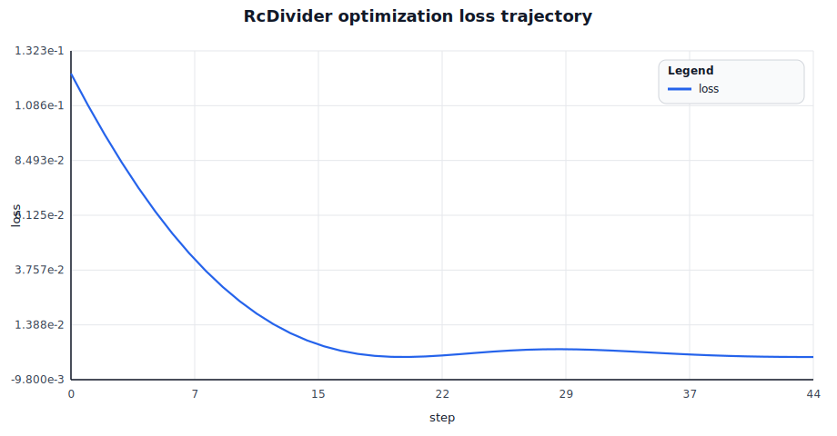
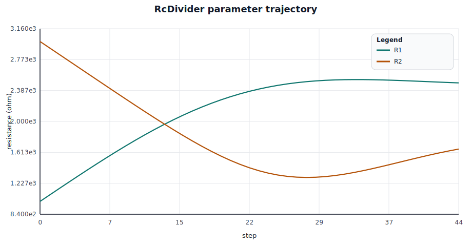
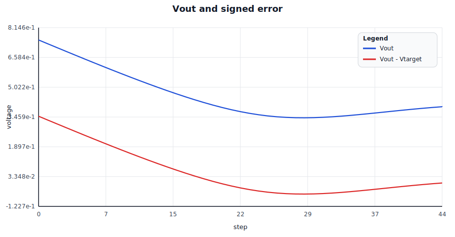
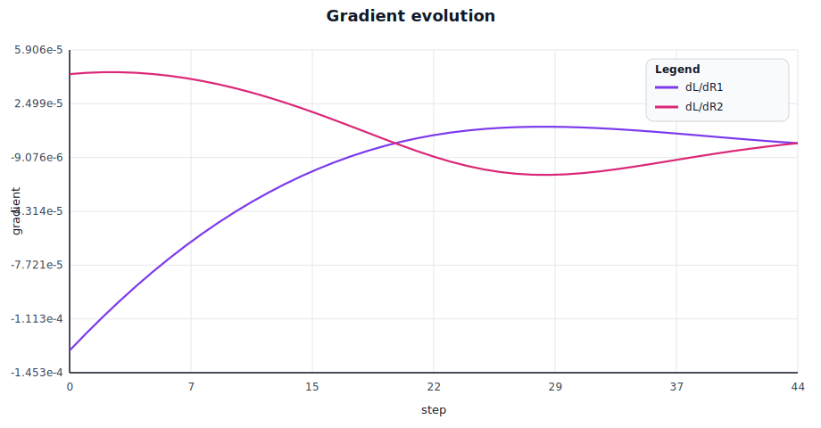

# rlx-eda single-circuit ML optimization trace

Circuit: `RcDivider` (`spike-divider-block`)

Target: `Vin = 1.000`, `Vout* = 0.400`

Loss definition:

$$L = (V_{out} - V_{target})^2$$

Gradient-driven parameter updates:

$$R_1 \leftarrow R_1 - \eta \frac{\partial L}{\partial R_1}, \quad R_2 \leftarrow R_2 - \eta \frac{\partial L}{\partial R_2}$$

## Optimization outcome

- initial: `R1=1000.000 ohm`, `R2=3000.000 ohm`, `Vout=0.750000`, `loss=1.225e-1`
- final: `R1=2482.341 ohm`, `R2=1654.907 ohm`, `Vout=0.400002`, `loss=3.753e-12`, `steps=44`

## Rendered charts

| Loss and objective | Parameter evolution |
| --- | --- |
|  |  |

| Output and error | Gradient signals |
| --- | --- |
|  |  |

## Chart grid

| Row | Left panel | Right panel |
| --- | --- | --- |
| 1 | A. Loss over steps | B. Parameter trajectory |
| 2 | C. Output tracking vs target | D. Gradient evolution |

### A) Loss over steps (sampled)

Optimization loss $L = (V_{out} - V_{target})^2$ decreases from 0.1225 to 3.75×10⁻¹² over 44 steps, demonstrating rapid convergence of the gradient descent process.

### B) Parameter trajectory (sampled)

Resistor values evolve under gradient guidance: **R1** increases from 1000 Ω to 2482 Ω, while **R2** decreases from 3000 Ω to 1655 Ω, balancing the voltage divider to reach the target output.

### C) Output tracking vs target (sampled)

Circuit output **Vout** smoothly converges to the target value of 0.400 V, with signed error diminishing from +0.350 V to ~0 V by step 44. The trajectory shows smooth, near-monotonic convergence.

### D) Gradient evolution (sampled)

Gradient signals $\partial L / \partial R_1$ and $\partial L / \partial R_2$ drive parameter updates via reverse-mode autodiff. Both gradients decay toward zero as the optimizer reaches the target, indicating convergence at the loss minimum.

## Step-by-step trace (all steps)

| step | R1 (ohm) | R2 (ohm) | Vout | loss | dL/dR1 | dL/dR2 |
| --- | --- | --- | --- | --- | --- | --- |
| 0 | 1000.000000 | 3000.000000 | 0.75000000 | 1.22499995e-1 | -1.31249995e-4 | 4.37499984e-5 |
| 1 | 1079.993896 | 2920.018311 | 0.73000234 | 1.08901545e-1 | -1.20450874e-4 | 4.45497863e-5 |
| 2 | 1159.734985 | 2840.002197 | 0.71004719 | 9.61292535e-2 | -1.10081295e-4 | 4.49524814e-5 |
| 3 | 1239.036987 | 2759.951172 | 0.69016236 | 8.41941908e-2 | -1.00154903e-4 | 4.49629806e-5 |
| 4 | 1317.701660 | 2679.881836 | 0.67037547 | 7.31028914e-2 | -9.06813220e-5 | 4.45881305e-5 |
| 5 | 1395.518311 | 2599.831299 | 0.65071434 | 6.28576726e-2 | -8.16666507e-5 | 4.38364295e-5 |
| 6 | 1472.266357 | 2519.857666 | 0.63120729 | 5.34568056e-2 | -7.31138207e-5 | 4.27178893e-5 |
| 7 | 1547.717163 | 2440.041260 | 0.61188293 | 4.48943712e-2 | -6.50227666e-5 | 4.12439113e-5 |
| 8 | 1621.636353 | 2360.487305 | 0.59277099 | 3.71606536e-2 | -5.73910111e-5 | 3.94271738e-5 |
| 9 | 1693.785645 | 2281.329346 | 0.57390273 | 3.02421562e-2 | -5.02140174e-5 | 3.72816721e-5 |
| 10 | 1763.926758 | 2202.731689 | 0.55531168 | 2.41217166e-2 | -4.34856629e-5 | 3.48229078e-5 |
| 11 | 1831.823364 | 2124.893555 | 0.53703451 | 1.87784564e-2 | -3.71986498e-5 | 3.20681247e-5 |
| 12 | 1897.245972 | 2048.052979 | 0.51911223 | 1.41877215e-2 | -3.13449564e-5 | 2.90368953e-5 |
| 13 | 1959.974731 | 1972.491821 | 0.50159150 | 1.03208320e-2 | -2.59162698e-5 | 2.57518113e-5 |
| 14 | 2019.803467 | 1898.540283 | 0.48452622 | 7.14468025e-3 | -2.09043246e-5 | 2.22395211e-5 |
| 15 | 2076.543457 | 1826.580811 | 0.46797916 | 4.62116580e-3 | -1.63012119e-5 | 1.85319914e-5 |
| 16 | 2130.027832 | 1757.050659 | 0.45202345 | 2.70643830e-3 | -1.20994800e-5 | 1.46678931e-5 |
| 17 | 2180.114258 | 1690.442139 | 0.43674397 | 1.35011924e-3 | -8.29219607e-6 | 1.06942061e-5 |
| 18 | 2226.688721 | 1627.298462 | 0.42223763 | 4.94512147e-4 | -4.87264879e-6 | 6.66741471e-6 |
| 19 | 2269.668213 | 1568.202637 | 0.40861267 | 7.41779586e-5 | -1.83395593e-6 | 2.65429435e-6 |
| 20 | 2309.002930 | 1513.759521 | 0.39598575 | 1.61142325e-5 | 8.31643206e-7 | -1.26854150e-6 |
| 21 | 2344.677490 | 1464.568481 | 0.38447726 | 2.40955706e-4 | 3.13350392e-6 | -5.01653267e-6 |
| 22 | 2376.711426 | 1421.188599 | 0.37420380 | 6.65444182e-4 | 5.08335597e-6 | -8.50110155e-6 |
| 23 | 2405.158691 | 1384.098267 | 0.36526906 | 1.20623829e-3 | 6.69584506e-6 | -1.16354222e-5 |
| 24 | 2430.106201 | 1353.656982 | 0.35775414 | 1.78471312e-3 | 7.98867859e-6 | -1.43414009e-5 |
| 25 | 2451.671387 | 1330.073364 | 0.35170892 | 2.33202917e-3 | 8.98231337e-6 | -1.65567399e-5 |
| 26 | 2469.999023 | 1313.387085 | 0.34714592 | 2.79355492e-3 | 9.69929079e-6 | -1.82408075e-5 |
| 27 | 2485.257324 | 1303.466309 | 0.34403837 | 3.13170510e-3 | 1.01632913e-5 | -1.93778651e-5 |
| 28 | 2497.634766 | 1300.020142 | 0.34232184 | 3.32677038e-3 | 1.03982566e-5 | -1.99774186e-5 |
| 29 | 2507.335205 | 1302.622803 | 0.34189951 | 3.37566715e-3 | 1.04276896e-5 | -2.00715931e-5 |
| 30 | 2514.575195 | 1310.742554 | 0.34264931 | 3.28910234e-3 | 1.02742715e-5 | -1.97105292e-5 |
| 31 | 2519.579590 | 1323.772705 | 0.34443179 | 3.08782677e-3 | 9.95977462e-6 | -1.89567618e-5 |
| 32 | 2522.578857 | 1341.059937 | 0.34709767 | 2.79865763e-3 | 9.50517369e-6 | -1.78795526e-5 |
| 33 | 2523.806396 | 1361.928345 | 0.35049441 | 2.45080353e-3 | 8.93083779e-6 | -1.65498459e-5 |
| 34 | 2523.495117 | 1385.699585 | 0.35447186 | 2.07281183e-3 | 8.25665938e-6 | -1.50361911e-5 |
| 35 | 2521.875244 | 1411.708252 | 0.35888606 | 1.69035629e-3 | 7.50217760e-6 | -1.34018865e-5 |
| 36 | 2519.172363 | 1439.313965 | 0.36360210 | 1.32480741e-3 | 6.68657322e-6 | -1.17032369e-5 |
| 37 | 2515.604736 | 1467.911377 | 0.36849642 | 9.92476009e-4 | 5.82849862e-6 | -9.98847645e-6 |
| 38 | 2511.381104 | 1496.936890 | 0.37345764 | 7.04497157e-4 | 4.94593951e-6 | -8.29770397e-6 |
| 39 | 2506.699219 | 1525.874390 | 0.37838721 | 4.67112841e-4 | 4.05597302e-6 | -6.66313326e-6 |
| 40 | 2501.743652 | 1554.259521 | 0.38319978 | 2.82247551e-4 | 3.17447598e-6 | -5.10965219e-6 |
| 41 | 2496.684326 | 1581.681885 | 0.38782242 | 1.48293620e-4 | 2.31599643e-6 | -3.65579990e-6 |
| 42 | 2491.675537 | 1607.787109 | 0.39219457 | 6.09248455e-5 | 1.49348830e-6 | -2.31454078e-6 |
| 43 | 2486.854492 | 1632.276489 | 0.39626721 | 1.39337999e-5 | 7.18203182e-7 | -1.09421819e-6 |
| 44 | 2482.340576 | 1654.907104 | 0.40000194 | 3.75255382e-12 | -3.74579534e-10 | 5.61864721e-10 |
