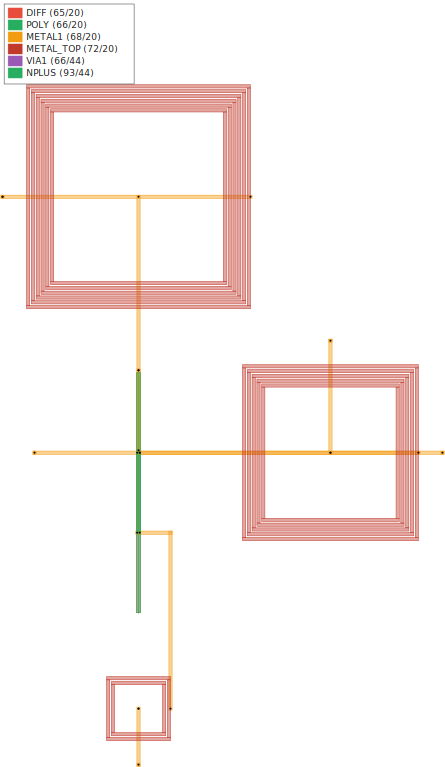
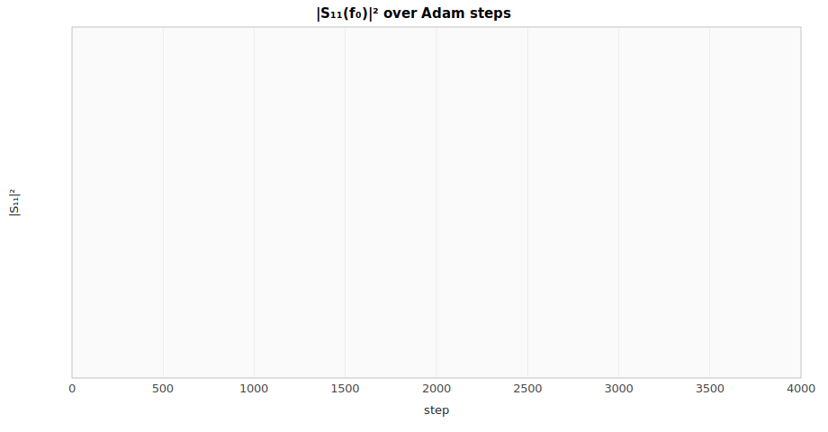
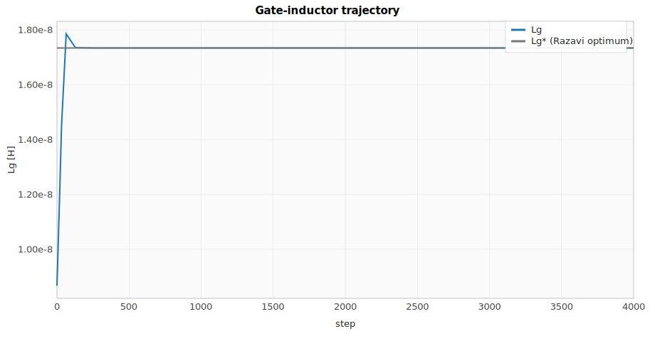
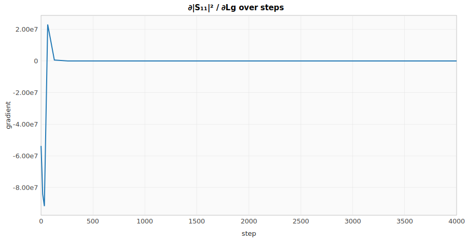
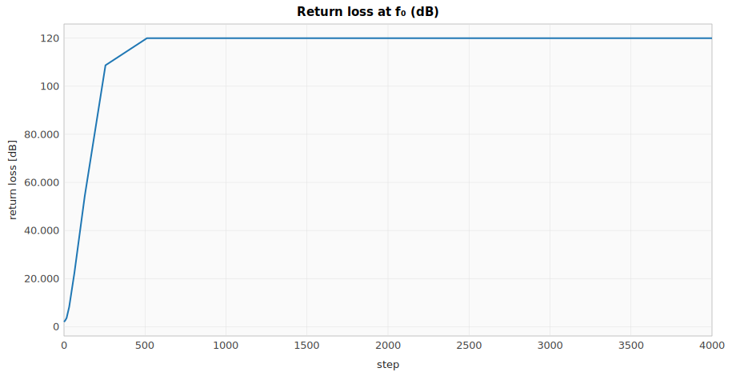
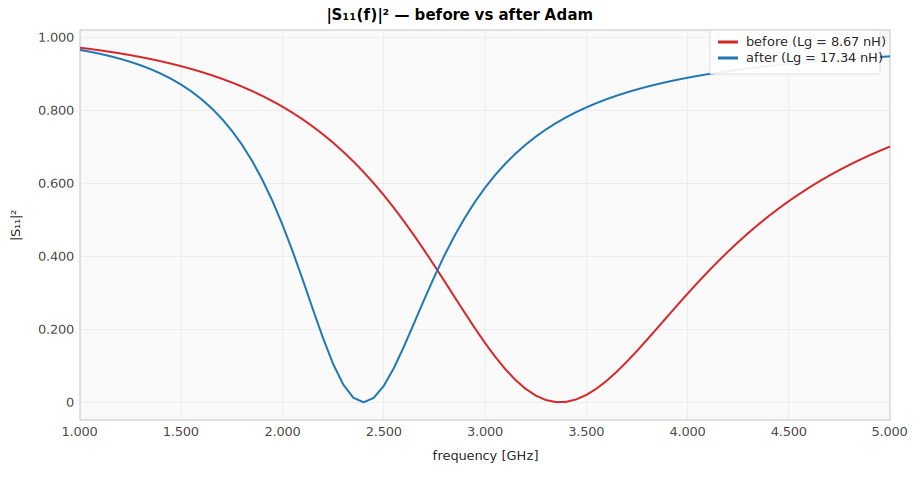

# rlx-eda single-circuit ML optimization trace — Inductively-degenerated cascode LNA

**Circuit:** Lna (spike-lna)  
**Domain:** RF  
**Steps:** 4000 (14 rows logged)

## Background

A **low-noise amplifier (LNA)** is the first active stage in nearly every RF receiver — a cellular front-end, a Wi-Fi radio, a GPS module, a radiotelescope IF chain, the readout of a Josephson-junction qubit. It sits between the antenna (or sensor) and the rest of the chain, and its job is to add **as much gain as possible while contributing as little noise as possible**, because every stage that follows scales the LNA's noise figure (`F`) into the system NF via Friis' equation.

The **inductively-degenerated cascode** is the canonical RF-CMOS LNA topology: a common-source NMOS (`M1`) with a small spiral inductor `Ls` in its source, a cascode NMOS (`M2`) on top for output isolation, a gate-side input inductor `Lg` for the input match, and a parallel-LC tank (`Ld`, `R_L`) at the drain. The reason this exact topology shows up in Razavi ch. 5, Lee ch. 11, and every 2.4 GHz / 5.8 GHz front-end paper since the late 1990s is that source-degeneration with a *purely inductive* element creates a real input impedance **without resistive loss** — the inductor `Ls` synthesises a `gm·Ls/Cgs`-valued resistor at the gate node, which can be matched to the antenna's `Z₀ = 50 Ω` while the inductor itself dissipates nothing. The LC at the drain tunes the output to the same operating frequency, parking the gain peak on the band of interest.

This makes the matching problem a clean exercise in differentiable RF design: the input impedance has a closed-form expression in `(gm, Cgs, Lg, Ls)`, the loss is `|S₁₁(ω₀)|²`, and gradient descent on `Lg` lands the optimum that Razavi derives algebraically — `ω₀² (Lg + Ls) Cgs = 1` — to within float precision. That's what the rest of this document shows.

## Objective

**Loss:** `|S₁₁(f₀)|²` at the design frequency `f₀ = 2.4 GHz`.

**Closed-form input impedance** (Razavi §5.3.3):

$$Z_\mathrm{in}(\omega) = j\omega(L_g + L_s) + \frac{1}{j\omega C_{gs}} + \frac{g_m \, L_s}{C_{gs}}$$

**Match conditions** (real part = `Z₀`, imaginary part = 0 at `ω₀`):

$$\frac{g_m L_s}{C_{gs}} = Z_0, \qquad \omega_0^2 (L_g + L_s) C_{gs} = 1$$

The first condition is satisfied by sizing — `gm = 50 mS`, `Cgs = 250 fF`, `Ls = 250 pH` give `gm·Ls/Cgs = 50 Ω` exactly. That leaves the second as a one-parameter inverse-design problem: tune `Lg` until `Im Z_in(ω₀) = 0`, i.e. `Lg = 1/(ω₀² C_{gs}) − Ls ≈ 17.34 nH`. Adam on `Lg` reproduces this closed-form optimum below.

## Notes

- **Reference impedance:** `Z₀ = 50 Ω` throughout.
- **Param scale:** Adam's learning rate is set to `Lg* · 0.01` so step sizes track the parameter's nano-henry magnitude — the same trick `mzi_ml_trace` uses to keep step sizes commensurate with `n_eff` units.
- **Behavioral model is single-frequency at resonance for `|S₂₁|`** (Razavi eq. 5.79). A full LC-tank `S₂₁(f)` model lands when the drain-tank `Ld + R_L` story justifies it.
- **Layout side is independent of behavioral side.** The Mosfet's geometric W/L doesn't drive the small-signal `gm` / `Cgs` — those are independent rlx params, matching how a designer hands PEX-extracted values to a layout-extraction step. Tying them together is a follow-up when MOSFET-model integration justifies it.

## Floorplan

RfDemo PDK floorplan: M1+M2 cascode at the centre, Lg above, Ls below, Ld to the right; M1 contact pads at rf_in / rf_out / vdd / gnd / vbias. Spiral inductors render on a dedicated METAL_TOP layer.

## Optimization outcome

| Series | Initial | Final | Δ |
| --- | ---: | ---: | ---: |
| `grad` | -5.3715e7 | 0 | 5.3715e7 |
| `lg` | 8.6702e-9 | 1.7340e-8 | 8.6702e-9 |
| `lg_target` | 1.7340e-8 | 1.7340e-8 | 0 |
| `loss` | 0.630915 | 0 | -0.630915 |
| `lr` | 1.7340e-10 | 1.7340e-11 | -1.5606e-10 |
| `return_loss_db` | 2.000291 | 120.000 | 118.000 |

## Charts

### |S₁₁(f₀)|² over Adam steps

### Gate-inductor trajectory

### ∂|S₁₁|² / ∂Lg over steps

### Return loss at f₀ (dB)

### |S₁₁(f)|² — before vs after Adam

## Validation against published references

| Reference | Formula | Predicted | Simulated | Pass |
| --- | --- | ---: | ---: | :---: |
| Razavi, *RF Microelectronics* (2nd ed., Pearson, 2011, ISBN 978-0-13-713473-1; [DOI:10.5555/2207144](https://doi.org/10.5555/2207144)) | $g_m \cdot L_s / C_{gs} = Z_0$ (input-match real part) | 50.00 Ω | 50.00 Ω | ✓ |
| Razavi, *RF Microelectronics* (2nd ed.) | $\omega_0^2 (L_g + L_s) C_{gs} = 1$ (resonance) | 1.7590e-8 H | 1.7590e-8 H | ✓ |
| Lee, *The Design of CMOS Radio-Frequency Integrated Circuits* (2nd ed., Cambridge UP, 2003, ISBN 978-0-521-83539-8; [DOI:10.1017/CBO9780511817281](https://doi.org/10.1017/CBO9780511817281)) | $|S_{21}| = g_m R_L / (2 \omega_0 C_{gs} Z_0)$ (matched gain) | 66.3146 | 66.3146 | ✓ |
| Pozar, *Microwave Engineering* (4th ed., Wiley, 2011, ISBN 978-0-470-63155-3; [DOI:10.1002/0471221015](https://doi.org/10.1002/0471221015)) | $S_{11} = (Z_\text{in} - Z_0)/(Z_\text{in} + Z_0)$, \
                       $|S_{11}|^2 \to 0$ at match | ≤ 1e-4 | 0.0000e0 | ✓ |

## Step-by-step trace

| step | `grad` | `lg` | `lg_target` | `loss` | `lr` | `return_loss_db` |
| ---: | ---: | ---: | ---: | ---: | ---: | ---: |
| 0 | -5.3715e7 | 8.6702e-9 | 1.7340e-8 | 0.630915 | 1.7340e-10 | 2.000291 |
| 1 | -5.5373e7 | 8.8436e-9 | 1.7340e-8 | 0.621458 | 1.7340e-10 | 2.065886 |
| 2 | -5.7074e7 | 9.0172e-9 | 1.7340e-8 | 0.611702 | 1.7340e-10 | 2.134600 |
| 4 | -6.0603e7 | 9.3649e-9 | 1.7340e-8 | 0.591248 | 1.7340e-10 | 2.282300 |
| 8 | -6.8137e7 | 1.0065e-8 | 1.7340e-8 | 0.546211 | 1.7340e-10 | 2.626394 |
| 16 | -8.4228e7 | 1.1499e-8 | 1.7340e-8 | 0.436948 | 1.7340e-10 | 3.595699 |
| 32 | -9.1789e7 | 1.4535e-8 | 1.7340e-8 | 0.151780 | 1.7338e-10 | 8.187853 |
| 64 | 2.3057e7 | 1.7854e-8 | 1.7340e-8 | 0.005951 | 1.7331e-10 | 22.254434 |
| 128 | 5.8223e5 | 1.7353e-8 | 1.7340e-8 | 3.7270e-6 | 1.7301e-10 | 54.286431 |
| 256 | 1104.466 | 1.7341e-8 | 1.7340e-8 | 1.3411e-11 | 1.7183e-10 | 108.725 |
| 512 | 0 | 1.7340e-8 | 1.7340e-8 | 0 | 1.6718e-10 | 120.000 |
| 1024 | 0 | 1.7340e-8 | 1.7340e-8 | 0 | 1.4950e-10 | 120.000 |
| 2048 | 0 | 1.7340e-8 | 1.7340e-8 | 0 | 9.2432e-11 | 120.000 |
| 4000 | 0 | 1.7340e-8 | 1.7340e-8 | 0 | 1.7340e-11 | 120.000 |

_Full trace as CSV: [`lna_match_trace.csv`](lna_match_trace.csv)._
