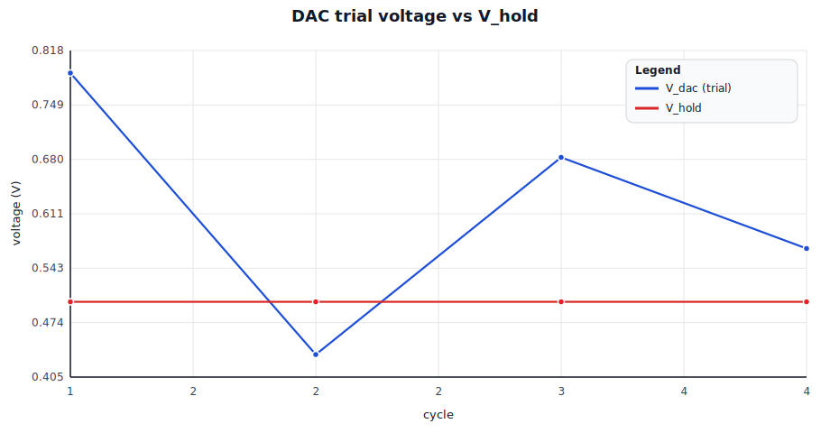
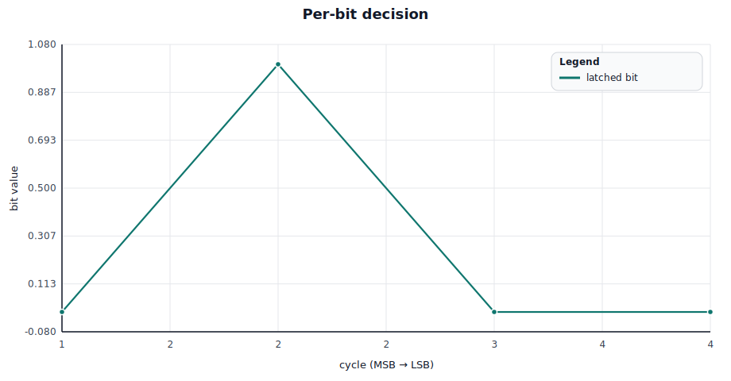
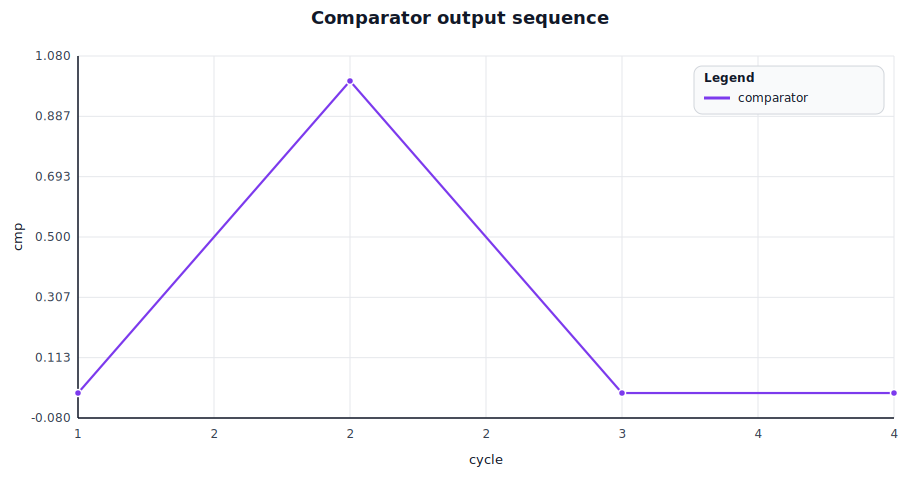
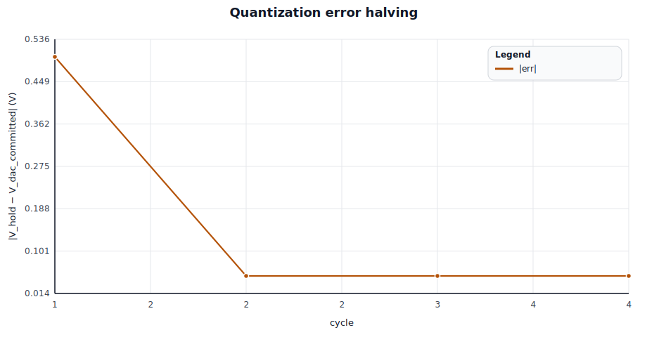
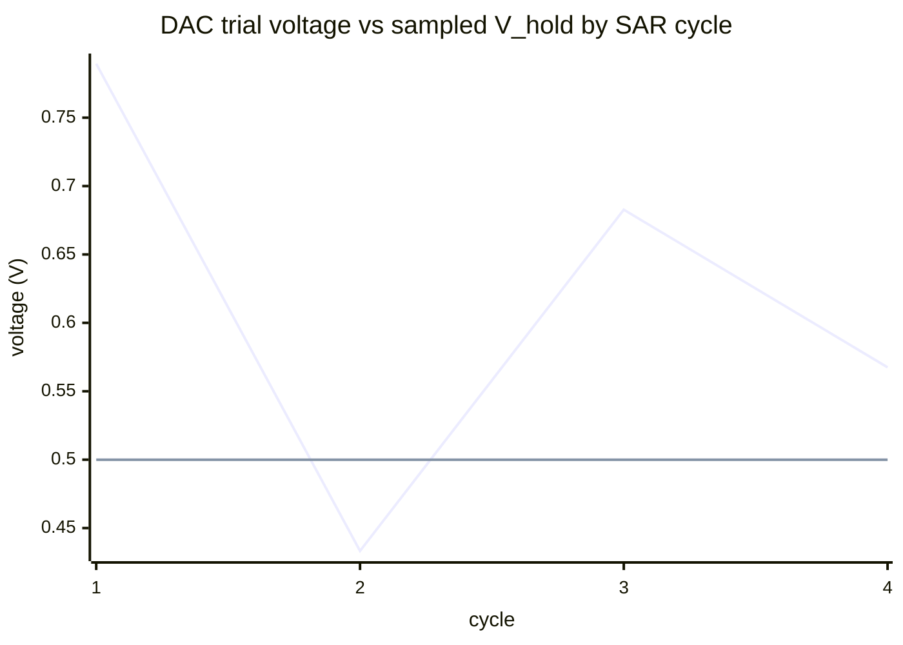
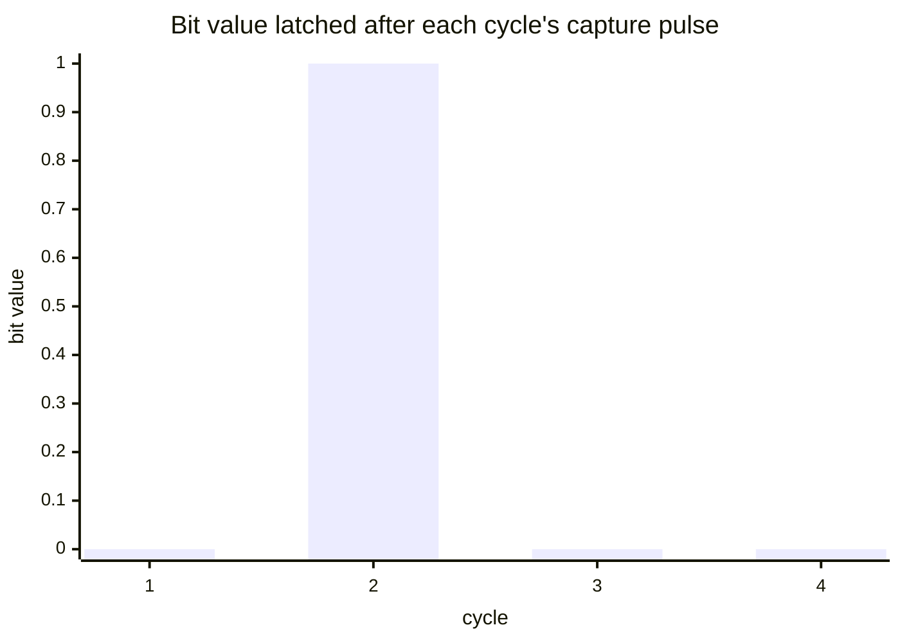
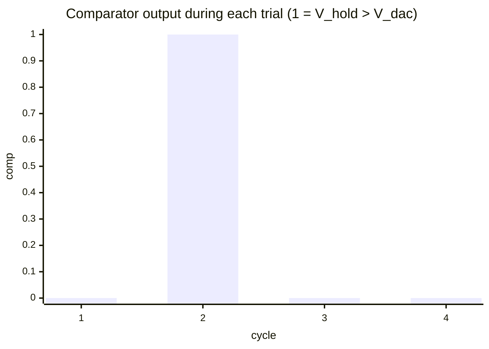
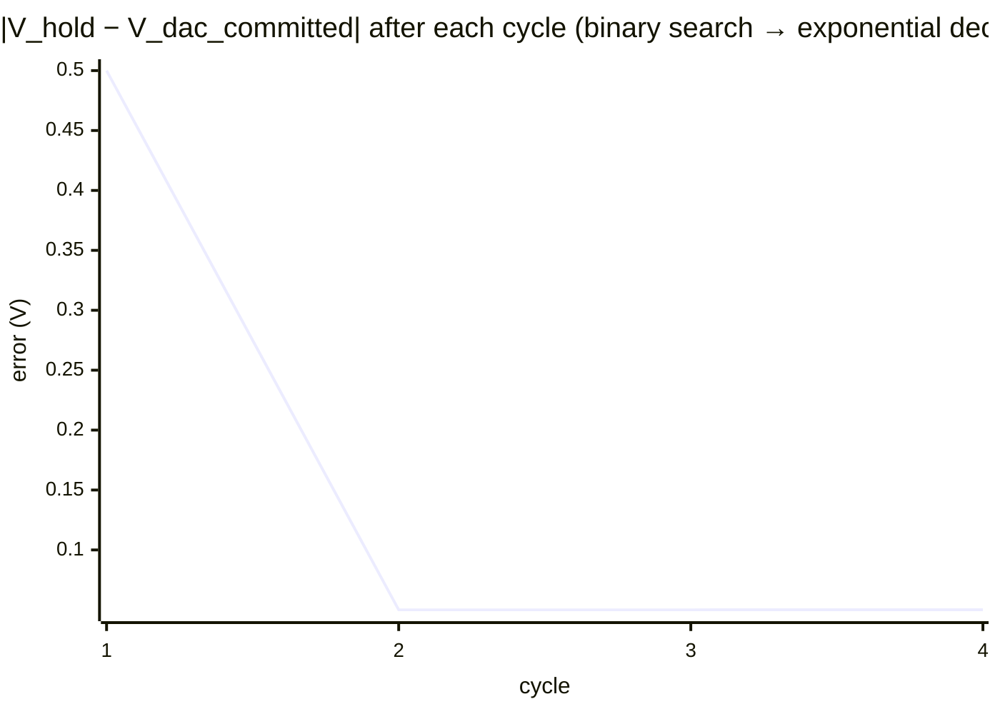

# rlx-eda single-conversion SAR ADC trace

Circuit: `SarAdc<4>` (`spike-sar-adc`) — Sample/Hold + SarRegister + R-2R DAC + behavioral Comparator.

Stimulus: `Vin = 0.500 V`, `Vref = 1.800 V`, N = 4 bits.

Algorithm:

$$\text{bit}_i \leftarrow \begin{cases} 1 & \text{if } V_{hold} > V_{dac}(\text{trial} = 1) \\ 0 & \text{otherwise} \end{cases}$$

Each cycle the SAR sets `bit_i = 1`, the DAC produces a trial voltage from the partial result, the comparator decides, and the capture pulse latches the decision. The trial bit walks from MSB down to LSB.

## Conversion outcome

- ngspice transient: code = 4 = `0b0100`
- analytic ideal  : code = 4 = `0b0100`
- match: ✅

## Rendered charts

| DAC trajectory & V_hold | Per-bit decisions |
| --- | --- |
|  |  |

| Comparator output | Quantization error |
| --- | --- |
|  |  |

## Chart grid

| Row | Left panel | Right panel |
| --- | --- | --- |
| 1 | A. DAC trial voltage vs V_hold | B. Per-bit decision (kept/cleared) |
| 2 | C. Comparator output by cycle | D. Quantization error halving |

## A) DAC trajectory (binary search)

Legend:

- line 1: `V_dac` trial value (with current bit set to 1)
- line 2: `V_hold` (sampled `V_in`) — the comparator's reference

## B) Per-bit decisions

Each bar is the latched decision for the bit being trialled in that cycle:

  - cycle 1: bit[3] = 0
  - cycle 2: bit[2] = 1
  - cycle 3: bit[1] = 0
  - cycle 4: bit[0] = 0

## C) Comparator output sequence

The comparator output drives each bit's latched value: `cmp = 1` keeps the trial bit, `cmp = 0` clears it.

## D) Quantization error halving

Binary search halves the residual at each cycle (in expectation). After N cycles the residual is bounded by 1 LSB = `Vref / 2^N`.

## Per-cycle trace

| cycle | bit | V_dac trial (V) | V_hold (V) | cmp (V) | bit value | err (V) |
| --- | --- | --- | --- | --- | --- | --- |
| 1 | bit[3] | 0.7894 | 0.5000 | 0.0000 | 0 | 0.5000 |
| 2 | bit[2] | 0.4333 | 0.5000 | 1.8000 | 1 | 0.0500 |
| 3 | bit[1] | 0.6827 | 0.5000 | 0.0000 | 0 | 0.0500 |
| 4 | bit[0] | 0.5675 | 0.5000 | 0.0000 | 0 | 0.0500 |
