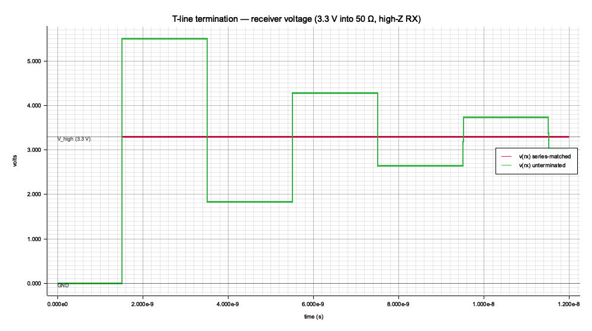
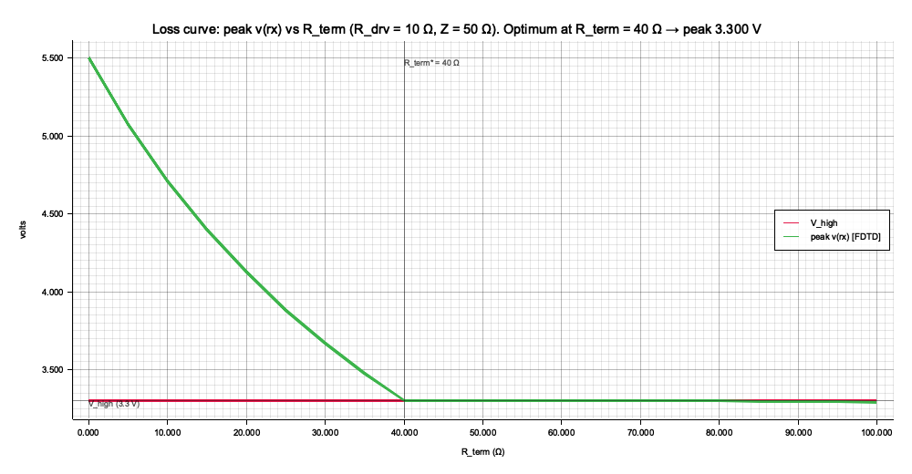

# spike-tline-termination — report

Driver (Thevenin V_s, R_drv = 10 Ω) → optional series R_term → 50 Ω lossless line, TD = 1 ns → high-Z receiver. Two cases studied: **unterminated** (R_term = 0) and **series-matched** (R_term = Z₀ − R_drv = 40 Ω).

## Headline numbers

| metric | unterminated | series-matched |
| --- | ---: | ---: |
| FDTD peak v(rx) | **5.500 V** (167% of V_high) | 3.300 V |
| FDTD trough v(rx) | 0.000 V (undershoot) | — |
| ngspice peak v(rx) | 5.500 V | — |
| optimal R_term (sweep min) | — | 40 Ω → peak 3.300 V |

## Theory: bounce diagram

With Γ_S = (R_s − Z₀)/(R_s + Z₀) and Γ_L = (R_L − Z₀)/(R_L + Z₀) and V_+ = V_s · Z₀/(R_s + Z₀), the receiver voltage at time `t = (2k+1)·TD` (k = 0, 1, 2, …) follows the geometric staircase

```
v_rx(t) = (1 + Γ_L) · V_+ · Σ_{j=0}^{k} (Γ_S · Γ_L)^j
```

For the unterminated case (R_drv = 10 Ω, Z₀ = 50 Ω, R_L = ∞): Γ_S = −2/3, Γ_L = +1, V_+ = (5/6)·V_s. First arrival at t = TD is **2·V_+ = (5/3)·V_s = 5.5 V** — exactly the peak in the LinkedIn screenshot. Long-time limit is V_s (the geometric series converges to it).

Series-matched (R_drv + R_term = Z₀): Γ_S = 0. First arrival at t = TD lands at V_s and stays there. No second front, no ringing.

## Validation pyramid

Three witnesses agree on the receiver voltage:

1. **Analytic** (closed-form bounce diagram, see `analytic_step_at` / `analytic_pulse_at` in `src/lib.rs`). Tested at characteristic times in `tests/analytic.rs`.
2. **FDTD** (discrete delay-line simulator with two queues of length N = TD/h, exact for a lossless line on an integer-h grid; see `fdtd_trace`). Cross-checked against the analytic on plateau midpoints in `tests/finite_difference.rs`.
3. **ngspice** (lossless `T` element). Cross-checked against the FDTD on plateau midpoints in `tests/ngspice.rs`. Backend is selected via `NGSPICE_BACKEND={local,docker}` matching the workspace convention from `spike-dado-sar::invoker_from_env`.

### Spot check (unterminated, all three engines)

| t [ns] | analytic [V] | FDTD [V] | ngspice [V] |
| ---: | ---: | ---: | ---: |
| 0.00 | 0.000 | 0.000 | 0.000 |
| 0.50 | 0.000 | 0.000 | 0.000 |
| 1.00 | 0.000 | 0.000 | 0.000 |
| 2.50 | 5.500 | 5.500 | 5.500 |
| 4.50 | 1.833 | 1.833 | 1.833 |
| 6.50 | 4.278 | 4.278 | 4.278 |
| 8.50 | 2.648 | 2.648 | 2.648 |
| 10.50 | 3.735 | 3.735 | 3.735 |

### Spot check (series-matched)

| t [ns] | analytic [V] | ngspice [V] |
| ---: | ---: | ---: |
| 0.00 | 0.000 | 0.000 |
| 0.50 | 0.000 | 0.000 |
| 1.00 | 0.000 | 0.000 |
| 2.00 | 3.300 | 3.300 |
| 3.00 | 3.300 | 3.300 |
| 5.00 | 3.300 | 3.300 |
| 7.00 | 3.300 | 3.300 |

## Plots



*Receiver voltage with the same 3.3 V step driving both topologies. Green-equivalent: unterminated (R_term = 0). Red-equivalent: series-matched (R_term = 40 Ω). Compare to the LinkedIn-quiz screenshot.*



*Loss curve: peak receiver voltage as a function of R_term. The minimum sits at R_term = Z₀ − R_drv = 40 Ω — exactly where Γ_S = 0 and the first reflection from the receiver gets absorbed at the source. Smaller R_term overshoots; larger R_term under-drives the line (but never overshoots).*

## Reproduction

```
cargo test  -p spike-tline-termination --features ngspice
cargo run   -p spike-tline-termination --features report --bin report
```

ngspice decks land at `docs/{unterminated,matched}.deck.spice`; binary raw at `docs/{unterminated,matched}.raw` (cicwave-readable).

## Floorplan / PDK note

This spike intentionally has **no floorplan, no PDK layout, no stdcell driver**. Transmission-line termination is a PCB-domain phenomenon: 50 Ω microstrip on FR-4. On-chip wires in sky130 are RC-dominated until many millimeters of length, at which point the relevant model is RLGC parasitic extraction — a different exercise. The right next step if you want a chip-domain analog is to take a long sky130 metal-N route, extract per-unit-length R/L/C from the metal stack via `eda-pdks`/`klayout-pdk`, plug those into the FDTD/T-element here, and ask: at what wire length does sky130 routing actually start ringing?

