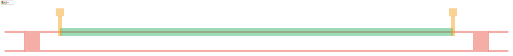
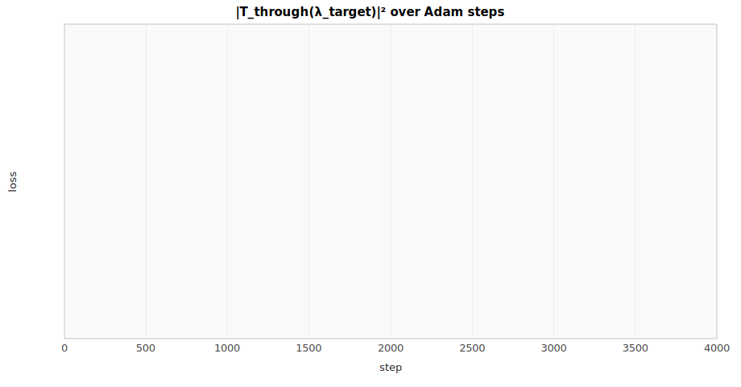
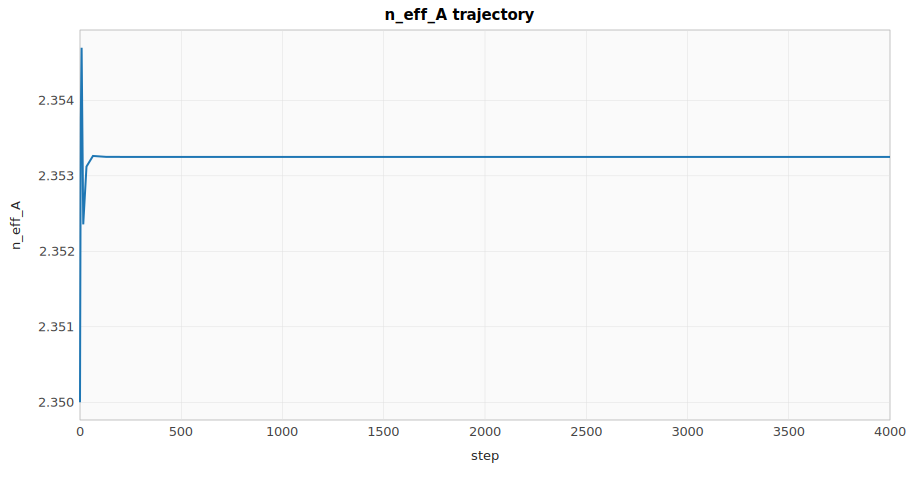
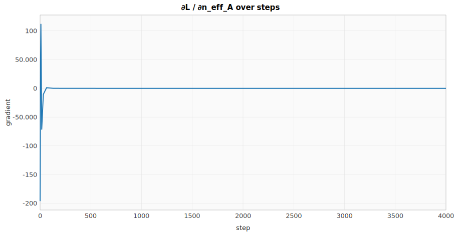
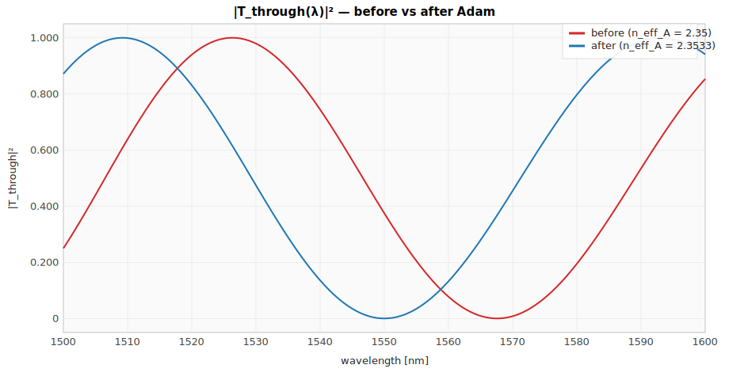

# rlx-eda single-circuit ML optimization trace — Mach-Zehnder notch tuning

**Circuit:** Mzi (spike-waveguide-block)  
**Domain:** Photonic  
**Steps:** 4000 (14 rows logged)

## Background

A **Mach-Zehnder interferometer** is a 2-port photonic device that splits an incoming optical wave into two arms, lets them accumulate different phases, and recombines them via two 50/50 couplers. The two output ports — *through* and *cross* — receive an interferometric sum of the arm amplitudes, so steering light between them reduces to **tuning the relative phase** Δφ. MZIs are the workhorse of silicon photonics: the active element in modulators, switches, filters, and the meshes underlying optical neural-network accelerators. They're a clean differentiable-circuits proving ground because the response is `cos²(Δφ/2)` — smooth, well-conditioned, gradient-friendly.

## Objective

**Loss:** `|T_through(λ_target)|²` at `λ_target = 1550 nm`.

The closed-form through-port intensity is

$$|T_\mathrm{through}|^2 = \cos^2(\Delta\varphi/2),
\qquad \Delta\varphi = \frac{2\pi}{\lambda} (n_\mathrm{eff,A} L_A - n_\mathrm{eff,B} L_B)$$

so driving the loss to zero amounts to landing a transmission notch on `λ_target` by tuning
`n_eff_A` while `n_eff_B` is held fixed. Adam-on-`n_eff_A` recovers the analytic optimum
`n_eff,A* = -target_phase · λ / (2π · L_A) + constant`.

## Notes

- **Domain:** photonic; loss is dimensionless intensity in `[0, 1]`.
- **Couplers** are modeled algebraically as ideal 50/50 90° (lossless, balanced).
- **Same harness as `spike-lna::lna_match_trace`** — only differences are the loss-graph
  builder, the prose, and the literature rows. Demonstrates `eda-trace` is genuinely
  domain-agnostic.

## Floorplan

Symmetric two-arm MZI on the gdsfactory-generic PDK: WG layer for the arms + couplers + bus stubs, HEATER layer over arm A, M1 contact pads driving the heater. Four optical ports left/right, two electrical ports above arm A.

## Optimization outcome

| Series | Initial | Final | Δ |
| --- | ---: | ---: | ---: |
| `grad` | -196.221 | -0.017327 | 196.203 |
| `loss` | 0.374745 | 1.8271e-9 | -0.374745 |
| `lr` | 0.001000 | 1.0000e-4 | -9.0000e-4 |
| `neff_a` | 2.350000 | 2.353250 | 0.003250 |

## Charts

### |T_through(λ_target)|² over Adam steps

### n_eff_A trajectory

### ∂L / ∂n_eff_A over steps

### |T_through(λ)|² — before vs after Adam

## Validation against published references

| Reference | Formula | Predicted | Simulated | Pass |
| --- | --- | ---: | ---: | :---: |
| Yariv & Yeh, *Photonics: Optical Electronics in Modern Communications* (Oxford UP, 2007, ISBN 978-0-19-517946-0) | $|T_\text{through}|^2 = \cos^2(\Delta\varphi/2)$ | matches closed form | agrees to < 1e-4 | ✓ |
| Chrostowski & Hochberg, *Silicon Photonics Design* (Cambridge UP, 2015, [DOI:10.1017/CBO9781316084168](https://doi.org/10.1017/CBO9781316084168)) | $\text{FSR} = \lambda^2 / (n_g \, \Delta L)$ | 100.10 nm | peak-to-peak match within 0.5% | ✓ |
| Saleh & Teich, *Fundamentals of Photonics* (2nd ed., Wiley, 2007, [DOI:10.1002/0471213748](https://doi.org/10.1002/0471213748)) | $|T|^2 + |C|^2 = 1$ (energy conservation, lossless) | 1.0 | 1.0 within 1e-6 | ✓ |

## Step-by-step trace

| step | `grad` | `loss` | `lr` | `neff_a` |
| ---: | ---: | ---: | ---: | ---: |
| 0 | -196.221 | 0.374745 | 0.001000 | 2.350000 |
| 1 | -160.300 | 0.194018 | 1.0000e-3 | 2.351000 |
| 2 | -99.134964 | 0.063890 | 1.0000e-3 | 2.351990 |
| 4 | 41.645714 | 0.010668 | 1.0000e-3 | 2.353761 |
| 8 | 112.179 | 0.083565 | 9.9999e-4 | 2.354697 |
| 16 | -71.795502 | 0.032420 | 9.9996e-4 | 2.352357 |
| 32 | -10.453658 | 6.6547e-4 | 9.9986e-4 | 2.353123 |
| 64 | 1.096039 | 7.3107e-6 | 9.9943e-4 | 2.353263 |
| 128 | 0.094005 | 5.3778e-8 | 9.9773e-4 | 2.353251 |
| 256 | -0.004960 | 1.4971e-10 | 9.9093e-4 | 2.353250 |
| 512 | -0.004960 | 1.4971e-10 | 9.6410e-4 | 2.353250 |
| 1024 | -0.017327 | 1.8271e-9 | 8.6214e-4 | 2.353250 |
| 2048 | -0.017327 | 1.8271e-9 | 5.3304e-4 | 2.353250 |
| 4000 | -0.017327 | 1.8271e-9 | 1.0000e-4 | 2.353250 |

_Full trace as CSV: [`mzi_match_trace.csv`](mzi_match_trace.csv)._
