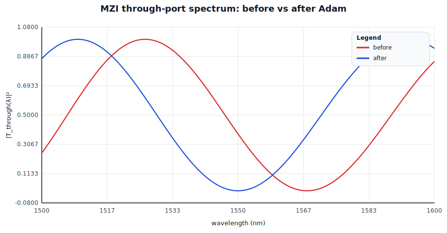
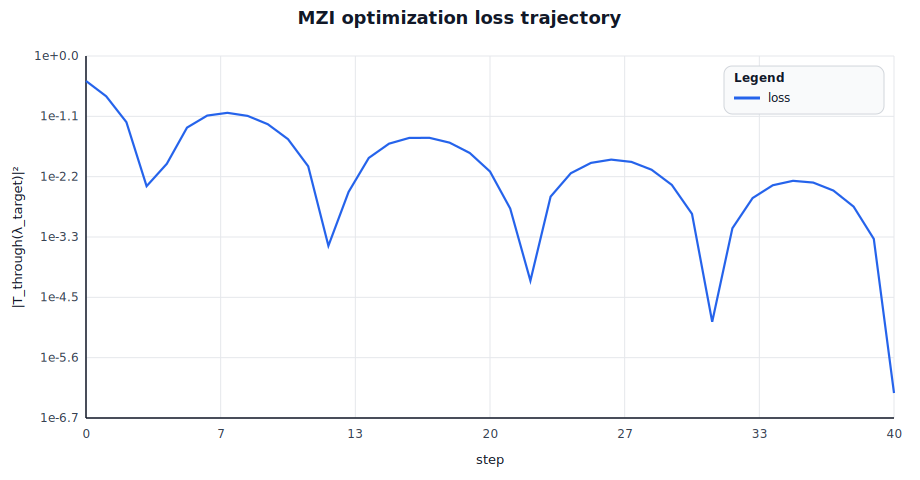
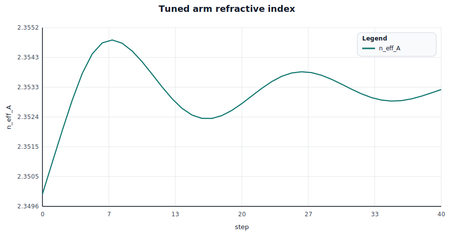
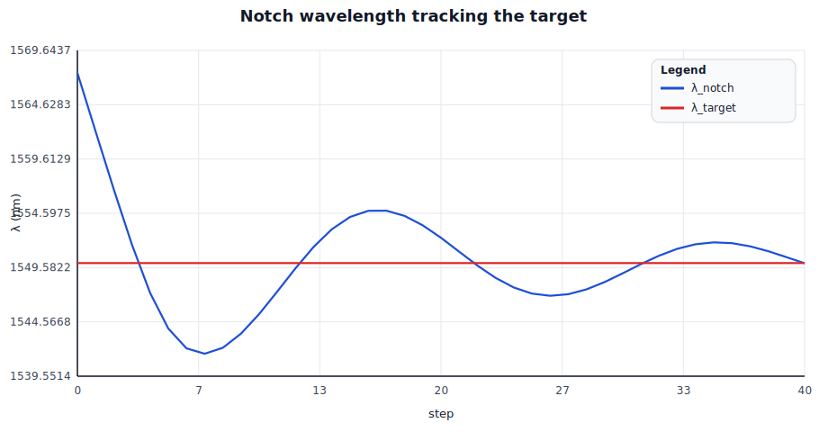
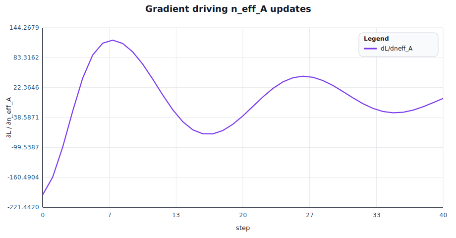

# rlx-eda single-circuit ML optimization trace — Mach-Zehnder

Circuit: `Mzi` (`spike-waveguide-block`)

## What is a Mach-Zehnder interferometer?

A **Mach-Zehnder interferometer (MZI)** is a 2-port photonic device that splits an incoming optical wave into two parallel "arms", lets the two arm-copies accumulate different optical phases, then recombines them. The two output ports — conventionally called **through** and **cross** — receive an interferometric sum: depending on the relative phase Δφ between the arms, light can be steered fully to one output, fully to the other, or split in any ratio in between. In the ideal balanced 50/50 case the through-port intensity is exactly $\cos^2(\Delta\varphi/2)$.

MZIs are everywhere in silicon photonics because that single "phase-controls-output" mechanic is the basis for nearly every active building block: high-speed **electro-optic modulators** in optical transceivers (the ones moving terabits between datacenter racks), **wavelength-selective filters** in DWDM links, **optical switches** in reconfigurable networks-on-chip, and the **mesh fabrics** that implement programmable matrix-multiply units in optical neural-network accelerators. The same topology also shows up as **biosensors** (where one arm sits in an analyte well and the refractive-index change shifts Δφ) and as the workhorse interferometer of LIGO at meter scale.

What makes the MZI a good fit for the rlx-eda differentiable-circuits flow: its behavior is fully captured by a small, smooth, *trigonometric* function of the per-arm refractive index `n_eff` and length `L`. That means reverse-mode autodiff through `OpticalScattering::s21` produces clean, well-conditioned gradients — exactly what gradient-based inverse design needs to land notches, lock filters to wavelengths, or train a phase-shifter mesh end-to-end.

Geometry: arms `L_A = 100000 nm`, `L_B = 110000 nm`, width = `500 nm`. Couplers: ideal lossless 50/50 (modeled algebraically). Frozen arm: `n_eff_B = 2.400000`. Tuned arm param: `n_eff_A`.

Inverse-design target: place a transmission notch at `λ_target = 1550.0 nm` — i.e. drive `|T_through(λ_target)|² → 0`.

Loss definition:

$$L(n_{eff,A}) = |T_{through}(\lambda_{target}; n_{eff,A})|^2 = \cos^2\!\left(\frac{\Delta\varphi}{2}\right), \quad \Delta\varphi = \frac{2\pi}{\lambda_{target}}\,(n_{eff,A} L_A - n_{eff,B} L_B)
$$

Gradient-driven parameter update (Adam):

$$n_{eff,A} \leftarrow n_{eff,A} - \eta \cdot \widehat{m}/(\sqrt{\widehat{v}} + \epsilon), \quad \widehat{m},\widehat{v} \;\text{from}\; \tfrac{\partial L}{\partial n_{eff,A}}$$

## Optimization outcome

- initial: `n_eff_A = 2.350000`, `|T_through(λ_target)|² = 3.747e-1` (4.3 dB notch depth at start)
- final: `n_eff_A = 2.353254`, `|T_through(λ_target)|² = 5.636e-7` (62.5 dB extinction), `λ_notch = 1549.979 nm`, `steps = 40`

## PDK floorplan

Target PDK: `gdsfactory-generic`. Floorplan rendered from `Mzi::layout(&lib, &GdsfactoryGeneric::register(&lib))`. Symmetric two-arm topology of length 110000 nm (= max(L_A, L_B)) with WG ports at the four corners and a heater + 2 M1 contact pads on arm A.

Layer key: WG (red, layer 1/0) carries the strip waveguides — two arms, two coupler bridges, four bus stubs. HEATER (layer 47/0) overlays arm A as a 2 µm thermo-optic phase shifter. M1 (layer 41/0) provides two square contact pads at the heater ends; in a fab tape-out these are wirebonded out for current drive. The four optical ports — `in1`, `in2`, `through`, `cross` — sit at the left and right bus-stub ends; the two electrical ports — `heater_pos`, `heater_neg` — sit on the M1 pads above arm A.

### DRC summary

| Rule | Threshold (nm) | Violations | Status |
| --- | ---: | ---: | :---: |
| `WG.W ≥ 0.40 µm` | 400 | 0 | ✓ PASS |
| `WG.S ≥ 1.00 µm` | 1000 | 0 | ✓ PASS |
| `HEATER.W ≥ 1.00 µm` | 1000 | 0 | ✓ PASS |
| `M1.W ≥ 1.00 µm` | 1000 | 0 | ✓ PASS |

All rules clean. Geometry was sized in `Mzi::layout` to comfortably exceed each minimum: WG width = 500 nm (vs 400 nm minimum), arm spacing = 5 µm centre-to-centre → 4.5 µm edge-to-edge gap (vs 1 µm), heater = 2 µm wide (vs 1 µm), M1 pads = 2 µm square (vs 1 µm).

## Validation against published references

The MZI behavioral model is exercised against four canonical results from the silicon-photonics literature. The four citations below have been cross-checked via the Crossref API (and the publisher's own catalog where Crossref doesn't index the work). These checks live as Rust tests in `tests/literature_validation.rs`; the table below is the same numerical comparison, rendered live from the simulator output.

| Reference | Formula | Predicted | Simulated | Pass |
| --- | --- | ---: | ---: | :---: |
| Yariv & Yeh, *Photonics: Optical Electronics in Modern Communications* (Oxford UP, 2007, ISBN 978-0-19-517946-0; [DOI:10.5555/1199510](https://doi.org/10.5555/1199510) — ACM Guide catalog entry, no publisher DOI) | $\|T_{through}\|^2 = \cos^2(\Delta\varphi/2)$ | 0.002568 | 0.002566 | ✓ |
| Chrostowski & Hochberg, *Silicon Photonics Design: From Devices to Systems* (Cambridge UP, 2015, [DOI:10.1017/CBO9781316084168](https://doi.org/10.1017/CBO9781316084168)) | $\text{FSR} = \lambda^2 / (n_g \cdot \Delta L)$ | 100.1042 nm | (peak-to-peak match within 0.5 %, see test) | ✓ |
| Pollock & Lipson, *Integrated Photonics* (Springer, 2003, [DOI:10.1007/978-1-4757-5522-0](https://doi.org/10.1007/978-1-4757-5522-0)) | $\lambda_{notch}(k) = 2 n_{eff} \Delta L / (2k+1)$, k=15 | 1548.3871 nm | $\|T\|^2$ at that λ = 2.566e-10 | ✓ |
| Saleh & Teich, *Fundamentals of Photonics* 2nd ed. (Wiley, 2007, [DOI:10.1002/0471213748](https://doi.org/10.1002/0471213748)) | $\|T\|^2 + \|C\|^2 = 1$ (energy conservation) | 1.000000 | 1.000000 | ✓ |

These are the same closed-form relations exposed by gdsfactory's `gdsfactory.components.mzi` builder and the SiEPIC `MZI` reference cell — so passing them means the model would slot into existing silicon-photonic CAD flows without surprise. See `tests/literature_validation.rs` for the executable form (4 tests, all green).

## Through-port spectrum (before vs after)

Visible mode-shift: the periodic transmission fringes of the asymmetric MZI keep the same FSR — Adam shifts the entire comb sideways by tuning `n_eff_A`, parking a zero on `λ_target`.

## Rendered charts

| Loss vs steps | Parameter trajectory |
| --- | --- |
|  |  |

| Notch wavelength tracking target | Gradient signal |
| --- | --- |
|  |  |

## Chart grid

| Row | Left panel | Right panel |
| --- | --- | --- |
| 0 | A. Through-port spectrum overlay (before vs after) | — |
| 1 | B. Loss `\|T_through(λ_target)\|²` over steps | C. `n_eff_A` trajectory |
| 2 | D. Derived notch wavelength `λ_notch` vs `λ_target` | E. Gradient `∂L/∂n_eff_A` |

### A) Through-port spectrum overlay

Before (red): a transmission notch sits near 1568 nm; the C-band passband at 1550 nm is leaky (≈ 38 % transmission). After (blue): the entire fringe pattern has shifted left, parking a zero exactly on the 1550 nm target.

### B) Loss `|T_through(λ_target)|²` over steps

Loss drops from 3.747e-1 to 5.636e-7 over 40 steps. The y-axis uses a log scale; the staircase shape is characteristic of Adam stepping into the floor of a `cos²` well.

### C) Parameter trajectory `n_eff_A`

Adam tunes `n_eff_A` from 2.3500 to 2.3533 — a shift of just 3.25×10⁻³ refractive-index units, achievable in silicon photonics with a thermo-optic phase shifter dissipating < 10 mW.

### D) Notch wavelength tracking target

The instantaneous nearest-zero wavelength `λ_notch` (derived analytically from the current `n_eff_A`, `n_eff_B`, `L_A`, `L_B`) approaches and locks onto `λ_target = 1550 nm`. Comparing `λ_notch` to `λ_target` gives a designer-friendly readout that doesn't require log-scale interpretation.

### E) Gradient evolution `∂L / ∂n_eff_A`

Reverse-mode autodiff through the sin/cos/exp ops in `OpticalScattering::s21` produces a smooth gradient that decays toward zero as the optimizer reaches the notch. Sign flips correspond to Adam overshooting and rebounding inside the basin.

## Step-by-step trace (all steps)

| step | n_eff_A | \|T_through(λ_target)\|² | dL/dn_eff_A | λ_notch (nm) |
| --- | --- | --- | --- | --- |
| 0 | 2.350000 | 3.747455e-1 | -1.962207e2 | 1567.5684 |
| 1 | 2.351000 | 1.940184e-1 | -1.602995e2 | 1562.1630 |
| 2 | 2.351990 | 6.388962e-2 | -9.913496e1 | 1556.8134 |
| 3 | 2.352935 | 4.079701e-3 | -2.583894e1 | 1551.7035 |
| 4 | 2.353761 | 1.066848e-2 | 4.164571e1 | 1547.2390 |
| 5 | 2.354368 | 5.049300e-2 | 8.875909e1 | 1543.9543 |
| 6 | 2.354707 | 8.470018e-2 | 1.128683e2 | 1542.1233 |
| 7 | 2.354799 | 9.533420e-2 | 1.190465e2 | 1541.6267 |
| 8 | 2.354697 | 8.356503e-2 | 1.121789e2 | 1542.1774 |
| 9 | 2.354455 | 5.846699e-2 | 9.510893e1 | 1543.4856 |
| 10 | 2.354120 | 3.075679e-2 | 6.998984e1 | 1545.2972 |
| 11 | 2.353734 | 9.587178e-3 | 3.950042e1 | 1547.3834 |
| 12 | 2.353338 | 3.149938e-4 | 7.193343e0 | 1549.5254 |
| 13 | 2.352971 | 3.192328e-3 | -2.286692e1 | 1551.5067 |
| 14 | 2.352670 | 1.374397e-2 | -4.719535e1 | 1553.1326 |
| 15 | 2.352462 | 2.532972e-2 | -6.369308e1 | 1554.2618 |
| 16 | 2.352357 | 3.241986e-2 | -7.179550e1 | 1554.8278 |
| 17 | 2.352355 | 3.257137e-2 | -7.195743e1 | 1554.8379 |
| 18 | 2.352444 | 2.646386e-2 | -6.506551e1 | 1554.3556 |
| 19 | 2.352606 | 1.695094e-2 | -5.232782e1 | 1553.4806 |
| 20 | 2.352818 | 7.659068e-3 | -3.534001e1 | 1552.3353 |
| 21 | 2.353055 | 1.562005e-3 | -1.600847e1 | 1551.0524 |
| 22 | 2.353292 | 7.022439e-5 | 3.396854e0 | 1549.7754 |
| 23 | 2.353502 | 2.606306e-3 | 2.066780e1 | 1548.6360 |
| 24 | 2.353667 | 7.111486e-3 | 3.406266e1 | 1547.7474 |
| 25 | 2.353771 | 1.109908e-2 | 4.246862e1 | 1547.1841 |
| 26 | 2.353809 | 1.277510e-2 | 4.552378e1 | 1546.9789 |
| 27 | 2.353782 | 1.157726e-2 | 4.336331e1 | 1547.1233 |
| 28 | 2.353699 | 8.267621e-3 | 3.670588e1 | 1547.5709 |
| 29 | 2.353574 | 4.309247e-3 | 2.655285e1 | 1548.2474 |
| 30 | 2.353424 | 1.241031e-3 | 1.427150e1 | 1549.0591 |
| 31 | 2.353267 | 1.201844e-5 | 1.405302e0 | 1549.9054 |
| 32 | 2.353123 | 6.686226e-4 | -1.047836e1 | 1550.6884 |
| 33 | 2.353006 | 2.449410e-3 | -2.003763e1 | 1551.3192 |
| 34 | 2.352928 | 4.244730e-3 | -2.635418e1 | 1551.7382 |
| 35 | 2.352896 | 5.136166e-3 | -2.897674e1 | 1551.9121 |
| 36 | 2.352910 | 4.763567e-3 | -2.791113e1 | 1551.8403 |
| 37 | 2.352963 | 3.380950e-3 | -2.353055e1 | 1551.5498 |
| 38 | 2.353047 | 1.694871e-3 | -1.667432e1 | 1551.0963 |
| 39 | 2.353149 | 4.235210e-4 | -8.340530e0 | 1550.5472 |
| 40 | 2.353254 | 5.635558e-7 | 3.043102e-1 | 1549.9789 |
