# Components

Floor plans for every layout-bearing component in the workspace, generated
end-to-end through the rlx-eda PNR stack (`eda-pnr`: `Connectivity` →
`ManualPlacer` → `ManhattanRouter` → `PnrFlow`) and rendered with
`eda-viz`. Regenerate with:

```sh
cargo run -p eda-floorplan --bin floorplan-all
```

Outputs land under `target/floorplans/<component>/{floorplan.svg,
floorplan.gds, summary.txt}`. The SVGs linked below are the same files,
copied into `docs/assets/floorplans/` so this page renders on GitHub.

One component — `beaver_optim` — is fitted to a raster image rather
than emitted from a `Block` impl, and ships its own binary instead of
running through `floorplan-all`. See [Greedy primitive-fit raster](#greedy-primitive-fit-raster-png--floorplan)
below.

PDK choice per family:

| Family | PDK used | Why |
|---|---|---|
| CMOS / digital | `Sky130Lite` (sky130 layer numbers) | satisfies both `RcLikePdk` + `MosfetPdk` so every CMOS component shares one layer map |
| RF | `RfDemo` | adds a dedicated `METAL_TOP` layer for spiral inductors that sky130's digital stack doesn't expose |
| Photonic | `GdsfactoryGeneric` | open SOI tech with the strip-waveguide + heater layers the photonic blocks need |

## CMOS primitives

| 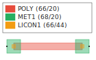 | 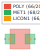 | 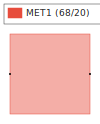 |
| :---: | :---: | :---: |
| **[resistor](../crates/spike-divider-block)** <br/> poly resistor primitive | **[diode](../crates/spike-divider-block)** <br/> Shockley diode (RES square + 2 metal1 pads) | **[capacitor](../crates/spike-divider-block)** <br/> MIM-style capacitor (single metal1 plate) |
|  | 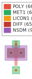 | 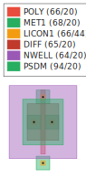 |
| **[voltage_source](../crates/spike-divider-block)** <br/> Ideal voltage source (1.8 V VDD) | **[mosfet_nmos](../crates/spike-divider-block)** <br/> NMOS W=2 µm / L=0.5 µm | **[mosfet_pmos](../crates/spike-divider-block)** <br/> PMOS W=4 µm / L=0.5 µm with n-well |

## CMOS composites (PNR-routed)

|  | 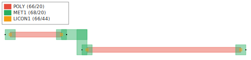 |
| :---: | :---: |
| **[rc_divider](../crates/spike-divider-block)** <br/> 2-resistor divider — PNR via `Layout::layout` | **[rc_divider_pnr](../crates/spike-divider-block)** <br/> same divider via explicit `PnrFlow::run` |

## TinyConv tile + array (PNR-driven)

Both the digital MAC tile and the 2×2 tile array now flow through
`eda_pnr::PnrFlow` end-to-end instead of the upstream
`Mac8x8Tile::layout` / `ArrayBlock::layout` direct-stamp paths. Cell
counts and row positions match the upstream 4-row sc_hd floorplan
(8 weight DFFs + 32+32 PP AND2 + 24+32+16+16 sum/final FAs + 16+16
accum DFFs + 10 control INVs — 202 cells).

Each base mock stdcell (`dfxtp_1`, `and2_1`, `fa_1`, `inv_1`) is
wrapped once via `wrap_stdcell` with named edge ports so
`ManhattanRouter` has terminals to land on — the wrapper is the
single port-bearing cell that the netlist instantiates many times.
Connectivity declared inside the tile is intentionally sparse — just
the per-row FA carry chains (`cout_i → cin_{i+1}`) drawn as small
abutment-adjacent jogs by the 1-bend planner — plus single-pin `clk`
and `rst_b` so the array level can fan out from the tile boundary.
A previous rev declared global multi-pin `clk` / `rst_b` plus
33-pin `wbcast_rN` weight-broadcast nets, but on a single-layer
metal1 PDK those produced thick router-emitted mats *on top of* the
DFF cell row, so they were dropped.

The array wraps each tile cell with edge ports
(`act_w`/`act_e`/`psum_n`/`psum_s`/`clk`/`rst_b`) and routes the
inter-tile abutment nets:
- `act_row{r}`: chains `act_e(tile[r][0]) → act_w(tile[r][1])`
- `psum_col{c}`: chains `psum_n(tile[0][c]) → psum_s(tile[1][c])`
- `clk` / `rst_b`: 4-pin Steiner fan-out across all four tiles

| 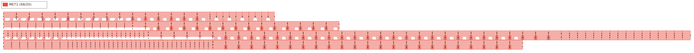 | 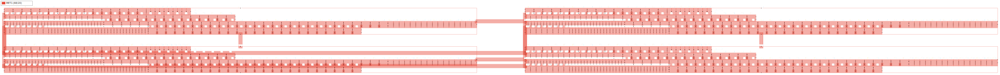 |
| :---: | :---: |
| **tinyconv_tile_digital** — 196.24 × 10.88 µm, 202 stdcell instances, 2 ports (`clk`, `rst_b`). 4 carry chains routed by `ManhattanRouter`. | **tinyconv_array_2x2** — 412.43 × 26.76 µm, 4 tile instances, 4 ports (`clk`, `rst_b`, `act_in`, `psum_top`). Inter-tile abutment + clk/rst Steiner fan-out. |

### `eda-viz` robustness fix that landed alongside

Wrapper cells (cells with only sub-instances and no direct shapes)
have an empty `local_bbox` — applying a transform to the
i64::MIN/MAX sentinel produced garbage that overflowed
`draw_instance_labels`'s y-flip and panicked the renderer. Two
upstream changes in `crates/eda-viz/src/layout.rs`:

1. `collect()` now falls back to `child.full_bbox(lib)` when
   `child.local_bbox()` is empty, so wrapper instances get accurate
   bboxes for label placement and downstream geometry queries.
2. `draw_instance_labels()` now skips instances whose bbox is still
   empty after the fallback (defensive guard — won't trigger today
   but keeps future degenerate cases from panicking).

With those in place, the per-wrapper bbox-marker stripes that were
keeping `eda-viz` happy could be removed from `wrap_stdcell`. Net
effect: each rendered wrapper drops from ~6 rects (4 perimeter
markers + 2 inner mock cell shapes) to just the inner ~2.

| Floorplan | Before fix | After fix | Drop |
|---|---:|---:|---:|
| `tinyconv_tile_digital.svg` | 1373 rects / 207 KB | **491 rects / 156 KB** | -64 % |
| `tinyconv_array_2x2.svg` | 5509 rects / 838 KB | **1981 rects / 634 KB** | -64 % |
| `sar_adc.svg` (also benefits) | 329 rects | **289 rects** | -12 % |

## SAR ADC (`spike-sar-adc`) — floorplan + schematic

Top-level cell built from the actual `spike_sar_adc::SarAdc<4>` struct.
Each sub-block is a composite of real workspace primitives (no
labelled-rect placeholders), and **every sub-block** has its
inter-primitive connectivity routed by `eda_pnr::PnrFlow` —
`ManhattanRouter` emits real metal1 wires inside Block_SH, Block_DAC,
Block_SAR, and Block_CMP, plus a final pass at the SAR top routes
the inter-block nets (`vhold` / `vdac` / `cmp` / `dcode_0..3`).

| 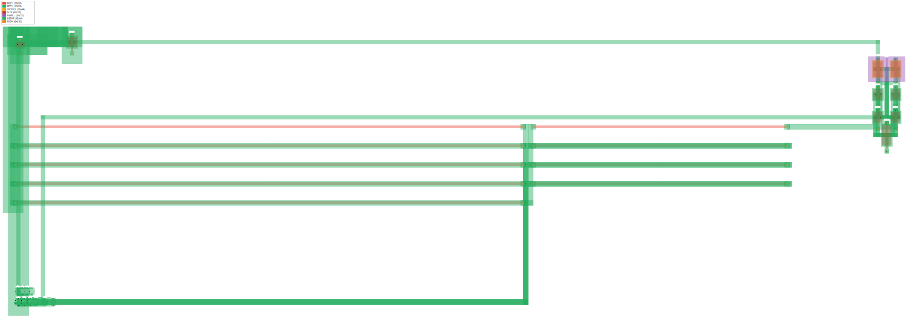 | 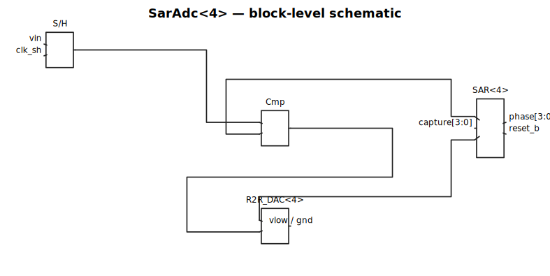 |
| :---: | :---: |
| **Floorplan** — 403.38 × 73.50 µm, sky130 layers via `Sky130Lite`. <br/> All four sub-blocks PNR-routed end-to-end. | **Schematic** — `eda_viz::schematic` block diagram. <br/> Same nets as `SarAdc::emit_spice`: `vhold`, `vdac`, `cmp`, `dcode_i`. |

Per-sub-block composition + internal PNR:

| Sub-block | Real primitives composed | Routed internal nets |
|---|---|---|
| **Block_SH** | `Mosfet::nmos(2µm)` switch + `Capacitor` (sized from `c_hold`) + `Mosfet::nmos(4µm)` source-follower buffer | `vsamp` (3-pin: switch.s ↔ cap.a ↔ buf.g) |
| **Block_DAC** | `2N+1 = 9` `Resistor` instances (R-2R ladder, vertical bit rows + termination) — lengths from `R2RDac.r_ohms` via `resistance_to_length` | `tap_0..tap_3`, `vlow`, `vout`, `bit_0..bit_3` |
| **Block_SAR** | `N=4` `dfxtp_1` + `N+2=6` `inv_1` mock stdcells (each wrapped once with named edge ports so `ManhattanRouter` has terminals to hit) | `phaseb_i`, `cmp_int` (5-pin bus across the DFF row), `vdd` / `gnd` |
| **Block_CMP** | 7 `Mosfet` instances — NMOS tail + NMOS input pair + NMOS cross-coupled latch + PMOS load pair (regenerative latch) | `tail`, `intl` / `intr` (5-pin each — the cross-coupling) |

## SVG-imported cells

Generic vector-import: any SVG file at a path resolvable from the
workspace root flattens into polygons on a PDK metal layer via
`eda_floorplan::svg_import::import_svg`. Curves are subdivided to a
configurable tolerance; the result is a `klayout-core::Cell` with
two electrical ports on the bbox edges so it drops into a parent
floor plan as a regular `Instance`. Useful for foundry-supplied
alignment marks, project banners, hand-drawn annotations — anything
that lives as vector art outside the Rust block hierarchy.

| 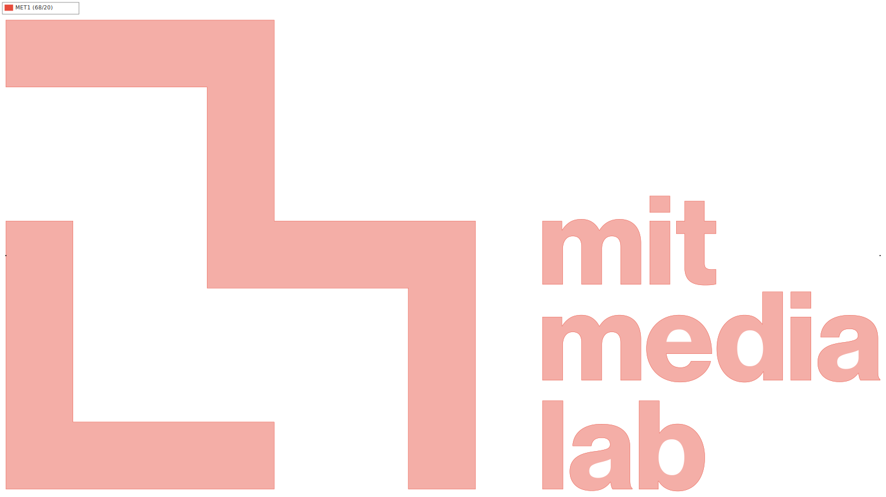 |
| :---: |
| **svg_imported_medialab** — `logos/MIT_Media_Lab_logo.svg` flattened to polygons on metal1 (148.31 × 80.00 µm), with `p_w` / `p_e` edge ports |

## Greedy primitive-fit raster (PNG → floorplan)

The `png-to-floorplan` binary fits a stack of colored axis-aligned
rectangles to a target PNG using the classic *greedy + local refine*
recipe ([Fogleman, 2016](https://github.com/fogleman/primitive); the
direct ancestor of differentiable-vector-graphics work like
[DiffVG](https://people.csail.mit.edu/tzumao/diffvg/), Li et al. 2020):

1. Start with a canvas of the average target color. Compute residual
   `r = target − canvas`.
2. Sample `K = 40` random rect candidates, with positions drawn
   proportional to `‖r‖₁` so proposals land where the canvas needs
   help — no wasted candidates over already-fitted regions.
3. For each candidate, run `80` hill-climb steps annealing position /
   size / α perturbations; **pick the rect's RGB color analytically**
   via the closed-form L2-best color over its soft mask
   (`color[c] = (Σ w·target[c] + Σ (w² − w)·canvas[c]) / Σ w²`,
   per channel). This is the Fogleman trick — color is one matrix
   dot product per candidate, not five extra DoF for the optimizer
   to wander around in.
4. Composite the best candidate via Porter-Duff `over`
   (`canvas ← canvas·(1−α·m) + α·m·color`) — naturally stays in
   `[0,1]³`, no soft-OR squash needed.
5. Repeat for `N = 400` rects, or stop early if no candidate improves.

Why this beats global AD-over-N-rects on this problem: the joint
loss landscape with `N` simultaneously-optimized rects is full of
permutation-invariance saddles and prefers a low-contrast averaged
fit. Greedy isolates each rect's gradient signal to its own
footprint — every accepted rect strictly reduces L1 — and the
closed-form color step removes 3·N DoF from the search. End result:
recognizable colored beaver in ~5 s at 192 × 288 RGB.

Reverse-mode AD via `rlx-ir` + `rlx_opt::autodiff::grad_with_loss`
is still demonstrated end-to-end: the **first** rect's geometry
refine runs through the rlx graph + Adam at a downsampled luma
resolution (5-param scalar problem, ~100 ms) so the "rlx-eda hits
silicon via reverse-mode AD" story has a live witness in the binary.
Subsequent rects use the much faster Rust hill-climb because the
per-step graph compile / param-rebind overhead dwarfs the actual
5-param math.

Regenerate with:

```sh
cargo run -p eda-floorplan --bin png-to-floorplan
```

Outputs land in `target/floorplans/beaver_optim/`:
`floorplan.svg` (colored — each rect at its fitted RGB so the
result reads as a *picture*), `floorplan_layers.svg` (multi-layer
chip rendering — k-means clusters rect colors into 7 sky130 layers
so KLayout shows the beaver in 7 distinct layer colors instead of
one solid metal1 mass), `floorplan.gds` (the multi-layer GDS — open
in KLayout to inspect / DRC), `convergence.png` (target \|
rasterized canvas \| hard-rect layout, RGB), `target.png` /
`rasterized.png` standalone, `loss.csv` (per-rect Δloss + running
L1 + the rect itself for replay), `summary.txt`.

| 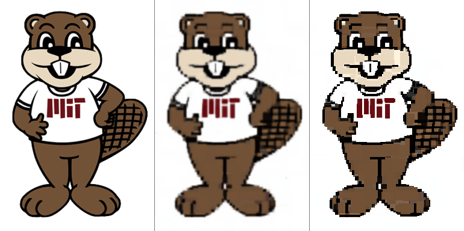 |
| :---: |
| **beaver_optim** — RGB convergence triptych at 256 × 384 raster: target \| greedy-fitted canvas \| hard-rasterized kept rects. 600 rects placed in ~17 s; L1 reduced 89.7 % (103280 → 10684) end-to-end with closed-form per-rect best-color. |

|  |
| :---: |
| **beaver_optim.svg** — fitted rectangle stack rendered with each rect's own fitted RGB color and opacity. This is the *picture* of the beaver — what the optimizer actually picked, for human inspection. |

|  |
| :---: |
| **beaver_optim_layers.svg** — multi-layer chip rendering. K-means clusters the 600 fitted rect colors into 7 groups in RGB space, then maps each cluster (luma-sorted) to a sky130 layer (`MET1`, `POLY`, `LICON1`, `DIFF`, `NWELL`, `PSDM`, `NSDM`). KLayout's per-layer palette renders the result in 7 distinct colors — the beaver shape stays recognizable and the GDS now carries actual layered structure rather than collapsing every fitted rect onto metal1. |

## Standard cells (mock sc_hd)

Each rendered standalone via `eda_stdcells::populate_mock_sc_hd` →
`lib.by_name(...)`. Geometry is a mock placeholder sized to the real
sc_hd bbox + Liberty area; swap in the foundry GDS to get real
polygons via `ScHdLibrary::load(...)`.

|  |  |  |  |
| :---: | :---: | :---: | :---: |
| **inv_1** | **buf_1** | **nand2_1** | **nor2_1** |
|  |  |  | 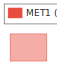 |
| **and2_1** | **fa_1** (full adder) | **dfxtp_1** (D flip-flop) | **mux2_1** |

## RF (RfDemo)

| 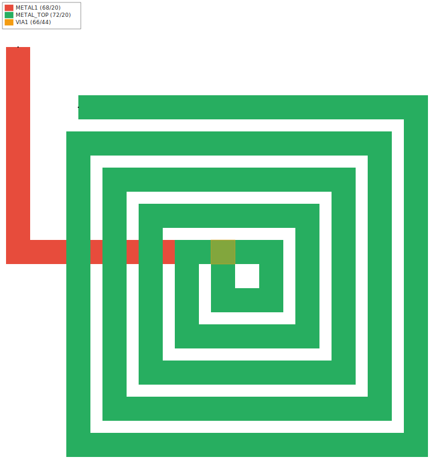 | 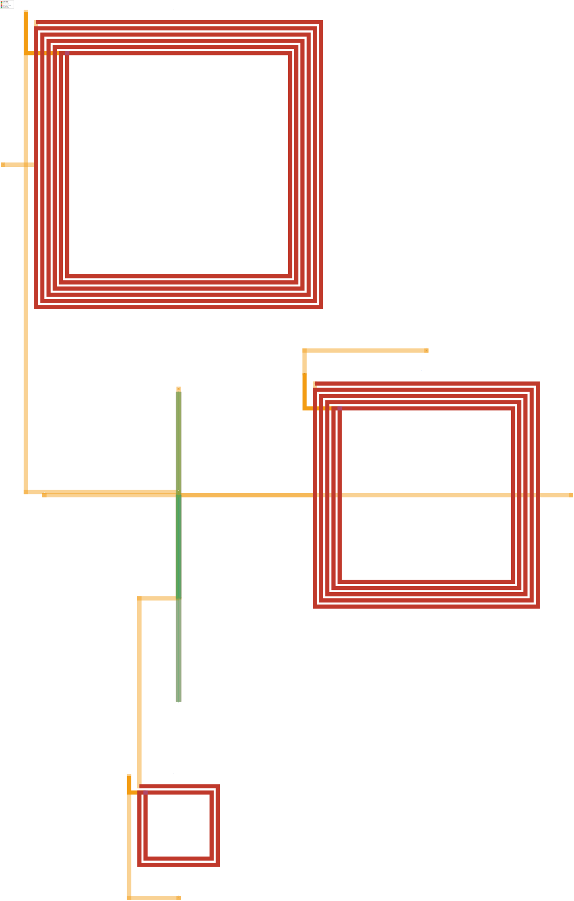 |
| :---: | :---: |
| **[spiral_inductor](../crates/spike-lna)** <br/> 5-turn 60 µm square spiral on METAL_TOP with metal1 underpass | **[lna_24ghz](../crates/spike-lna)** <br/> Inductively-degenerated cascode LNA at 2.4 GHz |

## Photonic (gdsfactory generic SOI)

| 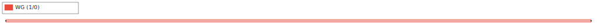 | 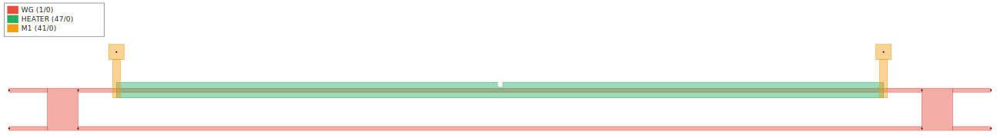 |
| :---: | :---: |
| **[waveguide](../crates/spike-waveguide-block)** <br/> 500 nm × 100 µm SOI strip | **[mzi](../crates/spike-waveguide-block)** <br/> Two-arm Mach-Zehnder interferometer |

## Per-component details

| Component | Crate | PDK | Size | Instances | Ports |
|---|---|---|---|---|---|
| `resistor` | [`spike-divider-block`](../crates/spike-divider-block) | sky130 | 12.00 × 2.00 µm | 0 | 2 |
| `diode` | [`spike-divider-block`](../crates/spike-divider-block) | sky130 | 6.00 × 4.00 µm | 0 | 2 |
| `capacitor` | [`spike-divider-block`](../crates/spike-divider-block) | sky130 | 8.00 × 8.00 µm | 0 | 2 |
| `voltage_source` | [`spike-divider-block`](../crates/spike-divider-block) | sky130 | 1.00 × 1.00 µm | 0 | 2 |
| `mosfet_nmos` | [`spike-divider-block`](../crates/spike-divider-block) | sky130 | 4.50 × 6.75 µm | 0 | 4 |
| `mosfet_pmos` | [`spike-divider-block`](../crates/spike-divider-block) | sky130 | 7.50 × 9.25 µm | 0 | 4 |
| `rc_divider` | [`spike-divider-block`](../crates/spike-divider-block) | sky130 | 47.00 × 5.00 µm | 2 | 3 |
| `rc_divider_pnr` | [`spike-divider-block`](../crates/spike-divider-block) | sky130 | 47.00 × 5.00 µm | 2 | 3 |
| `sar_adc` | [`spike-sar-adc`](../crates/spike-sar-adc) | sky130 | 403.38 × 73.50 µm | 4 | 17 |
| `tinyconv_tile_digital` | [`spike-tinyconv-tile`](../crates/spike-tinyconv-tile) | sky130 | 196.24 × 10.88 µm | 202 | 2 |
| `tinyconv_array_2x2` | [`spike-tinyconv-array`](../crates/spike-tinyconv-array) | sky130 | 412.43 × 26.76 µm | 4 | 4 |
| `stdcell_inv_1` | [`eda-stdcells`](../crates/eda-stdcells) | sky130 | 1.84 × 2.72 µm | 0 | 0 |
| `stdcell_buf_1` | [`eda-stdcells`](../crates/eda-stdcells) | sky130 | 1.84 × 2.72 µm | 0 | 0 |
| `stdcell_nand2_1` | [`eda-stdcells`](../crates/eda-stdcells) | sky130 | 2.30 × 2.72 µm | 0 | 0 |
| `stdcell_nor2_1` | [`eda-stdcells`](../crates/eda-stdcells) | sky130 | 2.30 × 2.72 µm | 0 | 0 |
| `stdcell_and2_1` | [`eda-stdcells`](../crates/eda-stdcells) | sky130 | 1.29 × 2.72 µm | 0 | 0 |
| `stdcell_fa_1` | [`eda-stdcells`](../crates/eda-stdcells) | sky130 | 3.68 × 2.72 µm | 0 | 0 |
| `stdcell_dfxtp_1` | [`eda-stdcells`](../crates/eda-stdcells) | sky130 | 2.30 × 2.72 µm | 0 | 0 |
| `stdcell_mux2_1` | [`eda-stdcells`](../crates/eda-stdcells) | sky130 | 3.68 × 2.72 µm | 0 | 0 |
| `spiral_inductor` | [`spike-lna`](../crates/spike-lna) | RfDemo | 70.00 × 70.00 µm | 0 | 2 |
| `lna_24ghz` | [`spike-lna`](../crates/spike-lna) | RfDemo | 554.00 × 862.00 µm | 10 | 5 |
| `waveguide` | [`spike-waveguide-block`](../crates/spike-waveguide-block) | gdsfactory | 100.00 × 0.50 µm | 2 | 2 |
| `mzi` | [`spike-waveguide-block`](../crates/spike-waveguide-block) | gdsfactory | 128.00 × 11.25 µm | 2 | 6 |
| `rlx_eda_logo` | [`eda-floorplan`](../crates/eda-floorplan) | sky130 | 76.00 × 108.00 µm | 0 | 0 |
| `svg_imported_medialab` | [`eda-floorplan`](../crates/eda-floorplan) | sky130 | 148.31 × 80.00 µm | 0 | 2 |
| `beaver_optim` | [`eda-floorplan`](../crates/eda-floorplan) (`png-to-floorplan` bin) | sky130 | 384 × 576 µm | 600 rects across 7 layers | 0 |

Each component also ships GDS-II at `target/floorplans/<component>/floorplan.gds`
(load directly into KLayout for DRC/LVS or polygon inspection) and a
text summary at `target/floorplans/<component>/summary.txt` with the
exact bbox, instance list, and port coordinates printed by the
generator.

## What's *not* rendered (and why)

The remaining spike crates lacking floor plans are intentional —
they're simulation harnesses (`spike-rc-transient`, `spike-mosfet-dc`,
`spike-ac`, `spike-pulse-rc`), MNA/DAE assemblies (`spike-divider-mna`,
`spike-sar-logic`, `spike-clocks`, `spike-clock-decoder`,
`spike-ripple-counter`, `spike-output-door`, `spike-tline-termination`,
`spike-comparator-cmos`, `spike-cmos-gates`), surrogate / PINN / DADO
experiments (`spike-pinn-*`, `spike-dado-*`, `spike-surrogate`,
`spike-triangulate`), or device-physics standalones (`spike-mosfet`,
`spike-diode`, `spike-divider`, `spike-lelo-ex`, `spike-divider-layout`).
They produce CSVs, traces, and sim reports but no `Block + Layout`
impl yet. `sar_adc` shows the pattern for lifting one of these into
a floor plan without touching the original crate: take its struct
type as input, derive geometry from its fields, transcribe its
internal nets into a `Netlist`, and let `PnrFlow` do the rest.
