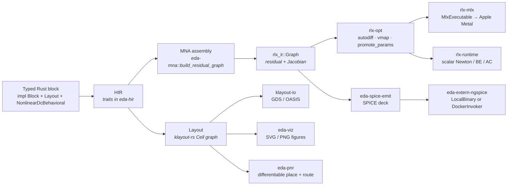
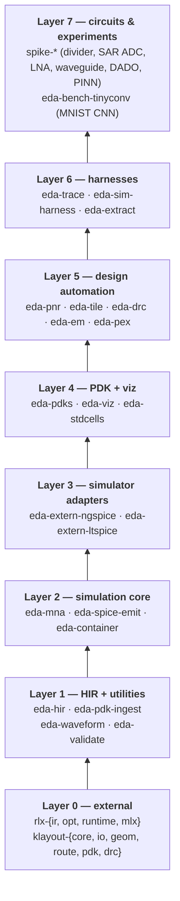
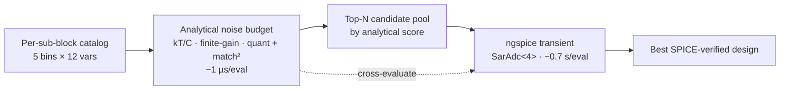
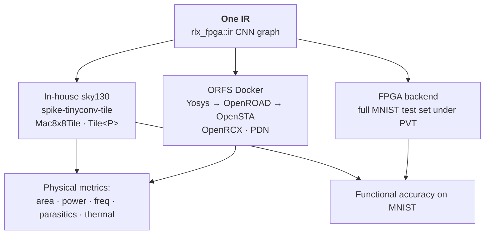
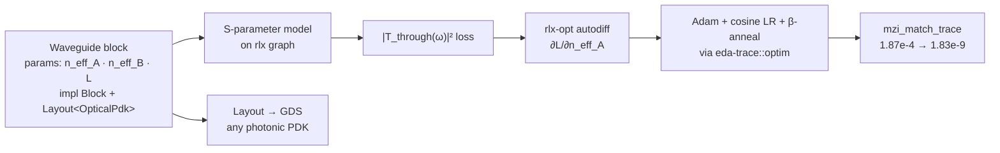
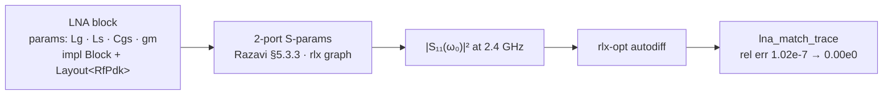

# Architecture and IR levels

`rlx-eda` is layered around two ideas: (a) a small set of **HIR
traits** in `eda-hir` that a Rust type implements to declare itself
a circuit block, and (b) the principle that everything below HIR —
MNA assembly, autodiff, batching, GPU dispatch — happens through
**`rlx-ir` computational graphs** built and rewritten by
`rlx-opt` and `rlx-mlx` (the sibling repo at `../rlx`). There is
no separate "low-level IR" layer in `rlx-eda`; the layout output is
a `klayout_core::CellId` straight from `klayout-rs`, and the MNA
residual / Jacobian are themselves `rlx_ir::Graph` instances.

This document describes the IR layers, the crate-dependency layers,
and traces several end-to-end examples — RC divider (passive),
SAR ADC (mixed-signal), TinyConv MNIST (digital ML), photonic
waveguide MZI, and RF LNA — through every layer so that mapping
any other circuit follows the same template.



## IR layers

There are three "IRs" in this workspace, only the first of which is
user-facing:

### 1. HIR — typed traits in `eda-hir`

`eda-hir` is *trait-only*. It does not own any data structures
beyond small descriptor types (`Pin`, `Boundary`, `SourceWaveform`).
The base trait is:

```rust
pub trait Block: Hash + Eq + Send + Sync {
    fn name(&self) -> String;
}
```

Every composable thing in the workspace is a `Block`. From there,
HIR splits into two roughly orthogonal capability sets:

**Electrical capabilities** (consumed by `eda-mna` and
`eda-spice-emit`):

- `DcBehavioral` — 2-terminal linear device with one resistance-like
  `Param` (closed-form forward models like the divider).
- `NonlinearDcBehavioral` — multi-terminal nonlinear DC (takes
  terminal voltages, returns terminal currents into the assembler).
  Sign convention: current flowing **from device into external node**.
- `MnaDevice` — generalized MNA contract with branch-current
  unknowns, for voltage sources, inductors, and other algebraic
  constraints.
- `TransientStorage` — capacitors / inductors. Returns C / L `Param`
  NodeId; assembler derives companion-current stamps from 2-terminal
  symmetry.
- `TransientDelay` — dispersionless waveguide delay
  `i_out(t) = G · v_in(t − τ)`, differentiable through
  in-graph linear interpolation.
- `SourceWaveform` — SPICE-style stimulus descriptors (DC, Pulse,
  Sine) plus a Rust-side `value_at(t)` so outer-loop transient
  drivers can sample without invoking SPICE.

**Physical capabilities** (consumed by `eda-viz`, `eda-pnr`, the GDS
writer in `klayout-io`):

- `Layout<P>` — `fn layout(&self, &Library, &P) -> CellId`. Single
  method; the `P` PDK type tag is supplied by `eda-pdks`.
- `Schematic<P>` — symbolic schematic emission (wires, symbols, port
  bundles) bound to the same Rust type.

**Composition hierarchy** (defined in
[`eda-hir::hierarchy`](../crates/eda-hir/src/hierarchy.rs); each rung
adds only the obligation specific to that level):

| rung | trait | obligations beyond `Block` | concrete consumers today |
| ---: | --- | --- | --- |
| 1 | `Device: Block` | `terminal_names()` | every `MnaDevice` impl (Mosfet, Diode, Resistor, Capacitor, …) |
| 2 | `Cell<P>: Block + Layout<P>` | `pins()` | `eda-stdcells::StdCell` (foundry sky130 cells) |
| 3 | `Macro<P>: Block + Layout<P>` | `pins()`, `boundary()` | `spike-divider-block`, `spike-sar-adc`, `spike-waveguide-block` |
| 4 | `Tile<P>: Block + Layout<P>` *(in `eda-tile`)* | `pitch()`, `rails()`, `edge_ports()` | `spike-tinyconv-tile::Mac8x8Tile` |
| 5 | `Core<P>: Block + Layout<P>` | `io_pins()` | — *(speculative; no consumer yet)* |
| 6 | `Die<P>: Block + Layout<P>` | `outline()`, `io_pads()`, `scribe_clearance_dbu()` | — *(speculative)* |
| 7 | `Reticle: Block` | `field_size()`, `fields()` | — *(speculative)* |
| 8 | `Wafer: Block` | `diameter_mm()`, `edge_exclusion_mm()`, `step_pattern()` | — *(speculative)* |
| 9 | `Lot: Block` | `wafer_count()`, `process_run_id()` | — *(speculative)* |

Per `eda-hir`'s philosophy ("traits earn their place"), the
speculative rungs carry only the minimal contract a future consumer
would need; richer obligations are added when a real use case lands.

### 2. MNA residual / Jacobian — `rlx_ir::Graph`

There is **no separate "MNA IR" crate**. `eda-mna::build_residual_graph`
takes a `Circuit` (a list of `MnaDevice` and `NonlinearDcBehavioral`
instances connected to named `NetId`s) and emits an `rlx_ir::Graph`
whose:

- **inputs:** one `Op::Input` per unknown net (`v_<id>`).
- **outputs:** KCL residuals at unknown nets (ground is the
  reference).
- **body:** rlx ops (`Mul`, `Add`, element-wise nonlinearities) for
  each device's `I(V)` characteristic, accumulated into KCL stamps.

The Jacobian graph is derived once via `rlx_opt::autodiff::grad_with_loss`
and reused per Newton iteration. `eda-mna` also exposes
**body builders** that emit `Op::Scan` bodies for backward-Euler
transient stepping (`build_linear_be_step_body`,
`build_nonlinear_scan_body`, `build_ac_response_graph[_multi]`).

For batched analyses (Monte Carlo, frequency sweeps), the residual
graph is composed with two `rlx-opt` rewrites:

1. `promote_params_to_inputs` — per-draw device parameters
   (Vth mismatch, R/C tolerance, IC variation) become `Op::Input`s
   with a batched axis.
2. `vmap` — lifts the scalar graph to shape `[B, n_unknowns]` along
   that axis.

Then `rlx_mlx::MlxExecutable::compile_with_mode` lowers the batched
graph (including `Op::DenseSolve` / `Op::BatchedDenseSolve`) onto
the Apple GPU's Metal LU+solve kernel. The compiled executable is
cached in `eda-mna::InnerSolveCache` and reused across Newton
iterations and timesteps.

### 3. Layout output — `klayout-rs` cell graph

`Layout::layout` returns a `klayout_core::CellId` referring to a
`Cell` already inserted into a `Library`. The intermediate
representation here is **klayout-rs's own typed cell / geometry
graph** (placed rectangles, instances, routing on typed PDK layers).
There is no rlx-eda-side LIR; `klayout-io` writes that graph out as
GDS / OASIS, and `eda-viz` renders SVG / PNG views of the same
graph for figures.

## Crate-dependency layers

The 33 workspace crates fall into seven layers. Crates in a higher
layer may depend on lower layers but never the reverse.



Per-crate one-liners are in [`workspace.md`](workspace.md).

## End-to-end data flow: the RC divider

This trace through `spike-divider-block` exercises every layer that
matters. Other circuits in the workspace follow the same shape.

### Step 1 — Define a typed device, implement HIR traits

```rust
// crates/spike-divider-block/src/lib.rs
pub struct Resistor { r_ohms: f64, name: String }

impl Block for Resistor { /* name(), Hash, Eq */ }
impl NonlinearDcBehavioral for Resistor {
    fn currents(&self, voltages: &[NodeId], graph: &mut Graph) -> Vec<NodeId> {
        // Emit rlx ops: I = (V0 - V1) / R
    }
}
impl<P: Sky130Like> Layout<P> for Resistor {
    fn layout(&self, lib: &Library, pdk: &P) -> CellId {
        // Draw RES + METAL1 contacts on PDK layers
    }
}
```

### Step 2 — Compose into a divider macro

```rust
pub struct RcDivider { r_top: Resistor, r_bot: Resistor }
impl<P> Layout<P> for RcDivider { /* hierarchical layout */ }
```

`RcDivider` is a `Macro` (rung 3). The same Rust type drives both
behavioral simulation and layout — this is the "no double
bookkeeping" property.

### Step 3a — In-house simulation through `eda-mna` + `rlx`

```rust
let mut circuit = eda_mna::Circuit::new();
let v_in  = circuit.alloc_boundary_net();
let v_mid = circuit.alloc_unknown_net();
circuit.add_device(&divider.r_top, &[v_in,  v_mid]);
circuit.add_device(&divider.r_bot, &[v_mid, NetId::GND]);

let residual = eda_mna::build_residual_graph(&circuit);  // rlx_ir::Graph
let solution = rlx_runtime::solve_dc(&residual, &params, &init);
```

Behind `solve_dc`: Newton loop over the residual graph + Jacobian
graph, both `rlx_ir::Graph` instances. For Monte Carlo:

```rust
let (g, _) = rlx_opt::promote_params_to_inputs(&residual, &["r_top_tol", "r_bot_tol"]);
let batched = rlx_opt::vmap(&g, &["r_top_tol", "r_bot_tol"], n_draws);
let exe     = rlx_mlx::MlxExecutable::compile_with_mode(&batched, Mode::Mlx)?;
let result  = exe.run(&bindings)?;     // [N, n_unknowns] on Apple GPU
```

### Step 3b — SPICE cross-validation through `eda-extern-ngspice`

The same `RcDivider` instance feeds `eda-spice-emit` to produce a
deck that ngspice consumes. Backend selected via `NGSPICE_BACKEND`:

```rust
let invoker: Box<dyn Invoker> = match std::env::var("NGSPICE_BACKEND").as_deref() {
    Ok("docker") => Box::new(DockerInvoker::from_env()?),
    _            => Box::new(LocalBinary::from_env()?),
};
let result = invoker.run_dc(&deck, &requests)?;
```

`LocalBinary` and `DockerInvoker` share a private `NgspiceRunner`
trait so all stdout / Nutmeg parsing is reused; only the subprocess
invocation differs. The Docker path uses the pinned image at
`docker/ngspice/Dockerfile` (`rlx-ngspice:local`).

### Step 4 — Layout, GDS, viz

```rust
let lib = klayout_core::Library::new();
let pdk = eda_pdks::Sky130 { /* generated layer indices */ };
let cell_id = divider.layout(&lib, &pdk);
klayout_io::write_gds(&lib, cell_id, "divider.gds")?;     // GDS for tape-out / DRC
eda_viz::render_layout_png(&lib, cell_id, "divider.png", &palette)?;  // figure
```

### Step 5 — Inverse design via autodiff

```rust
let loss = rlx_opt::autodiff::grad_with_loss(
    &residual, &["v_mid"], target = 1.0
);
for _ in 0..100 {
    let grads = rlx_runtime::eval(&loss, &params);
    adam.step(&mut params, &grads);
}
// params["r_top_G"], params["r_bot_G"] now satisfy V_mid ≈ 1.0 V
```

## Other end-to-end examples

The same trait set is exercised across four very different domains;
each one stresses a different edge of the IR.

### SAR ADC — mixed-signal, surrogate-then-verify

`spike-sar-adc::SarAdc<N>` is a const-generic N-bit successive-
approximation ADC composed of four sub-blocks (sample-hold,
comparator, capacitive DAC, SAR logic). `spike-dado-sar` wraps it in
a discrete-design optimizer over a `5¹² ≈ 2.4 × 10⁸` catalog.



Headline: 36× wall-clock vs direct ngspice optimization at ~5%
quality loss (`docs/dado-sar-worked-example.md`). The same SAR ADC
typed block is re-used by `spike-pinn-sar` and `spike-pinn-sar-mc`
as the surrogate target in the PINN experiment series.

### TinyConv MNIST — digital ML, three-backend triangulation

`eda-bench-tinyconv` is the umbrella for a CNN-on-silicon study with
**three backends and one IR**: in-house code-defined sky130 layout
(design under test), Yosys + OpenROAD in Docker (physical ground
truth — PnR, OpenSTA, OpenRCX, PDN), and FPGA (functional ground
truth at scale, fast enough to validate accuracy across the full
MNIST test set under PVT). Functional accuracy on MNIST is the
load-bearing metric; physical metrics ride on top.



This is the workspace's only **active `Tile<P>` consumer** — the
abutment contract (`pitch()`, `rails()`, `edge_ports()`) is what
makes the 8×8 MAC array tileable into a regular CNN compute fabric.

### Photonic waveguide / MZI — multi-PDK genericity

`spike-waveguide-block` is the photonic counterpart to the divider.
It defines an `OpticalPdk` trait, implements it for each photonic
PDK shipped by `eda-pdks` (gdsfactory-generic, cornerstone-si220,
siepic-ebeam), and layers a parametric `Waveguide` block on top.



Same `Block + Layout` flow as CMOS — only the PDK trait and the
behavioral model differ. The MZI inverse-design trace bin shares
the optimizer harness (`AdamState`, `LrSchedule`, `BetaSchedule`)
with the LNA's `Lg` matching and with `eda-pnr`'s placement loss.

### RF LNA — 2.4 GHz, S-parameters, autodiff matching

`spike-lna` defines an `RfPdk` trait, implements it for each CMOS
PDK in `eda-pdks` (sky130, gf180mcu), and layers an inductively-
degenerated cascode LNA block on top. Behavioral side is a closed-
form 2-port S-parameter model (Razavi §5.3.3) on the rlx graph, so
input-match `|S₁₁(ω₀)|²` is differentiable wrt `Lg / Ls / Cgs / gm`.



The LNA, MZI, and `eda-pnr` placer all drive the same Adam +
cosine-LR + β-anneal optimizer harness in
[`eda-trace::optim`](../crates/eda-trace/src/optim.rs); the only
thing that changes between domains is the loss expression on the
rlx graph.

## Three simulation paths

1. **In-house** — residual graph → `rlx_runtime::solve_dc` /
   `solve_be_transient` / AC. Differentiable end-to-end.
2. **External cross-validation** — SPICE deck → `eda-extern-{ngspice,
   ltspice}`. Used for sanity checks and for benchmarks against the
   in-house path.
3. **Hybrid surrogate-then-verify** — analytical scoring function
   on the rlx side, top-N candidates verified through path (2). Used
   in `spike-dado-sar` to get a 36× wall-clock speedup at ~5%
   relative quality loss.

Paths (1) and (2) consume the **same** typed Rust block, so the two
solvers can never silently disagree about what circuit is being
solved.

## PDK pipeline

Foundry `.lyp` files (Sky130A, gf180mcuA-D, ihp-sg13g2, …) are parsed
at build time:

```
   .lyp file (foundry)
        │
        │  eda-pdk-ingest::parse_lyp
        ▼
   Vec<LayerProps>
        │
        │  eda-pdks/build.rs   (codegen)
        ▼
   $OUT_DIR/pdks_generated.rs
        │
        │  include!() from eda-pdks/src/lib.rs
        ▼
   pub struct Sky130 { pub RES: LayerIndex, pub METAL1: LayerIndex, … }
```

Path resolution: `$RLX_EDA_PDK_<NAME>_LYP` env var → `$PDK_ROOT` →
`~/.ciel` → `~/.volare`. Per the workspace convention, no hardcoded
absolute paths; missing PDK soft-skips its feature flag.

## GPU lowering — what's shipped

| `eda_mna::` builder | Linear / Nonlinear | mc_params (per-draw) | Boundary inputs (per-draw) | Multi-unknown |
| --- | --- | --- | --- | --- |
| `build_linear_be_step_body` | linear | ❌ | ❌ | ✅ |
| `build_linear_be_step_body_with_mc_params` | linear | ✅ | ❌ | ✅ |
| `build_nonlinear_be_step_body` | nonlinear (single-unknown MVP) | ❌ | ❌ | n=1 |
| `build_nonlinear_scan_body` | nonlinear | ✅ | ✅ | ✅ |
| `build_ac_response_graph` | linear | ❌ | n=1 stimulus | n=1 |
| `build_ac_response_graph_multi` | linear | ❌ | n=1 stimulus | ✅ |

All five `*_be_step_body` and `*_ac_*` builders return graphs that
plug into the same `scan_trajectory + vmap + MlxExecutable`
pipeline; per-draw MC over (1) initial conditions, (2) device
parameters, (3) boundary stimuli, and (4) frequency points are all
just different `vmap` batched-input lists. Adding a new analysis is
one new `build_*` function — never a new solver path.

Cross-bench numbers vs ngspice and the honest scope of what isn't
on the GPU yet (variable-iter Newton inside `Op::Scan`, branch
unknowns in scan / AC bodies, AC linearization at non-zero DC
operating point) are in [`gpu-monte-carlo.md`](gpu-monte-carlo.md).
