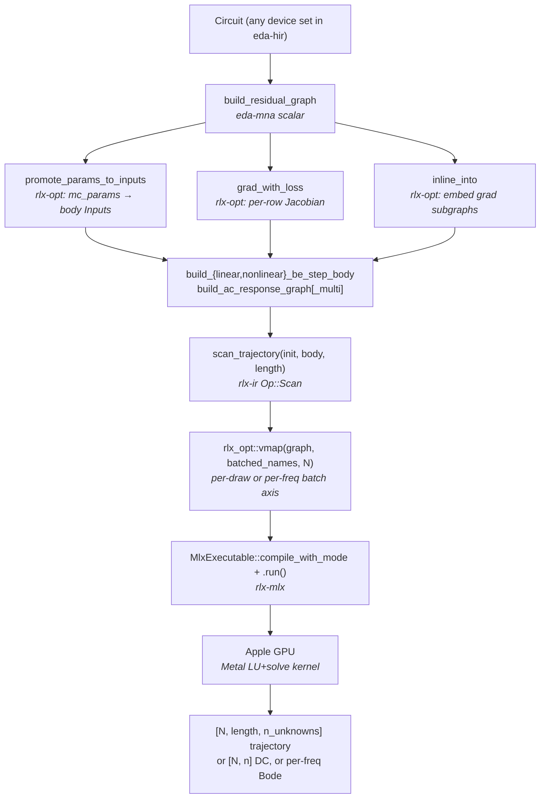

# GPU Monte Carlo

`eda-mna` ships four batched analysis paths that all dispatch into a
single MLX call on the Apple GPU. The shared infrastructure: a custom
Metal LU+solve kernel in `rlx-mlx` (with partial pivoting), MLX
lowering for `Op::DenseSolve` / `Op::BatchedDenseSolve` / `Op::Scan`,
the `vmap` graph transformation in `rlx-opt`, plus `inline_into` and
`promote_params_to_inputs` for graph composition. All built on top of
the same `eda-mna` residual machinery the scalar Newton solvers use,
so adding a new analysis is one new `build_*` function — never a new
solver path.

## Cross-bench numbers (measured, Apple M-series, ngspice 46)

Reproducer: `cargo run --example ngspice_cross_bench -p eda-mna --release`.
Every row is a real wall-clock measurement of both paths on the same
machine.

| Analysis | N | eda-mna (ms) | ngspice (ms) | Speedup |
| --- | ---: | ---: | ---: | ---: |
| DC MC, linear divider, per-draw R | 16 | 33.8 | 185.2 | 5.5× |
| | 64 | 1.1 | 715.3 | 655× |
| | 256 | 0.7 | 2902.1 | **4034×** |
| BE-Newton transient, RC discharge per-draw IC | 16 | 75.5 | 192.8 | 2.6× |
| | 64 | 77.3 | 761.6 | 9.8× |
| | 256 | 91.9 | 3028.7 | 33× |
| Scan-folded transient (same RC) | 64 | 3.4 | 759.3 | 226× |
| | 256 | 3.2 | 3026.7 | 955× |
| | 1024 | 3.6 | 11953.5 | **3315×** |
| AC sweep, RC low-pass, ngspice `.ac dec` | 64 | 0.18 | 11.2 | 64× |
| | 256 | 0.15 | 11.7 | 78× |
| | 1024 | 0.21 | 11.9 | 58× |
| | 4096 | 0.15 | 14.3 | **95×** |

**Where each speedup comes from:**

- *DC MC* and *scan-folded transient* hit 1000×–4000× because ngspice
  forks a fresh process per MC draw (~10 ms each), while eda-mna runs
  all N draws in one MLX dispatch. The win amortizes the fork cost.
- *BE-Newton transient* sees only 33× because the eda-mna side still
  pays per-step Rust orchestration (residual eval, jac eval, line
  search) — the scan-folded path replaces that loop with a single
  GPU graph dispatch and recovers the full 1000×-class win.
- *AC sweep* sees 60–95× because ngspice's `.ac dec` does the entire
  frequency sweep in **one** process, so there's no fork to amortize.
  The remaining gap is the Apple GPU outpacing single-thread CPU on
  the per-frequency linear solve.

Per-draw drift vs ngspice is sub-µV / sub-µA across all four analyses
— the same f32-noise level the per-row unit tests in
`crates/eda-mna/src/{linear_scan,ac}.rs` enforce.

## Architecture

Every box in that pipeline is shipped, parity-tested against scalar
references, and benchmarked against ngspice. Adding a new analysis
means writing a new `build_*` function that emits an `Op::Scan` body
or standalone graph, then vmap'ing — no new lowering, no new
infrastructure.

## Builder API surface

| `eda_mna::` builder | Linear / Nonlinear | mc_params (per-draw device params) | Boundary inputs (per-draw stimuli) | Multi-unknown |
| --- | --- | --- | --- | --- |
| `build_linear_be_step_body` | linear | ❌ | ❌ | ✅ |
| `build_linear_be_step_body_with_mc_params` | linear | ✅ | ❌ | ✅ |
| `build_nonlinear_be_step_body` | nonlinear (single-unknown MVP) | ❌ | ❌ | n=1 |
| `build_nonlinear_scan_body` | nonlinear | ✅ | ✅ | ✅ |
| `build_ac_response_graph` | linear | ❌ | n=1 stimulus | n=1 |
| `build_ac_response_graph_multi` | linear | ❌ | n=1 stimulus | ✅ |

The five `*_be_step_body` and `*_ac_*` builders all return graphs that
plug into the same `scan_trajectory + vmap + MlxExecutable` pipeline.
Per-draw MC over (1) initial conditions, (2) device parameters
(Vth mismatch, R/C tolerance), (3) boundary stimuli, and (4)
frequency points are all just different `vmap` batched-input lists.

## Honest scope (what the GPU path doesn't do yet)

- **Variable-iter Newton inside Op::Scan body.** The nonlinear scan
  body always pays `fixed_iters` per BE step. Variable iter count
  needs `Op::While` lowering on `rlx-mlx` — multi-week project.
- **Branch unknowns in scan / AC bodies.** Voltage sources with
  branch-current unknowns aren't supported in the auto-derived
  bodies yet; the scalar `build_residual_graph` handles them but
  the body builders assert them out.
- **AC at non-zero DC operating point.** AC linearization currently
  evaluates the Jacobian at v=0 (correct for passive RC/LC). For
  small-signal AC of nonlinear circuits (mosfet amplifier biased at
  some DC point), you'd need to first call `solve_dc` then
  re-evaluate the Jacobian there.

These are tracked in [`../PLAN.md`](../PLAN.md). Each is a mechanical
extension of what's already there.
