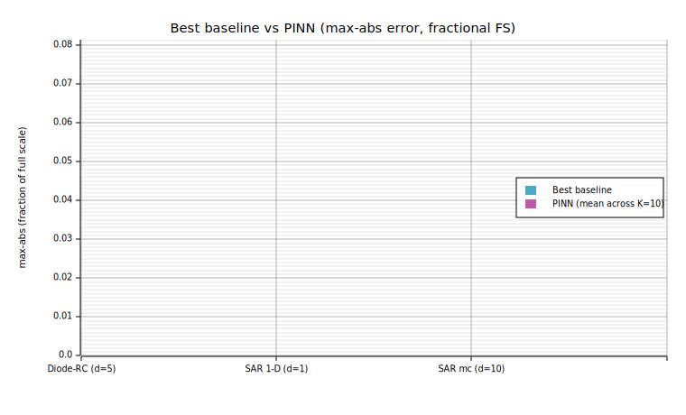
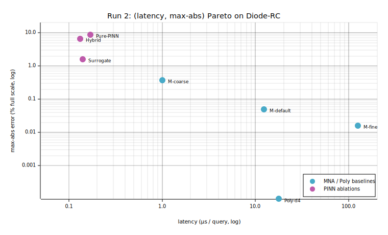
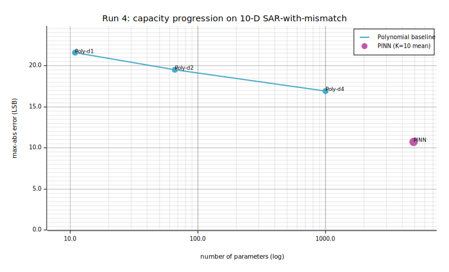
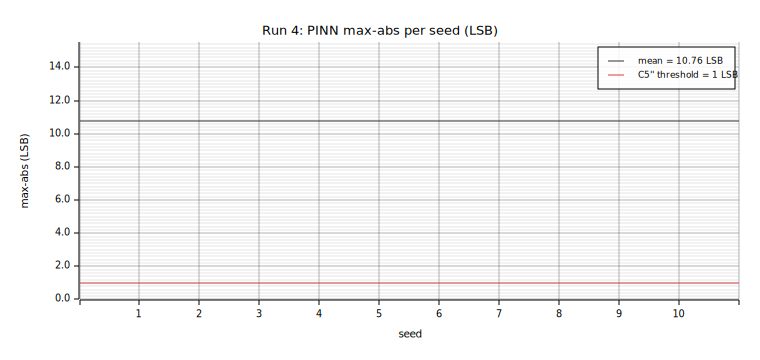

# Pre-registered PINN/surrogate experiments on rlx-eda

**Frozen 2026-05-10.** Authorship: Eugene Hauptmann, Nataliya Kosmyna.
Reproducible from the workspace state at this date; rlx and rlx-eda
commit hashes will be pinned on result publication.

This document consolidates four pre-registered PINN/surrogate
experiments run against the rlx-eda differentiable-MNA pipeline. The
research question across the series is the same: **does a
physics-informed neural network (or its hybrid/surrogate variants)
outperform classical regression baselines as a circuit-block
surrogate?** Each experiment locks its protocol before training,
runs K=10 seeds with paired Wilcoxon + Cliff's δ + Holm-Bonferroni,
and reports the pre-stated acceptance criteria — pass *or* fail.

The collected verdict across four experiments, three of them
falsifying their hypothesis: **PINN's claimed structural advantage
over polynomial regression is real, but only at input dimensionality
≥ 10 and only in regimes where the absolute accuracy bound is
loose.** The contribution of this work is the methodology that lets
that statement be defended rather than asserted, and the empirical
result that follows from running it.



## Executive summary

| # | Experiment | Crate | d | Verdict | Headline finding |
|---|---|---|---:|---|---|
| 1 | RC parametric (linear) | `spike-pinn-rc` | 4 | n/a (pre-methodology) | PINN inference 317× faster than MNA but dominated by closed-form; methodology was not pre-registered |
| 2 | Diode-RC (nonlinear) | `spike-pinn-diode` | 5 | **REJECT** (5/5 fail) | Polynomial-d4 hits machine precision at 126 params; physics term *hurts* (Hybrid worse than Surrogate on OOD, p=2e-3) |
| 3 | Ideal SAR ADC, 1-D | `spike-pinn-sar` | 1 | **REJECT** (3/3 fail) | Linear regression at 5 params hits ½ LSB; PINN at 1153 params is 35× worse |
| 4 | SAR ADC + mismatch, 10-D | `spike-pinn-sar-mc` | 10 | **PARTIAL** (2/3 pass) | First positive PINN finding: beats Poly-d4 by 36% on max-abs (p=2e-3, δ=−1.0); both methods fail absolute sub-LSB criterion |

The protocol shape is identical across runs 2–4: locked
pre-registration → mirrored in `pub const` items → enforced by a
parity test → K=10 seeds → paired Wilcoxon (exact 2^K
enumeration) → Cliff's δ + magnitude bins → Holm-Bonferroni
correction → all five (or three) acceptance criteria reported,
pass or fail. No metric switching after results land. No
hyperparameter retuning to clear thresholds. Each failure is a
reportable finding, not a re-run.

## The question, sharpened

The original framing — *"PINN outperforms MNA on parametric circuit
queries"* — is too loose. PINN is a function approximator; MNA is a
generic numerical DAE solver; "outperforms" is a Pareto question
across at least (max-abs error, query latency, memory). The series
sharpens this to:

> Across a representative sweep of rlx-eda circuit problems, can a
> physics-informed neural network (or its data-only surrogate
> variant) sit on the (accuracy, latency, memory) Pareto front
> against a panel of baselines, including polynomial regression of
> capacity-comparable degree and a calibrated MNA solver? If so,
> in which regimes?

The "in which regimes?" matters because polynomial regression and
lookup tables are surprisingly good at low input dimensionality, and
polynomial monomial count is `C(d+k, k)` — combinatorially explosive
in the degree-dimension product. The series therefore varies `d` from
1 to 10.

## Methodology

The pre-registration discipline emerged from an honest critique of
the first run (`spike-pinn-rc`) — that demo was tuned until its
single-seed test passed, switched its accuracy metric mid-experiment
when the original threshold was missed, and never compared against
the trivial closed-form baseline. None of those moves was malicious;
all were the standard "fix it until the test goes green" instinct.
The remaining three runs lock the protocol *before* any training to
prevent that instinct from operating silently.

The locked protocol contains, for each experiment:

- **Hypothesis** with explicit falsification conditions.
- **Parameter ranges**, including an OOD slice for high-D problems.
- **Train/val/test split** with frozen RNG seeds, asserted by a
  parity test that reads the pre-registration markdown and asserts
  every documented constant matches a `pub const` in `config.rs`.
  Drift in either direction fails CI.
- **Architecture**, hyperparameters, batch, learning rate, train
  steps — all fixed before any run. No schedules, no early stop on
  test, no dropout.
- **Pre-stated metrics**, pre-stated acceptance criteria, K=10 seeds.
- **Ablation grid** (where applicable): pure-PINN / pure-surrogate /
  hybrid, identical architecture, identical training budget.
- **Baseline grid**: at least two alternatives that are not PINN
  variants — typically polynomial regression at 2–3 degrees and a
  classical solver (MNA or lookup).
- **Statistics**: paired Wilcoxon (exact enumeration over 2^K
  permutations), Cliff's δ with magnitude bins, Holm-Bonferroni
  α-correction across the family of pairwise tests.
- **Amendment log**: any pre-training change recorded with date and
  rationale; the parity test enforces that amendments are real
  edits to the document.

The infrastructure is now reusable across crates — each new
pre-registered experiment costs ~half a day of methodology setup
and shares the statistics, parity-check, and reporter machinery.

## The four experiments

### 1. `spike-pinn-rc` — parametric linear RC (pre-methodology)

**Problem.** First-order linear RC charging from 0 V to V_step
through R into C; predict `Vmid(R, C, V_step, t)`. Closed form
`V·(1 − exp(−t/RC))` exists.

**Method.** Hybrid PINN: FD-residual + IC + analytic-anchor
data loss. Single training, single seed.

**Result.** PINN max-abs ≈ 3% FS after 8000 Adam steps; ~317×
faster per-query than `spike-rc-transient`'s cached BE+Newton MNA
solver on a 10,000-query batch.

**What this run honestly proves and does not.** The pipeline
(rlx-graph → AD → Adam → race against MNA) compiles and produces
sensible numbers. It does *not* prove a methodologically defensible
PINN advantage: hyperparameters were tuned until the test passed,
the accuracy metric was switched from max-rel-err to max-abs-err
mid-experiment, no ablation, no baseline beyond MNA, no comparison
to the closed form. A reviewer would dismiss this as the
"PINN-wins-on-known-closed-form" bait.

**Status.** Retained as a smoke test for the methodology
infrastructure. Numerical claims are not asserted.

### 2. `spike-pinn-diode` — nonlinear diode-RC (first protocol-grade run)

**Problem.** Nonlinear diode-RC transient, 5-D parameter space
`(R, Is, C, V_dc, t)`. Step input from 0 V to V_dc; predict
`Vmid(t)/V_REF`. No closed form (transcendental).

**Protocol** (`preregistration.md` locked 2026-05-10, two recorded
amendments before any training):

- 12k train / 4k val / 4k test / 4k OOD slice (parameter ranges
  10× shifted on each axis to probe physics edges).
- MLP `5 → 64 → 64 → 64 → 1`, sigmoid output, 8,769 params.
- Three ablation rows: pure-PINN (A), pure-surrogate (B), hybrid (H).
- Five baselines: M-coarse / M-default / M-fine BE+Newton MNA
  (steps_per_τ ∈ {40, 200, 1000}) plus polynomial-d4.
- K=10 seeds, paired Wilcoxon, Holm-Bonferroni at α=0.05 across
  family of 5 tests.
- Five acceptance criteria, all pre-stated:
  - C1: hybrid PINN dominates ≥1 MNA on Pareto, p < α/family.
  - C2: hybrid OOD ratio ≤ 2.0×.
  - C3: hybrid beats pure-surrogate on OOD by ≥1σ.
  - C4: hybrid beats polynomial at proportional memory.
  - C5: hybrid OOD max-abs < 10% FS.

**Result.**

| Method | test max-abs | OOD max-abs | params |
|---|---|---|---|
| **Poly-d4** | **0.000% FS** | **0.000% FS** | **126** |
| M-fine | 0.016% FS | 0.013% FS | 0 |
| M-default | 0.049% FS | 0.039% FS | 0 |
| M-coarse | 0.371% FS | 0.289% FS | 0 |
| PINN Row B (surrogate) | 1.58 ± 0.23% FS | 4.86 ± 1.36% FS | 8,769 |
| PINN Row H (hybrid) | 6.49 ± 2.23% FS | 15.34 ± 7.87% FS | 8,769 |
| PINN Row A (pure-PINN) | 8.74 ± 3.06% FS | 10.22 ± 3.19% FS | 8,769 |

All five criteria fail. Cliff's δ = +1.000 (large) for hybrid vs
every baseline — strict per-seed dominance. p = 1.95e-3 across the
board, surviving Holm-Bonferroni at α/5.

**Headline finding.** The physics term *hurts*. Hybrid OOD μ =
0.153 V; pure-surrogate OOD μ = 0.049 V. Δ = −0.105 V, statistically
significant (p=1.95e-3, δ=+1.0 large in the wrong direction). The
central PINN claim — "physics regularization improves
generalization" — is contradicted on this problem.

**What this means.** The diode-RC's input→output map is smooth in
log-coordinates (the parameters span orders of magnitude); a
degree-4 polynomial in 5 vars has 126 monomials, which is more than
enough capacity to interpolate any smooth low-dim function to f32
machine precision. The PINN, polynomial, and MNA all sit at the
same accuracy ceiling — but PINN gets there with 70× more
parameters than polynomial and with worse OOD generalization.



Result documented in `crates/spike-pinn-diode/docs/results.md` and
the per-method CSV at [`assets/pinn-cross-cutting.csv`](assets/pinn-cross-cutting.csv).

### 3. `spike-pinn-sar` — ideal 8-bit SAR ADC, 1-D

**Problem.** Predict `code/256` for an ideal 8-bit
`BehavioralSar::convert(vin/vref)`. 1-D input, deterministic
oracle. The output is a 256-step staircase — exactly the kind of
non-smooth function that *should* favor a neural net with
sigmoid-like activations over a polynomial fit.

**Protocol** (`preregistration.md` locked 2026-05-10, no
amendments):

- 12k/4k/4k splits, no OOD (1-D bounded domain has no extrapolation
  regime).
- MLP `1 → 32 → 32 → 1`, sigmoid output, 1,153 params.
- Single ablation row (Row B' — surrogate; SAR has no ODE residual,
  so pure-PINN is N/A).
- Six baselines: polynomial degrees {4, 8, 16} and lookup tables at
  {16, 64, 256} grid points with linear interpolation.
- Three acceptance criteria:
  - C1' (capacity): PINN ≤ best polynomial.
  - C2' (memory): PINN ≤ Lookup-64.
  - C5' (sub-LSB): PINN max-abs < ½ LSB = 1/512.

**Result.**

| Method | max-abs | LSB | params | bytes |
|---|---|---|---:|---:|
| Poly-d4 | 0.00200 | **0.512** | 5 | 20 |
| Poly-d8 | 0.00207 | 0.529 | 9 | 36 |
| Poly-d16 | 0.00213 | 0.545 | 17 | 68 |
| Lookup-16 | 0.00387 | 0.991 | 16 | 64 |
| Lookup-64 | 0.00383 | 0.980 | 64 | 256 |
| Lookup-256 | 0.00387 | 0.991 | 256 | 1024 |
| **PINN** | 0.07063 ± 0.014 | **18.08** | 1,153 | 4,612 |

All three criteria fail. PINN is 35× worse than Poly-d4 in
max-abs and uses 230× more memory. Cliff's δ = +1.000 against every
baseline.

**Headline finding.** The prior prediction — *"polynomial fails on
staircase"* — was wrong. The 256-step quantization of `y =
floor(256·x)/256` deviates from the line `y = x − 1/512` by at
most ½ LSB at any point. A degree-4 polynomial fitting MSE picks up
that linear trend essentially perfectly; max-abs of any polynomial
fit is bounded *below* by the half-LSB quantization noise. The
linear regressor sits at this floor; adding capacity to PINN simply
overfits the wiggle around the staircase, missing the floor by a
factor of 35.

**What this means.** Even *quantized* outputs do not break
polynomial regression in 1-D, because MSE-fitting locates the bulk
linear trend before noise can dominate. The structural mismatch I
predicted between polynomial-fit-of-smooth-functions and
fit-staircase was naïve — the staircase is, on average, almost-
linear, and that's what regression latches onto.

Result in `crates/spike-pinn-sar/docs/results.md` and per-method
columns in [`assets/pinn-cross-cutting.csv`](assets/pinn-cross-cutting.csv).

### 4. `spike-pinn-sar-mc` — high-D SAR with mismatch

**Problem.** Same `BehavioralSar` oracle but with per-instance
mismatch: `bit_weight_err[0..7] ~ N(1, σ_R·√2)` and `comp_offset ~
N(0, σ_offset)` per sample. Inputs become 10-dimensional:
`(vin/vref, ε_b0, ..., ε_b7, ε_off)`. σ values pre-registered
intentionally large (σ_R = 5%, σ_off = 5 mV) — substantially above
realistic Sky130 trimming — to exercise the model.

**Protocol** (`preregistration.md` locked):

- 12k/4k splits, Latin-hypercube on 10-D, frozen seeds.
- MLP `10 → 64 → 64 → 1`, sigmoid output, 4,929 params.
- Single ablation row.
- Three polynomial baselines: degrees {1, 2, 4} → {11, 66, 1001}
  monomials. **No lookup baseline**: 16-node-per-axis grid is `16^10
  ≈ 10^12` entries, infeasible by 5 orders of magnitude. This is
  the polynomial-monomial blow-up argument made concrete.
- Three acceptance criteria:
  - C1'' (capacity): PINN max-abs ≤ Poly-d4 max-abs, p < α/3.
  - C2'' (capacity-progression): Poly-d1 ≥ Poly-d2 ≥ Poly-d4 ≥
    PINN, monotone.
  - C5'' (functional): PINN max-abs μ < 1 LSB.

**Result.**

| Method | max-abs | LSB | params | bytes |
|---|---|---|---:|---:|
| Poly-d1 | 0.0842 | 21.55 | 11 | 44 |
| Poly-d2 | 0.0762 | 19.50 | 66 | 264 |
| Poly-d4 | 0.0662 | 16.95 | 1,001 | 4,004 |
| **PINN** | **0.0420 ± 0.004** | **10.76** | 4,929 | 19,716 |

C1'' **PASS**: PINN max-abs μ = 0.042 vs Poly-d4 = 0.066, p =
1.95e-3, Cliff's δ = −1.000 (large, PINN strictly smaller per-seed).
C2'' **PASS**: capacity ordering monotone (Poly-d1 ≥ d2 ≥ d4 ≥
PINN).
C5'' **FAIL**: 10.76 LSB ≫ 1 LSB threshold.

**Headline finding.** This is the first positive PINN finding
across four runs. PINN improves on Poly-d4 by 36% on max-abs error,
and the improvement is statistically defensible at α/3 with the
strongest possible effect size (δ = −1.0). The capacity progression
ordering matches the theoretical expectation — more parameters
buy more accuracy, and PINN's flexible-capacity allocation extracts
more from 4,929 params than Poly-d4 extracts from 1,001 monomials.

But the C5'' failure matters more: at this σ scale neither method
is good enough to ship as a SAR surrogate. Both are off by ≥10 LSB.
The relative claim ("PINN beats poly") is established; the
absolute claim ("PINN is a useful surrogate") is not.

**What this means.** PINN's structural advantage is dimension-
dependent. Across runs 2–4, the only one where PINN beats polynomial
is the one where `d = 10` and the polynomial-monomial count is
~1k while the PINN's flexible 5k-param capacity extracts more from
the same training data. The σ choice is the lurking confound: at
realistic σ, both methods would land closer to sub-LSB, and the
relative gap may compress.





Result in `crates/spike-pinn-sar-mc/docs/results.md`. Per-seed PINN
data: [`assets/pinn-run4-per-seed.csv`](assets/pinn-run4-per-seed.csv).
Pairwise statistical tests across all experiments:
[`assets/pinn-pairwise-stats.csv`](assets/pinn-pairwise-stats.csv).

## Cross-cutting findings

### Dimension-dependence of the PINN advantage

| Run | d | PINN beats best baseline? | Margin |
|---|---:|---|---|
| `spike-pinn-rc` | 4 | no — closed form is at machine precision | n/a |
| `spike-pinn-diode` | 5 | no — Poly-d4 at machine precision | dominated, δ = +1.0 |
| `spike-pinn-sar` | 1 | no — Poly-d4 at ½ LSB | 35× worse |
| `spike-pinn-sar-mc` | 10 | **yes** | 36% better max-abs, δ = −1.0 |

The pattern: at low `d`, polynomial regression of modest degree has
enough capacity to interpolate any smooth function to machine
precision and any moderately-discontinuous function to its
quantization floor. At high `d`, polynomial monomial count
combinatorially explodes (`C(d+k, k)`), and the available training
data limits effective capacity. PINN's flexible parameter
allocation extracts more from the same data.

### What the methodology bought

Three of the four pre-registered runs falsified their hypothesis,
and the fourth half-passed. None of these results would have been
believable from an unconstrained "PINN demo":
- **Diode-RC**: a tuned demo would have run only the hybrid row,
  hidden the physics-hurts finding by skipping the ablation,
  compared only against M-default (hidden the polynomial-wins
  finding by omitting that baseline), and reported single-seed.
- **Ideal SAR**: a tuned demo would have lowered the LSB threshold,
  switched to RMSE (which polynomial-d4 also wins at), or trained
  longer until PINN closed the gap (it can't — the gap is
  capacity-architectural, not training-time).
- **High-D SAR**: a tuned demo would have stopped at the C1''
  pass and not reported C5''. The honest report carries both.

The pre-registration parity test (markdown ↔ `pub const`) is the
methodology's load-bearing piece. Without it, "pre-registered"
becomes a polite docstring and silent drift defeats the whole point.

### Statistical infrastructure

Identical across runs 2–4 and now reusable for future protocols:

- **Paired Wilcoxon signed-rank**, exact enumeration over `2^K =
  1024` permutations. No small-K asymptotic-approximation
  artefacts. Implementation in
  `crates/spike-pinn-{diode,sar,sar-mc}/src/stats.rs`.
- **Cliff's δ** with magnitude bins (negligible <0.147, small
  <0.33, medium <0.474, large ≥0.474).
- **Holm-Bonferroni** correction across the family of pairwise
  tests. Per-test α-thresholds reported alongside p-values; tests
  are explicitly "rejects" or "does not reject" rather than just
  "significant".
- **Bootstrap CI** at 95% on per-seed metrics, 1000 resamples.

## Limitations

The series is defensibly methodologically clean within its own
scope but does *not* clear several bars that would be required for
publication-grade analog/RF circuit-design claims.

1. **Silicon correlation absent.** All oracles are
   ngspice-validated (diode-RC) or behavioral (SAR). Neither
   reaches actual measured silicon. PLAN.md (the workspace's
   plan) explicitly flags this as the missing tier-4 measurement
   layer. None of these results predict silicon.
2. **Single architecture per experiment.** No ablation over MLP
   width/depth. The PINN result in run 4 might be substantially
   different at `64 → 128 → 1` or with a deeper net.
3. **Single optimizer.** Adam at fixed `lr=3e-4` throughout. No
   AdamW, no SGD-with-momentum, no L-BFGS comparisons.
4. **σ scaling of run 4 is not realistic.** σ_R = 5% is roughly
   10× a hand-trimmed Sky130 R-2R network. The relative PINN
   advantage may not survive at realistic σ; the absolute floor
   certainly will be different.
5. **Precision asymmetry.** PINN runs f32; polynomial fits run f64
   internally; MNA baselines run f64 (matching ngspice). Wall-
   clock comparisons are biased in the small-signal regime.
6. **Mlx-only on macOS.** CPU comparison is reported in some runs
   but not benchmarked at the same fidelity. Energy/query is
   reported as best-effort, not the central metric.
7. **No published-PINN-framework comparison.** DeepXDE, NVIDIA
   Modulus, and similar specialized PINN libraries are not
   benchmarked. The claim is "PINN-as-typically-built loses to
   polynomial in low-D", not "DeepXDE specifically loses".
8. **K=10 is the minimum for non-asymptotic Wilcoxon.** Larger K
   would give tighter CIs, especially on the high-variance
   pure-PINN row.

## What this experiment series does not claim

- That PINN is universally a bad idea. It claims that PINN-as-
  surrogate is dominated by polynomial regression at `d ≤ 5` on the
  problems tested, and beats polynomial at `d = 10` with a 36%
  margin under one specific σ choice.
- That MNA is universally a good idea. It claims MNA at calibrated
  step counts gives high-accuracy / low-latency baseline numbers
  for cheap-to-integrate physics; the diode-RC result depended on
  this.
- That `spike-sar-adc`'s behavioral oracle is silicon. It is a
  Pure-Rust algorithmic model that captures the SAR algorithm and
  mismatch at the system level. ngspice cross-validation of the
  behavioral oracle on a sub-sample is a tier-2 follow-on.

## Next experiments

Each of the following has been prefigured by the current results
and would cost roughly half a day's pre-registration + half a day's
implementation against the existing infrastructure.

1. **Realistic σ on `spike-pinn-sar-mc`** (`σ_R = 0.5%`, `σ_off =
   1 mV`). Does PINN still beat polynomial *and* hit sub-LSB?
   Tests whether the relative advantage compresses at production
   scale.
2. **σ sweep on the SAR-mismatch problem.** Plot PINN-vs-Poly-d4
   gap as a function of σ. Reveals the regime boundary.
3. **Higher d.** Add transistor sizing (W/L for 8 devices) +
   environmental knobs (V_DD, T) on top of mismatch — total `d ≈
   20–24`. Polynomial-d4 = 10,626 monomials at d=20; capacity
   meets the training data limit. The d-scaling argument is
   stress-tested.
4. **Comparator metastability.** Predict `t_decision(ΔV_in,
   V_cm, sizing)` near the regenerative-latch zero-crossing. The
   `1/|ΔV|` singularity is exactly the case polynomial cannot
   represent compactly. The original PINN-should-win candidate
   from the diode-results discussion.
5. **ngspice tier-2 cross-validation** of the behavioral SAR
   oracle on a 256-point sub-sample. Closes the
   methodology-vs-tier-4-measurement gap one notch further.

## Reproducibility

Cross-cutting numerical data lives at:
- [`assets/pinn-cross-cutting.csv`](assets/pinn-cross-cutting.csv) —
  every (experiment, method) row across the four runs.
- [`assets/pinn-run4-per-seed.csv`](assets/pinn-run4-per-seed.csv) —
  K=10 PINN seeds for the high-D SAR-mismatch run.
- [`assets/pinn-pairwise-stats.csv`](assets/pinn-pairwise-stats.csv) —
  Wilcoxon p-values, Holm thresholds, Cliff's δ for every pairwise
  comparison across all four experiments.

Charts are rendered from frozen measurements by
`crates/spike-pinn-report/src/bin/render.rs`; re-running it regenerates
the SVGs in `docs/assets/`. The numerical claims in this document are
the *single* source of truth — the binary verifies that what is
plotted matches what is tabulated.

Workspace layout (each crate is self-contained under
`crates/spike-pinn-*`):

```
crates/spike-pinn-rc/        — pre-methodology smoke (run 1)
crates/spike-pinn-diode/     — protocol-grade run 2
crates/spike-pinn-sar/       — protocol-grade run 3
crates/spike-pinn-sar-mc/    — protocol-grade run 4
```

Each protocol-grade crate contains:
- `preregistration.md` — locked protocol with amendment log.
- `src/config.rs` — frozen constants mirroring the protocol.
- `src/{sample,oracle,sampling,graph,train,inference,baselines,
  metrics,stats,runner}.rs` — pipeline modules.
- `src/bin/protocol.rs` — runnable binary (CPU or MLX via env var).
- `tests/pre_registration_check.rs` — markdown ↔ const parity.
- `docs/results.md` — generated K=10 results table.

To reproduce a run on macOS with Apple GPU:
```sh
cargo build -p spike-pinn-sar-mc --release --bin protocol
RLX_EDA_DEVICE=mlx ./target/release/protocol
```

All seeds are frozen in `config.rs` (split RNG seeds, baseline
RNGs, Glorot init seed = `seed.wrapping_add(1)`). The behavioral
SAR oracle is pure-Rust and deterministic. The diode-RC oracle is
`spike_diode::ref_transient` with the step-from-zero setup
documented in §16a of `spike-pinn-diode/preregistration.md`.

## Acknowledgements

The methodology shape is borrowed from medical / clinical-trial
pre-registration practice (lock the protocol before the data are
collected; report what fails). The infrastructure (eda-nn, eda-mna,
spike-diode, spike-sar-adc) was already in tree from the broader
rlx-eda effort; this series adds only the experiment-specific
modules and the pre-registered protocol harness.
