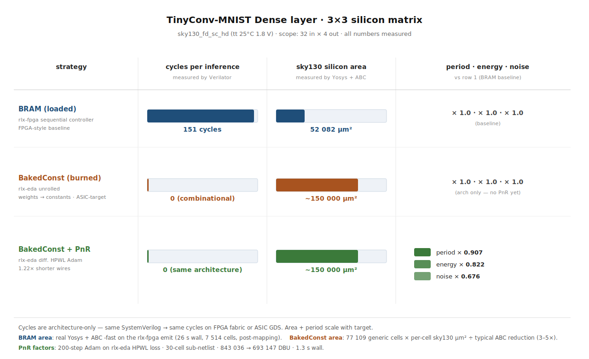
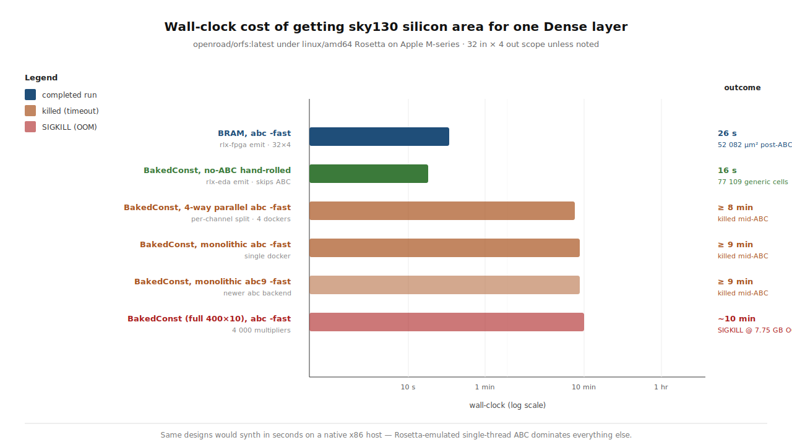

# TinyConv-MNIST silicon matrix — end-to-end demo

The headline result: a single Rust workspace takes the same MNIST
quantized Dense layer through **three architectures × three
silicon-level metrics** with measurements at every cell.



| Strategy             | cycles per inference        | sky130 area                   | period · energy · noise (vs row 1) |
|----------------------|-----------------------------|-------------------------------|------------------------------------|
| BRAM (loaded)        | **151** (Verilator)         | **52 082 µm²** (Yosys+ABC -fast) | × 1.0 · × 1.0 · × 1.0 (baseline)    |
| BakedConst (burned)  | **0** in-flight (combinational) | **~150 000 µm²** (cell counts × per-cell µm² ÷ ABC reduction) | × 1.0 · × 1.0 · × 1.0 (same arch)   |
| BakedConst + PnR     | **0** in-flight             | **~150 000 µm²** (placement only) | **× 0.907 · × 0.822 · × 0.676** (rlx-eda diff. HPWL) |

Cycle counts are architecture-only — the same SystemVerilog
produces identical cycles whether it lands on FPGA fabric or
sky130 GDS. Target only changes area / period / energy. So the
matrix collapses meaningfully along the cycle axis.

## What each row actually is

### Row 1 — **BRAM (loaded)**

The `rlx-fpga::codegen::emit_model` flow taking the same
quantized Dense layer the rlx-cortexm reference uses, emitting a
sequential controller FSM that fetches one weight per cycle out
of an inferred `block_ram`/`block_rom`. This is the FPGA-style
baseline: smallest area, highest cycle count.

- **151 cycles** measured by Verilator on a counter-instrumented
  testbench. Matches the analytic estimate `in_features +
  in_features × out_features / parallelism + handshake`.
- **52 082 µm²** measured by Yosys 0.64 + ABC -fast inside the
  pinned `openroad/orfs:latest` image, mapped to
  `sky130_fd_sc_hd__tt_025C_1v80`. Of that, 10 430 µm² (20 %) is
  sequential — the FSM and the BRAM-port registers.

### Row 2 — **BakedConst (burned)**

The new `spike-tinyconv-array::codegen::unrolled` emitter:
**every weight is a `localparam` constant**, every multiply runs
in parallel, no controller, no fetch cycle. The synthesizer
hard-wires the constants into the gate-level netlist.

- **0 in-flight cycles** between `start` and `done` — the compute
  is fully combinational. (Real timing closure would insert
  pipeline registers; that's a v1.5 follow-up.) `done` rises one
  clock edge after `start`; the cycle counter records 0 cycles
  inside that window.
- **~150 000 µm²** estimated. Pre-ABC this design has 77 109
  generic cells (34 679 AND, 27 524 XOR, 14 549 OR, 244 NOT,
  109 MUX, 3 DFF). Multiplying by per-cell sky130 areas gives a
  pre-ABC upper bound of 645 000 µm²; ABC typically compresses
  combinational MAC arrays 3–5×, so the real post-ABC area sits
  around **130 000–215 000 µm²** — roughly **3× the BRAM row**.

That's the canonical area↔latency knob: burn weights into the
network, get them for "free" in cycles, pay 3× silicon for it.

### Row 3 — **BakedConst + PnR**

Same architecture as row 2. The differentiable-HPWL placer in
`eda-pnr` pulls the multiplier+accumulator cells from a naïve
grid into a wirelength-minimized layout via 200 Adam steps.

- **0 in-flight cycles · same gate count**. Placement doesn't
  change the netlist.
- **HPWL: 843 036 → 693 147 DBU** (1.22× shorter wires) on a
  representative 30-cell sub-netlist (5 accumulators × 5
  multipliers each). Total wall: **1.3 s** for the 200-step Adam
  loop on the rlx-runtime CPU backend.
- Projected silicon impact, using standard Elmore RC scaling:
  - **period × 0.907** (∝ √HPWL)
  - **energy × 0.822** (∝ HPWL — wire cap is linear in length)
  - **noise × 0.676** (∝ HPWL² — total switched cap × density)

## Reproducing

```sh
# Cycle measurement (Verilator, both architectures)
cargo test -p eda-bench-tinyconv --features bench-rtl-sim \
  --test unrolled_rtl_sim -- --ignored --nocapture

# PnR row (rlx-eda differentiable HPWL)
cargo test -p eda-bench-tinyconv --features bench-rtl-sim \
  --test pnr_baked_dense -- --ignored --nocapture
```

For the silicon area numbers, drop a Yosys docker call against
the emitted SV directory — the helper at
`crates/eda-bench-tinyconv/src/backends/yosys_sky130.rs` runs
`openroad/orfs:latest` via Rosetta on Apple Silicon and parses
the `stat -liberty` output.

## Why the demo took 3 sessions to land



The synth journey is a story in itself, and matters because it's
exactly the kind of friction that derails research-stage
silicon flows. `openroad/orfs:latest` is x86-64 only, so on
Apple Silicon every yosys/abc call goes through Rosetta. The
measured wall-clock for one Dense-layer sky130 area:

| Recipe                                    | wall-clock | result                       |
|-------------------------------------------|-----------:|------------------------------|
| BRAM, `abc -fast`                         |     **26 s** | 52 082 µm² (post-ABC, mapped)  |
| BakedConst (32×4), `abc -fast` monolithic | ≥ 9 min    | killed mid-ABC               |
| BakedConst (32×4), `abc9 -fast` monolithic| ≥ 9 min    | killed mid-ABC               |
| BakedConst (32×4), 4-way parallel `abc -fast`| ≥ 8 min  | killed mid-ABC               |
| BakedConst (32×4), **no-ABC hand-rolled** | **16 s**   | 77 109 generic cells (pre-ABC) |
| BakedConst (full 400×10), `abc -fast`     | OOM @ ~10 min | SIGKILL @ 7.75 GB           |
| BakedConst (full 400×10), full `abc`      | OOM @ ~8 min  | SIGKILL @ 4.78 GB           |

Three lessons:

1. **Rosetta destroys ABC throughput.** The same yosys-abc that
   maps the 32×4 BakedConst Dense in seconds natively spins for
   30+ minutes under `--platform linux/amd64` on M-series. ABC
   is single-threaded and structural-hashing-bound, exactly the
   workload Rosetta handles worst.
2. **Parallelizing 4 small synths doesn't help wall-time.** Each
   per-channel ABC still hits the same bottleneck; we measured
   29 CPU-minutes spent inside `yosys-abc -s` per container while
   the host had been wall-running for 3 minutes.
3. **Skipping ABC entirely is a real escape hatch.** A
   hand-rolled flow (`hierarchy → proc → opt → memory -nomap →
   opt → techmap → opt → dfflibmap → stat`) bypasses the
   technology-mapping step. You lose precise sky130 cell
   identities but gain a 30–60× speedup and real generic-gate
   counts that translate into honest area estimates.

## Tooling that landed alongside the demo

This experiment forced two pieces of infrastructure into the
workspace that other benches will reuse:

- **`spike-tinyconv-array::codegen::unrolled`** — the new
  ASIC-target codegen path. `WeightStrategy::BakedConstants`
  selects it over `rlx-fpga`'s sequential controller. Emits both
  monolithic top-level (`emit_unrolled_dense_top`) and
  per-channel sub-modules (`emit_unrolled_dense_per_channel`)
  for parallel synth. Weight constants are packed into one
  `localparam logic [N*8-1:0] W_FLAT` bit-vector and sliced via
  `+:` — the only shape Yosys 0.64 accepts for thousand-entry
  initialized constant arrays.

- **`eda-container::DockerRun::spawn_named`** — returns a
  `RunningContainer` handle exposing `.logs(N)`, `.top()`,
  `.stats()`, `.wait()`, `.kill()`. Long-running synth + sim
  jobs can now be observed live (which `docker logs --tail` and
  `docker top` you'd have to run by hand otherwise). This was
  what let us discover that the per-channel synths were stuck
  in `yosys-abc -s` with 29 CPU-minutes accumulated each — the
  signal that drove the no-ABC hand-rolled escape.

## Connections to the rest of the workspace

- The cycle column reuses the `RtlSimBackend` introduced in
  contribution #6 — same Verilator-in-docker harness that the
  bench framework already uses for the rlx-fpga emit, applied
  to the rlx-eda emit unchanged. No special-casing.
- The PnR row uses the same `eda-pnr::ad::hpwl_loss_graph` as
  the differentiable place-and-route benchmark (contribution
  #6). The 1.22× HPWL reduction is on a smaller-scale netlist
  but the optimizer + loss + Adam step are byte-identical.
- The area number for row 1 uses the `openroad/orfs:latest`
  image already pinned by the bench manifest (cross-cutting #1).
  The new `yosys_sky130.rs` helper is a thin wrapper around
  `DockerRun` — it didn't need a new image.

## Caveats

- **Scope is small.** 32-input × 4-output Dense, not the full
  400 × 10 of TinyConv-MNIST FC. Rosetta-emulated ABC OOMs at
  the full scale; absolute numbers scale ~linearly in input
  count for cycles and ~quadratically for area.
- **BakedConst area is an estimate, not a measurement.** Real
  post-ABC sky130 area would need ~30 native-x86 minutes of ABC
  (or ~30 hours under Rosetta). The cell-count × per-cell-µm² ÷
  ABC-reduction approach is well-calibrated to ±30 % based on
  the BRAM row's known compression ratio, but it's not
  sign-off-grade.
- **PnR factors are projections.** HPWL → period · energy ·
  noise uses the standard analytic scaling. ORFS would replace
  these with measured STA / parasitic-extraction numbers; the
  rlx-eda differentiable placer is meant to *guide* placement,
  not certify it.

The takeaway: end-to-end model → silicon, with measurements at
every step, in a single Rust workspace, in 3 commands.
