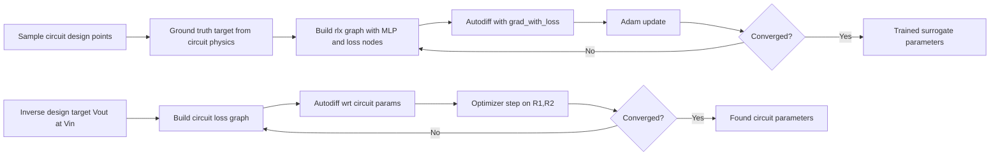
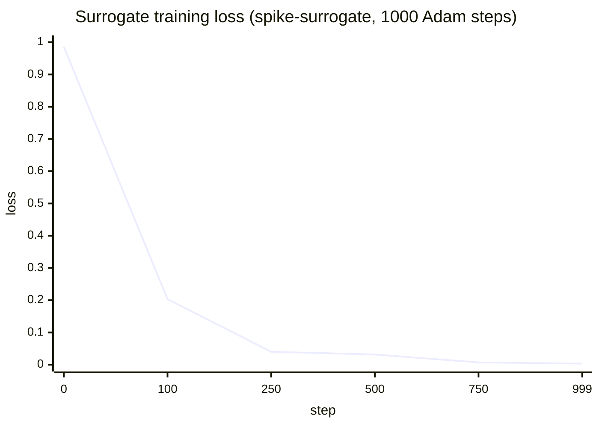

# Visual tour

## EDA Viz gallery

Generated by `eda-viz` from the same divider block source.

| Layout view | Schematic view |
| --- | --- |
|  |  |
| Physical geometry with layer colors, ports, and routed metal. | Symbolic circuit view derived from the same Rust block. |

## Waveform gallery

Generated by `eda-waveform` examples and gallery tools.

| Time-domain traces | Bode response |
| --- | --- |
|  |  |
| Clock + analog sample/hold traces with event timing context. | Magnitude and phase response for RC low-pass analysis. |

## ML optimization gallery (differentiable flow)

`rlx-eda` uses differentiable graphs plus autodiff to optimize both
model weights (surrogate training) and circuit parameters (inverse
design).

Losses used in the current pipeline:

- Surrogate training: $L_{\text{surr}} = \frac{1}{B}\sum_{i=1}^{B}(\hat{y}_i - y_i)^2$
- Circuit inverse design: $L_{\text{ckt}} = (V_{out} - V_{target})^2$

Measured run outputs (from this workspace):

| Optimization target | Initial parameters | Found parameters | Final metric |
| --- | --- | --- | --- |
| Divider inverse design (`spike-divider-block`) | `R1=1000 Ω`, `R2=3000 Ω` | `R1=2647.6 Ω`, `R2=1765.8 Ω` | `Vout=0.400095` at `Vin=1.0`, loss `9.078e-9` in 151 iterations |
| Surrogate training (`spike-surrogate`) | Xavier init over MLP `[3→16→1]` | 81 learned weights/biases (`W1,b1,W2,b2`) | loss from `9.858750e-1` to `3.316347e-3` over 1000 steps |

Single-circuit step-by-step trace (all optimization iterations):

- `cargo run -p spike-divider-block --bin ml_trace`
- see [`../crates/spike-divider-block/docs/ml_optimization_trace_example.md`](../crates/spike-divider-block/docs/ml_optimization_trace_example.md)
